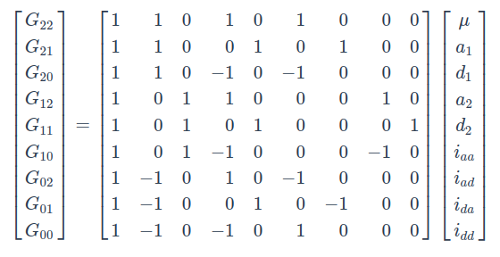
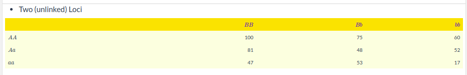
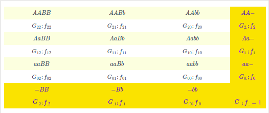
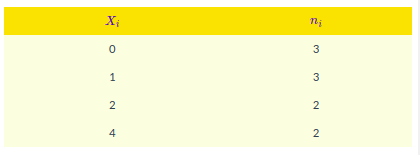

```{r setup, include=FALSE}
knitr::opts_chunk$set(echo = TRUE)
```

# Aula 01 - Introdução à Genética Quantitativa
## Características Quantitativas

**Características quantitativas** são de natureza métricas, ou seja, temos que avalia-las usando alguma escala de medida. Por terem natureza métrica são controladas por _muitos genes_. Elas foram descobertas por Fisher (1918), onde muitos conceitos foram consolidados neste paper. Na época:

- existia um embate entre mendelianos e biometristas;

- muitos biometristas consideravam as leis de Mendel como um caso particular e serviam apenas para características qualitativas;

- Fisher colocou um ponto final nessa discussão ao descobrir que as características quantitativas eram controlados por diversos genes.

Por serem governadas por muitos genes, elas precisam ser avaliadas usando _métodos estatísticos_, podendo ser contínuas ou discretas. Essas características também são conhecidas como _poligênicas_ ou _multifatorias_. E por serem controladas por muito genes elas são altamente influenciadas pelo ambiente. Também temos que:

- as características qualitativas _quase não_ são influenciadas pelo ambiente;

- já nas características quantitativas, cada gene reflete uma pequena influência do ambiente e de maneira geral a característica como um todo sofre uma grande influência do ambiente;

- é um _erro_ pensa que quanto maior o número de genes maior será ainfluência do ambiente. A partir de um pequeno número genes podemos ter uma influência do ambiente. A partir de um pequeno número de genes podemos ter uma influência maior ou menos, o _efeito do ambiente_ em cada gene pode variar.

Dessa forma, é necessário métodos estatísticos para estudar essas características. Assim, pode-se diferenciar genética quantitativa e estatística:

- genética quantitativa é estudar a _transmissão e herança_ dos caracteres quantitativos;

- genética genética estatística é _desenvolvimento de modelos_ ara analisar dados de genética que pode ser caracteres quantitativos ou qualitativos. Ou seja, o desenvolvimento de métodos estatísticos para fenômenos genéticos.

## Papers Seminais
**Fisher(1918)** - com esse paper Fisher colocou um ponto final na briga dos biometristas e mendelianos. Ele mostrou que um caráter quantitatibo tem sim heranla mendeliana. Nesse paper ele também apresentou o conceito de ANOVA, decomposição da variância, delinamentos experimentais, verossimilhança, evolução quantitativa.

**Wright (1921)** 

**Lockerham (1954)** - decompopsição da variância genética e componentes devio aos diferentes tipos de epistasia.


## Histórico
A genética quantitativa começou com esse paper do Fisher, mas a discussão a respeito da herdabilidade das características quantitativas começou antes com vários autores. 

**Mendel** 

- Mendel apresentou a herança das características discretas, ou seja, variáveis qualitativas e definiu primeira e segunda lei de Mendel;

- O paper de Mendel na época não teve tanto destaque porque na mesma época Darwin publicou o paper dele que teve muito impacto na época.

**Darwin**

- Apresenta a teoria da evolução.

**Galton (1889) - Regression toward mediocraty**

- Era primo de Darwin e foi uma das pessoas que propôs o conceito de eugenia;

- Ele fez uma interpretação errrônea de alguns conjuntos de dados e, em 1889 ele apresentou o conceito de regressão para mediocridade.

**Pearson (1908)**

- Em 1903, Pearson interpretou os dados do Galton corretamente e para interpretar ele propôs alguns conceitos, como por exemplo resposta à seleção e regressão linear.

## Galton's Data
Galton tinha a altura média dos pais e a altura média dos filos. Ele obteve um gráfico mais ou menos assim:

{height="450px" width="500px"}


Em uma primeira visualização podemos observar que pais mais altos tendem a ter filhos mais altos e, pais mais baixos tendem a ter filhos mais baixos. Existe, portanto, uma tendência, mas que não é _absoluta_. Observa-se também uma concentração de pontos em torno da media, ou seja, indivíduos medianos tem filhos com alturas medianas.

Galton passou uma linha nesse gráfico com coeficiente angular *b = 1*, este determina a inclinação de uma reta. O coeficiente angular pode ser demonstrado pela fórmula:

$$cA = \frac{\delta y}{\delta x}$$
$\delta$ = variação

Ter um $cA = 1$ significa que a altura do pai é igual a altura do filho. Se a análise do gráfico for feita quando o _coeficiente angular = 1_, nota-se que temos muito mais filhos baixos para pais mais altos do que o contrário. A quantidade de pontos é bem maior para filhos mais baixos. Portanto, parece que os pais mais altos têm tendência de ter filhos mais baixos do que seria esperado em uma reta igual a 1.

Seguindo essa análise, ao olharmos na região de pais mais baixos, nota-se que tem mais pontos na parte acima da reta. Ou seja, os pais mais baixos tendem a ter filhos mais altos, Filhos mais baixos tem a tendência a ter filhos mais altos na próxima geração.

Portanto, a interpretação de Galton foi: pais mais altos tendem a ter filhos mais baixos e pais mais baixos tendem a ter filhos mais altos. Ou seja, de uma geração para outra os que são muito alto vão tender a ficar mais baixos e os que são mais baixos vão tendem a ficam mais altos. E com isso, ao longo das gerações irá _regredir em torno da mediocridade_, ou seja, regressão em direção à média.

Ou seja, a população irá caminhar para uma altura mediana, se acumulando em torno da média. Com isso, a amplitude de variação de uma geração para outra irá diminuir.

Galton generalizou isso para todas as características e com isso porpôs a _eugenia_ (melhoramento de humanos). Ele queria fazer uma selação de pessoas para que com o passar das gerações a espécie humana não caminhasse para a mediocridade.

## Interpretação de Pearson
Pearson interpretou novamente os dados de Galton a partir de uma regressão. Pearson ajustou o coeficiente angular da reta a apartir dos mínimos quadrados ajustados aos pontos, assom teve:

- $\hat{\beta} = 0.65$ como a reta que melhor se ajusta aos dados;

- Na regressão, a soma de quadrados dos desvios em torno da reta é a menos possível;

- De acorodo com essa reta metade dos indivíduos estão acima da reta e metade está abaixo. Então, o argumento de Galton não é verdadeiro quando passamos a reta de mínimos quadrados.


A herdabilidade do caráter é uma _função do coeficiente angular_ da regressão. Ou seja, o quanto _transmite_ de uma geração para outra depende da reta do coeficiente angular. Quando fazemos uma regressão de uma característica, o coeficiente angular é proporcional ao coeficiente de herdabilidade.

Esse $\hat{\beta}$ não é igual a 1 porque a _herdabilidade_ de uma característica _nunca é igual a 1_, pois existe o _efeito do ambiente_ e o _efeito da transmissão_ (um pai nunca transmite os genótipos para os filhos e sim os gametas). Na média os gametas se combinam para formar a próxima geração. Não transmitimos de uma geração para outra integralmente os fenômesmo que observamos em uma geração. Ou seja, nem tudo que medimos em uma geração vai passar para outra. O que estamos medindo em um geração tem erros e causas ambientais que não são herdáveis (por isso $\hat{\beta}$ nunca será igual a 1).

A média e a variância _se mantém_ ao longo dos anos, ou seja, a média de uma população não muda de uma geração para outra. Elas vão se alterar se fizermos seleção (pressão seletiva).

A herdabilidade está _relacionada com a covariância_ entre os eixos, porque o $\beta$ da regressão é uma função da covariância entre os dois eixos. É uma covariância entre as gerações ou entre indivíduos aparentados. Quando medimos a covariância entre indivíduos aparentados estamos medindo uma função da herdabilidade. Tem que haver uma dependência ou uma covariância entre eixos para termos progresso de uma geração para outra.

Galton estava errado em dizer que haveria uma regressão em torno da média. Na verdade, se não fizermos nada a média e a variância continuarão sendo as mesmas. Se selecionarmos os pais com as maiores alturas termos a média dos indivíduos selecionados e alteraremos a média da geração seguinte:

{height="500px" width="400px"}

Quando selecionamos a geração atual (ms) temos uma média igual a m1 da geração seguinte. Essa diferença entre a média da população e a média dos selecionado é o **diferencial de seleção**. Que pode ser exemplificado da seguinte maneira:

$$ms - m = \delta s$$

e a diferença entre o m1 e m é o **ganho de seleção**. Exemplificado da seguinte maneira:

$$m1 -m = G$$

a relação entre o cateto oposto e o cateto adjacente é a tangente do ângulo:

$$tg \ \alpha = \frac{C.O.}{C.A.}$$
a tangente desse ângulo é o coeficiente angular da reta:

$$cA = \frac{\delta y}{\delta x}$$

o coeficiente angular dita quão grande é esse ganho, quanto maior o $\beta$ que é a tangente do ângulo, maior será o ganho de seleção:

$$\therefore \beta = \frac{G}{S} \\
\therefore G = \beta.S \\
\therefore G = h^2.S$$

Quando fazemos uma regressão dos pais em relação aos filhos, o slope da regressão (coeficiente angular da reta) é proporcional à herdabilidade no sentido restrito. Ele mede o quando eu ganho no eixo y (cateto oposto) quando eu ando no eixo x (cateto adjacente). E se pararmos para pensar, o cateto adjacente nada mais é do que o diferencial de seleção (alteração do fenótipo causado pela selação) e o cateto oposto é o ganho de seleção (resposta à seleção).

E Pearson nouto exatemente isso, a resposta à seleção através das gerações é a diferençã média da altura dos pais selecionados e a média da altura antes da seleção.

## Dias "Atuais"

**Shull (1905)** - Reparou que a uniformidade genética diminui a variabilidade. Portanto, as características devem ter uma base genética grande.

**Nelson-Ehle (1909)** - Estudou a segregação em três locos e observou que isso tinha uma influência na variabilidade.

**Johannsen (1903) & Johannsen (1909)** 

- Propôs a separação entre genótipo e fenótipo;

- Observou que os caracteres sofrem influência do ambiente;

- Observou que não existe ganho de seleção em materiais homogêneos, ou seja, é necessário ter variabilidade genética para se ter ganho.

## Tecnologias Modernas

**Quantitative Trait Loci** - hoje conseguimos encontrar quais são os locos que controlam as características (onde eles estão localizados no cromossomos), quais são os efeitos desses QTL na característica e qual influência do ambiente sobre eles.

**Seleção Genômica** - são métodos que usm muitos locos ao mesmo tempo para tentar fazer a predição de características quantitativas.

**Objetivos da Genética Quantitativa** 

- Entender e estimar a proporção das variações fenotípicas explicadas por causas genéticas. QUais são as bases genéticas da variabilidade que a gente observa?

- Entender as consequências da endogamia e heterose;

- Entender e estimar o ganho de seleção;

- Estimar o breeding value.

## Tarefa

- Ler o capítulo 1 Lynch & Walsh (1998);

- Escrever o que entendeu da discussão Galton x Pearson

### Capítulo 01

**Foundations of Quantitative Genetics**

A seleção natural é o que temos mais próximo a uma lei em biologia. Portanto, é lógico que a adotemos como uma referência em nossas tentativas de entender a natureza. Enquanto a teoria de otimização pode ser bem sucedida em predizer o que deve evoluir, mas no diz pouco de como deve acontecer. O objetivo principal da genética quantitativa é entender os mecanismos do processo evolutivo.


**Quantitative Genetics and Phenotypic Evolution**

A problemática central na natureza do processo que define a evolução de características morfológicas, fisiológicas e comportamentais, que são o foco da maioria dos programas de melhoramento, onde o homem em vez da natureza define a intensidade e direção da seleção.

Apesar da cultura e/ou transmissão dos efeitos ambientais terem papel importante em alguns casos, evolução é primeiramente um processo genético.

Na genética quantitativa, a maioria das formulações são ditas em termos de médias fenotípicas e variâncias. Seus princípios foram delineados por Fisher (1918) e Wright (1921).

Os princípios Mendelianos nos quais as teorias da genética quantitativa são fundadas são universais, aplicadas às espécies domesticadas e populações naturais. Mesmo assim, devido os sistemas de cruzamento, forças evolucionárias encontradas em populações naturais são geralmente bem diferentes do que programas controlados impõem nas plantas domesticadas, estudos de herança de características quantitativas em populações naturais apresentam muitos desafios. A maioria dos parâmetros são estimados pela comparação de fenótipos de indivíduos com grau de relacionamento conhecidos. Idealmente, análises genéticas controladas devem ser realizadas em conjuntos específicos em ambientes específicos. Essa falta de controle pode comprometer os tipos de parentes que podem ser testados e o grau de "balanceamento" do conjunto final de dados. Tais problemas incentivaram o desenvolvimento de novas estatísticas como BLUP e REML.

**Historical Background**

A genética quantitativa desenvolvida nesse século em resposta à uma controvérsia que ainda há remanescentes. A redescoderta da genética Mendeliana focou na herança de caracteres discretos, enquanto que Galton se concentrou em caracteres contínuos. A maior discussão era se caracteres possuíam as mesmas propriedades de hereditariedade e evolução que os caracteres contínuos. Os Mendelianos acreditavam que a variação nos caracteres discretos levavam a evolução ao surgimento de novas macromutações, enquanto que os biometricos viam a evolução como resultado da seleção natural agindo em caracteres distribuídos continuamente.

Darwin assumiu que características contínuas exibiam herança misturada. O problema desse pensamento já foi apontado por Jenkin (1867), que metade da variação existente é removida a cada geração com herança misturada.

Galton apontou outro problema. Quando ele plotou a altura média de filhos contra altura média dos pais. No entnato, a inclinação da reta indicava que a progênie era, em média, menos exepcional que seus pais. Pais cuja média eram baixa tendiam a ter progênie mais alta, mas ainda abaixo da média. Galton chamou essa tendência de regressão para a mediocridade e, argumentou que isso iria erosar qualquer progresso seletivo. Ele concluiu que a evolução deve ser baseada em mutações de grandes efeitos ao invés de selecionar variações contínuas.

Pearson (1903) apontou o erro de Galton. Imagine que a seleção aja de maneira que apenas pais altos se reproduzam, então a altura média dos adultos reprodutivos após a seleção ($\mu s$) é maior do que a altura média antes da seleção ($\mu$). Se $\mu_0$ é  a altura média da progênie dos pais selecionados, então a resposta à seleção entre gerações é $\mu_0 - \mu$. Uma vez que a inclinação da relação parental-progênie é menor do que 1, a progênie adulta não pe esperada ser tão grande quanto aos pais selecionados. No entanto, a altura média é estável, se a seleção for parada, a nova altura não pe esperada decair ao valor original. Galton aparentemente falhou ao perceber que a seleção começa de uma nova média a cada geração e é para essa nova média que a próxima geração regressa. 


### Minha Resposta

_Após a redescoberta das leis de Mendel surgiu a questão se era possível explicar caracteres contínuos por essas leis, uma vez que estas foram inicialmente estabelecidas por meio de estudos com caracteres discretos. E então começou-se um embate entre os Mendelianos e os Biometristas. Para os Mendelianos, o surgimento de novas mutações eram consequência da variação dos caracteres discretos, já para os Biometristas a seleção natural agia nos caracteres distribuídos continuamente. Darwin tentou descrever essas características quantitativas através de uma “herança de mistura”, em que a progênie seria a média de seus genitores, o que foi contestado por Jenkin (1867), uma vez que caso isso ocorresse a cada geração metade de sua variação seria desfeita. Como um adepto aos biometristas, Galton, primo de Darwin, tentou desenvolver uma estatísticas que pudesse descrever a passagem de caracteres contínuos de uma população parental para sua prole. Para isso ele plotou em um gráfico a média da altura dos pais (eixo x) contra a altura dos filhos (eixo y), e então traçou uma reta com ângulo de inclinação igual a 1. A partir desse gráfico ele observou que na extremidade com os pais mais baixos a maioria de seus filhos estavam acima da reta traçada, ou seja, eram mais altos que seus pais. E na outra extremidade ele observou o contrário, pais mais altos tinham mais filhos cuja altura estava abaixo da reta, ou seja eram mais baixos que seus pais. Isso o fez concluir que ao longo das gerações iria ocorrer uma “regressão à mediocridade”, isto é, a população  iria caminhar até uma altura mediana onde haveria uma estagnação. Atualmente sabemos que diversos fatores influenciam na característica observada, como o ambiente, o ambiente e a sua interação com o genótipo, o grau de herdabilidade, o pedigree - que me fez pensar sobre os dados obtidos pelo Galton, uma vez que casamentos entre primos (consanguíneos) eram mais comuns no século 19 (o próprio Darwin era casado com sua prima), o que pode ter efeitos negativos na progênie - entre outros. Mas o erro de Galton não foi não levar em consideração esses fatores que hoje sabemos ser importantes, e sim na sua interpretação ao estabelecer uma reta com inclinação, b =1. O que foi corrigido, em 1903, por Pearson ao ajustar uma reta que melhor adequasse os dados, através dos mínimos quadrados. A nova reta ajustada obteve coeficiente angular igual a 0.65 com, metade da progênie está acima da reta e outra metade abaixo. E então, Pearson interpretou que caso nenhuma seleção fosse aplicada a média e a variância de uma população continuará a mesma de uma geração para outra. E caso haja alguma pressão de seleção a média terá uma tendência para onde há a seleção e uma nova média irá compor a nova geração. Galton não percebeu que a seleção começa em uma nova média e é pra ela que a próxima geração regressa._


# Aula 02 - Revisão de Conceitos Estatísticos
## Distribuição de Probabilidades
É um modelo matemático que gera uma curva cuja área é igual a 1. 

{height="450px" width="400px"}

A curva $y=f(x)$ nesse exemplo é chamda de densidade de probabilidade de uma variável aleatória continua x. Cada variável contínua tem sua própria funça densidade. A probabilidade $Pr(a \leq x \leq b)$ é a área abaixo da curva entre x-valores a e b.

No eixo x nós temos uma variável que é medida no mundo real. Essa variável pode ser discreta (cara ou coroa/indivíduos homo ou heterozigostos) ou contínua (peso/altura dos indivíduos). 

Se a variável for discreta teremos que usar distribuições discretas para modelar o fenômeno. E se ela for contínua, distribuições contínuas.

Pode ser que a curva acima consiga modelar algum fenômeno do mundo real. Nota-se que essa curva apresenta um pico mais alto e outro mais baixo. Isso poderia ser, por exemplo, a altura de pessoas ou plantas segregando para dois QTL, em que o QTL com maior frequência representa o pico mais alto da curva e o com menor frequência o mais baixo.

A função que gere o gráfico é uma função matemática e a usamos para modelar um fenômeno do mundo real. Como ela é função de probabilidade, a área abaixo da curva deve ser igual a 1. Matematicamente pode ser representada como:

$$\int_{-\infty}^{\infty}p(z)dz = 1$$

Onde:

-$p(z)$ é a função da variável aleatória;

- $z$ é a variável aleatória (característica);

- A área é igual a 1 porque é a soma de todos os possíveis eventos.

A probabilidade de um determinado evento ocorrer entre dois intervalos é obtida através da integral definida entre esses dois intervalos. A integral divide a área desses dois intervalos em vários retângulos pequenos e posteriormente soma a área desses retângulos. Matematicamente, temos:

$$P(z_1 \le z \le z_2) = \int_{z_1}^{z_2}p(z)dz$$

## Distribuição Normal

Iniciou-se coma a predição de jogos e movimentos dos astros e foi formalizada por Gauss. Sua função densidade pode ser descrita por:

$$f(z) = \frac{1}{\sqrt{2\pi\sigma^2}} e^{\frac{-(z-\mu)^2}{2\sigma^2}}$$

Onde:

- $\sigma^2$ é a variância;

- $f(z)$ é a probabilidade de se obter o valor z;

- $\mu$ é a média;

- $z$ é a variável quantitativa.

Para fazer a curva de densidade de probabilidade precisamos de $\mu$, $z$ e $\sigma^2$. O $\mu$ interfere no desenho da cursa e dizemos que ele é uma medida de posição. Para diferentes valores de $\mu$ e $\sigma^2$, teremos curvas de densidade de probabilidade. Graficamente temos:


É muito comum fazermos transformações e padronizar essa distribuição. A transformação é feita para cada valor da seguinte maneira:

$$z' = \frac{z - \mu}{\sigma}$$

Em que $z'$ é o valor transformado (standardizado).

A transformação da variável aleatória normal com média $\mu$ e desvio padrão $\sigma$ em uma aleatória normal padronizada com média 0 e o desvio padrão 1, permite a comparação das distribuições, uma vez que elas estarão em uma mesma escala. 

A variância é uma medidade de dispersão e portanto, quanto maior a variância mais os dados estarão dispersos em torno da média e mais aberta será a curva.

Na análise de dados o objetivo é encontrar um modelo que consiga explicar de alguma maneira uma determinada variável e um modeo muito usado á a distribuição normal. Essa distribuição funciona muito bem para fenômenos do mundo real, inclusive caracteres quantitativos.

**Propriedades da Distribuição Normal**

A distribuição normal é amplamente utilizada, pois:

- A distribuição normal é normal é uma boa distribuição para medir variáveis quantitativas em que a maioria das observações estão concentradas ao longo da média. Os dados mais concentrados ao longo da média possuem maior probabilidade de ocorrer. _(A maioria dos valores estão concentrados em torno da média)_;

- A distribuição é simétrica, ou seja, o que acontece acima da média também acontecerá abaixo. _(Quando os dados acima e abaixo da média são simétricos)_;

- Raramente iremos observar indivíduos nas extremindades. Podemos até observa-los, mas probabilidade de ocorrer valores extremos é muito pequena. _(Os valores extremos são raros)_;

## Caracteres Quantitativos
Quanto eu tenho um evento que é a soma de evento de menores, independente da distribuição dos eventos menores a distribuição do evento final tende a ser uma distribuição normal.

Trazendo para a genética quantitativa: o efeito de um caracter quantitativo é a soma do efeito de diversos pequenos genes. E quando eu somo tudo é razoável pensar que a distribuição do efeito final é uma normal.

Quando temos apenas **um gene** controlando determinada característica, temos:

$$\mbox{valores genotípicos estabelecidos} \left \{ \begin{matrix} 1 = aa \\ 2 = Aa \\ 3 = AA \end{matrix} \right.$$

O número de indivíduos que temos em cada categoria depende da população que estamos trabalhando. Se fizermos a frequência alélica e a população estiver em equilíbrio de Hardy-Weinberg teremos $p^2$, $2pq$ e $q^2$ genótipos. Se cada alelo for 0.5, temos:

{height="400px" width="350px"}

Nota-se que pelo gráfico não temos a distribuição normal, pois temos apenas 3 categorias (AA, Aa e aa) e a distribuição não temos apenas 3 categorias. Já quando há 2 genes controlando uma determinada característica, temos:

$$\mbox{valores genotípicos} \left \{ \begin{matrix} 1 = aa & 1 = bb \\ 2 = Aa & 2 = Bb \\ 3 = AA & 3 = BB \end{matrix} \right.$$

A medida que aumentamos o número de genes nós aumentamos também o número de categorias.

Quando temos seis genes segregando temos algo próximo da distribuição normal. Usa-lá para aproximar esse fenômeno funcionará. A distribuição dos genes não é uma distribuição normal, mas se eu modelar como sendo, poucas propriedades da distribuição normal serão perdidas. Dessa forma, a istribuição normal é um excelente modelo para estudar características quantitativas.

Como é uma simulação, sabemos que não e uma distribuição normal e sim uma multinomial. No exemplo, cada gene acrescenta uma unidade no valor genotípico. Como, por exemplo, o indivíduo AABBCCDDEEFF apresenta uma valor genotípico igual a 18. No entanto, se considerarmos o efeito ambiente, esse indivíduos poderá ser 17, 17.5, 19... Portanto, haverá trocas de classes e e valores intermediários, que dependerão do tipo de escala usada e do ambiente.

Por fim, é possível modelar caracteres quantitativos através da distribuição normal porque esses caracteres são controlados por muitos genes de pequeno efeito e há influência do ambiente. Como são resultado do efeito de múltiplas variáveis de pequeno efeito, ao somarmos esses efeitos tenderemos a encontrar a distribuição normal. Isso é o **Teorema Central do Limite**.

No Teorema Central do Limite é estabelecido que em algumas situações quando variáveis aleatórias independentes são acionadas, sua soma adequadamente normalizada tende para uma _distribuição normal_, mesmo que as próximas variáveis originais não sejam (Ou seja, efeito diferentes com distribuição diferente terão uma distribuição normal ao se somar seus efeitos).

## Esperança Matemática

A esperança é o primeiro momento em relaão à média da distribuição. A média está relacionada com o conjunto de dados que já observamos. A esperanla é a média de um conjunto de dados que não estamos vendo ou que não ocorreu. Matematicamente, temos a esperança de uma variável z como:

$$E(z) = \mu = \int_{-\infty}^{\infty}z \ p(z) \ dz$$

Onde $p(z)$ é uma determinada distribuição probabilidade de ocorrência. (Se eu usar a distribuição normal, teremos uma determinada esperaça). Portanto, a média esperada varia de acordo com a distribuição.

Imagine uma característica quantitativa modelada com distribuição normal. Qual a média dess variável quando a modelagem é feita usando distribuição normal? A média dessa distribuição é o que chamamos de esperaça de z; e no caso da distribuição normal a esperançã é $\mu$.

Pela fórmula vemos que a esperaça é a soma do produto de cada probabilidade de ocorrência pelo seu respectivo valor. Isto é, representa o valor médio "esperado" de uma experiência se for repetida muitas vezes.

**Propriedades**

- $E(x + y) = E(x) + E(y)$

- $E(cx) = cE(x)$

## Variância Esperada

A variância é o segundo momento em relação à média da distribuição. Matematicamente temos:

$$\sigma^2 = \int_{-\infty}^{\infty}(z-\mu)^2p(z)dz \\
= E[(z-\mu)^2] \\ \\
\therefore \sigma^2 = E(z^2) - [E(z)]^2$$

Portanto, para uma determinada distribuição podemos obter a esperaça (média esperada da distribuição) e a variância (variância esperada da distribuição). Cada distribuição terá uma esperança e uma variância.

A esperanla de $z$ para variáveis centradas námédia é igual a zero e, portanto, a variância será de $z$ ao quadrado:

$$\sigma^2 = E(z^2)$$

**Formula da variância**

$$\sigma^2 = \frac{1}{n-1} \left[\sum z^2 - \frac{\sum z^2}{n} \right] $$

## Distribuição Normal Bivariada
Duas variáveis do mundo real são utilizadas para descrever um fenômeno. Segue a função:

$$f(x,y) = \frac{1}{2 \pi \sigma_x  \sigma_y \sqrt{1-p^2}} \ exp \left( - \frac{1}{2(1-p^2)} \left[\frac{(x - \mu_x)^2}{\mu_x^2} + \frac{(y - \mu_y)^2}{\mu_y^2} - \frac{2 \rho(x - \mu_x)(y - \mu_y)}{\sigma_x \sigma_y}  \right] \right)$$

Os parâmetros da função são:

- Variância de x ($\sigma_x^2$) e variância de y ($\sigma_y^2$);

- Correlação entre x e y ($\rho$);

- Média de x ($\mu_x$) e média de y ($\mu_y$).

Portanto, para descrever essa distribuição bivariada é necessário termos a média e a variância das duas variáveis e a sua correlação. Também temos:

$$\mu = {\mu_x \choose \mu_y}$$

e

$$\sum = \begin{pmatrix} 
  \sigma_x^2 & \rho\sigma_x\rho\sigma_y \\ 
  \rho\sigma_y\rho\sigma_x & \sigma_y^2 \\
  \end{pmatrix}$$

Quando estamos estudando duas variáveis a distribuição depende de como essas duas variáveis se associam. O fato de x e y seguirem uma distribuição normal não garante que x e y conjuntamente terão uma distribuição normal bivariada. Se duas variáveis aleatórias são independentes, a correlação e a covariância é igual a zero.

Nos dados de Galton, nota-se um achatamento na elipse. Esse achatamento sugere que existe uma correlação entre as duas carcterísticas. E é exatamente isso que acontece, pois pais mais altos tendem a ter filhos mais altos. 

Na distribuição bivariada o f(x,y) nos dá a probabilidade de observar um valor para as duas variáveis ao mesmo tempo. Já na distribuição normal univariada f(x) nos dá a probabilidade de observar um valor para a variável x. O pico da distribuição é a média das duas variáveis ao mesmo tempo. Nota-se que a maioria dos valores estão concentrados na média. E nas extremidades temos os valores raros.

### Distribuição Conjunta para Normal Bivariada
É a probabilidade de determinado evento acontecer entre algum intervalo de x e y. Obtida através da integral entre esses intervalos. É o cálculo do volume:

$$P(y_1 \leq y \leq y_2, \ x_1 \leq x \leq x_2) = \int_{y_1}^{y_2} \int_{x_1}^{x_2} p(x, y) \ \delta_x\delta_y$$

Podemos também calcular a probabilidade condicional. Podemos, por exemplo, fixar o valor de x e calcular a probabilidade de y estar entre $y_1$ e $y_2$.

$$P(y_1 \leq y \leq y_2 \ | \ x) = \int_{y_1}^{y_2} p(y \ | \ x) \ \delta_y$$

E da mesma maneira conseguimos calcular a esperança:

$$E[f(x,y)] = \int_{ -  \infty}^{\infty } \int_{- \infty}^{ \infty} f(x,y) \ p(x, y) \ \delta_x\delta_y$$

O valor esperado é a média da população que estamos estimando. A esperança e a variância da distribuição é a média e a variância populacional, respectivamente. Não conhecemos a média e a variância populacional e o que usamos são amostras para estimar o comportamento dessa população.

## Covariância
Quando estamos lidando com apenas uma variável precisamos de média e variância. Já quando estamos lidando com duas características nós precisamos da média e da variância das duas características e da correlação ou da covariância.

A covariância é a variação conjunta de duas características, ou seja, é uma medida de associação linear entre duas variáveis.

Assim:

$$\sigma(x,y) = E[(x - \mu_x)(y - \mu_y)]$$
ou

$$\sigma(x,y) = E(xy) - \mu_x \mu_y \\
= E(xy) - E(x)E(y)$$

Por definição é a esperança do produto dos desvios das observação em torno da média.

Mas também pode ser representada por:

$$\sigma(x,y) = \frac{1}{n-1} \left[\sum (x - \mu_x)(y - \mu_y) \right]$$

ou 

$$\sigma(x,y) = \frac{1}{n-1} \left[\sum xy - \frac{\sum x \sum y}{n} \right]$$

Quando fazemos os desvios de y em torno da média, metade dos valores estarão acima da média e metade abaixo. A mesma coisa também contece para o x.
Será que quando os valores de x estão acima da média existe alguma relação para que os valores de y também estejam acima da média?

Se fizermos o produto de desvios positivos de x com desvios positivos de y teremos uma covariância positiva. E se fizermos o produto dos desvios negativos de x com os desvios negativos de y também termos uma covariância positiva. Ou seja, se tivermos produto de indivíduos com o mesmo sinal, a covariância deve ser positiva. Graficamente pode ser ilustrado da seguinte maneira:

{height="400px" width="350px"}

A partir do gráfico, podemos perceber que existe um predomínio de pontos no quadrante positivo/positivo e no negati/negativo. Ou seja, a tendência é que essa covariância seja positiva. Se os pontos estiverem igualmente distribuídos ao longo dos quatro quadrantes, os efeitos irão se cancelar e a covariância será igual a zero. E se tivermos mais pontos nos quadrantes em que os indivíduos tem sinais diferentes teríamos covariâncias negativa.

A covariância é uma medidad de _associação_ entre x e y. Essa medida pode assumir:

$$- \infty < cov(x,y) < \infty$$
Portanto, ela é difícil de interpretar na escala original e geralmente usamos o coeficiente de correlação que varia de -1 a 1.

### Identidades Úteis
Considera que _a_ é uma constante e _x_ e _y_ são variáveis aleatórias:

1. $\sigma(x,x) = \sigma_x^2$ (a covariância de uma constante com ela mesma é a variância).

**Demonstração**

$$cov(x,x) = E[(x - \mu_x)(x - \mu_x)] \\
= E[(x^2 - 2\mu_x x - \mu_x^2)] \\
= E(x^2) - E(2\mu_x x) + E(\mu_x^2) \\
= E(x^2) - 2\mu_xE(x) + \mu_x^2 \\
= E(x^2) - 2\mu_x\mu_x + \mu_x^2 \\
= E(x^2) - 2\mu_x^2 + \mu_x^2 \\
= E(x^2) - \mu_x^2 \\
= E(x^2) - [E(x)]^2 \ \mbox{(formula da variância)}$$

2. $\sigma(a,x) = 0$ ( a covariância de uma constante e uma variável é zero)

**Demonstração**

$$cov(a,x) = E[(a-\mu_a)(x-\mu_x)] \\
\therefore cov(a,x) = 0$$


3. $cov(ax,y) = a cov(x,y)$

**Demonstração:**

$$cov(ax,y) = E[(ax-a\mu_x)(y-\mu_y)] \\
= E[a(x-\mu_x)(y-\mu_y)] \\
= a E[(x-\mu_x)(y-\mu_y)] \\
= a \sigma(x,y)$$

4. $\sigma(ax,by) = ab \sigma(x,y)$

**Demonstração:**

$$cov(ax,by) = E[(ax-a\mu_x)(by-b\mu_y)] \\
= E[a(x-\mu_x)b(y-\mu_y)] \\
= ab E[(x-\mu_x)(y-\mu_y)] \\
= ab \ \sigma(x,y)$$

5. $\sigma^2(ax)= a^2 \sigma^2 (x)$

**Demonstração:**

$$cov(ax) = E[(ax-a\mu_x)(ax-a\mu_x)] \\
= E[a(x-\mu_x)a(x-\mu_x)] \\
= aa E[(x-\mu_x)(x-\mu_x)] \\
= a^2 E[(x^2) - 2\mu x^2 - \mu x^2] \\
= a^2 E[(x^2) - \mu x^2] \\
= a^2 E(x^2) - [E(x)]^2 \\
= a^2 \sigma^2(x)$$

6. $\sigma[(x+y), (w+z)] = \sigma(x,w) + \sigma(x,z) + \sigma(y,w) + \sigma(y,z)$

7. $\sigma^2(x+y) = \sigma^2(x) + \sigma^2(y) + 2\sigma(x,y)$

Se analisarmos os dados de Galton, nota-se que os dados apresentam uma correlação positiva. A elipse está achatada com os dados concentrados nos quadrantes positivos e negativos. A medidade que a altura dos pais aumenta a dos filhos também aumenta. Como medir a associação? Calculando a covariância ou fazendo uma medida de dose e resposta.

## Modelos para a regressão
### Filhos = Pais
Esse seria o modelo mais simples em que tentamos explicar o comportamento dos filhos comportamento dos pais

### Filhos = Pais + $\alpha$
Agora temos um modelo um pouquinho mais complexo em que somamos uma constante para explicar a próxima geração. Essa constante pode ser, por exemplo, adicionada ao modelo porque pode ter tido uma melhora na nutrição de uma geração para outra.

### Filhos = Pais x $\beta$
Podemos também considerar um coeficiente e multuplica-lo na altura dos pais.

### Filhos = Pais x $\beta$ + $\alpha$
Por fim, poderíamos considerar um coeficiente e uma constante. Esse último modelo é o que mais se aproxima da realidade. E esse se aproxima muito de uma _regressão linear_. Esse modelo tenta explicar os filhos em função dos pais.

## Regressão linear
**Modelo Linear** é uma boa aproximação para se iniciar os estudos. Esse modelo tenta explicar o y (variável resposta) em função do x (variável preditora). Para associações, temos:

$$y =\alpha + \beta x + e$$

Colocamos o e (componente de incerteza) para coisas que não consseguimos controlar. No exemplo de Galton, pai com uma determinada altura não necessariamente terão filhos com essa altua.

$\alpha$ e $\beta$ são parâmetros do modelo. Nós precisamos desses dois parâmetros para obter valores de $\hat{y}$. Esses parâmetros são desconhecidos e precisamos estima-los. Ao conseguirmos isso, é possível predizer os valores preditos do modelo.

$$\hat{y} = \alpha + \beta x$$

$\alpha$ e $\beta$  são estimados para dar o melhor ajuste para a distribuição conjunto de x e y. E geralmente podemos utilizar mínimos quadrados para obter essas estimativas.

## Mínimos Quadrados
Seu critério é minimizar o $e$, que são desvios e a $E(e^2)$ é a variância residual.

O melhor ajuste é alcançado quando minimizamos a SQR.
Assumimos que erramos para baixo e para cima com a mesma probabilidade e em média o meu erro será zero, e haverá uma boa representação do modelo.

Depois de algumas derivações, temos:

$$a = \bar{y} - b \bar{x}$$

e

$$b = \frac{cov(x,y)}{var(x)}$$
### Algumas Suposições:

- **E(e) = 0:** em média, o erro é zero. Não necessariamente temos a mesma magnitude de erros, mas na média eles se cancelam. É razoável se assumir isso no mundo real. As vezes erramos para + e as vezes para -, e em média esses erros se cancelam. QUando estimamos o $\beta$ e o $\alpha$, em média não erramos (Diminuímos esse erro controlando as _fontes de variação_).

- **$cov(x,e)=0$:** a covariância entre o eixo x e o erro é zero, ou seja, você vai erra ao longo da reta na mesma maneira. Nós supomos o erro como zero. Nunca iremos conhecer o erro. O erro está condicionado ao modelo que escolhemos para representar algo da vida real. Isso não significa que será o melhor modelo. Nenhum modelo é correto, mas são suficiente para _representar_ aquilo que estudamos.

### Regressão dos dados de Galton

Intercepto ($\alpha$): 23,94. Se os pais tiverem altura _zero_ os filhos terão altura média de 23,94.

Coeficiente angular ($\beta$): 0,64629. A cada uma unidade que eu acrescento no eixo x para a direita eu tenho um _aumento_ de 0,64629 na altura dos filhos.

## Correlação

É um reescalonamento da covariância. É uma medida adimensional de associação. Pode ser representada pela seguinte fórmula:

$$r(x,y) = \frac{cov(x,y)}{\sqrt{var(x)var(y)}}$$
é a estimativa de máxima verossimilhança de $\rho$.

Nota-se que tanto $\beta$ quanto r tem em comum a covariância, ou seja, os dois são em função da covariância. Portanto, conseguimos reescrever o $\beta$ em função do r, da seguinte forma:

$$b(x,y) = r \sqrt{\frac{var(y)}{var(x)}}$$
 
Correlação, covariância e regressão são medidas de covariação ou de _variação conjunta_. Em escalas diferentes, com finalidades diferentes mas que medem tendência de associação entre as variáveis da mesma maneira.
 
### Coeficiente de determinação ($r^2$)
Quando elevamos a correlação ao quadrado ($r^2$) nos temos o coeficiente de determinação. É a proporção da variação de y explicada pelo modelo que eu ajustei.

- variância da regressão $r^2 var(y)$

- variância residual: $(1-r^2) var(y)$

No exemplo de Galton o $r² = 0,21$, ou seja, dessa variação apenas 21% é explicada pela variação dos pais, o restante é explicado por outras coisas. Quanto maior o $r^2$ maior será o resíduo.

## Genética Quantitativa
Calculamos a correlação entre os valores fenotípicos e genotípicos:

$$z = G + E$$
Assim:

$$\sigma(z,G) = \sigma[(G+E), \sigma] \\
= \sigma(G,G) + \sigma(E,G) \\
= \sigma_G^2 + \sigma_{GE}$$
e

$$\rho(G,z) = \frac{\sigma_G,z}{\sigma_G \sigma_z} \\
= \frac{\sigma_G^2 + \sigma_{GE}}{\sigma_G \sigma_z}$$


Se a covariância entre genótipo e o ambiente ($\sigma_{G,e}$) é igual a zero, o efeito genético e o ambiente são idependentes. Se a covariânca for positiva, valores maiores de G tendem a ter maiores de E. Se fizermos uma _casualização_ no experimento no qual controlamos o ambiente, conseguimos eliminar esse termo da fórmula (evitamos erros sistemáticos).

Assim:

$$\rho(G,z) = \frac{\sigma_G^2+ \sigma_{GE}}{\sigma_G \sigma_z} \\
= \frac{\sigma_G^2}{\sigma_G \sigma_z} \\
=\frac{\sigma_G}{\sigma_z}$$

**Coeficiente de Herdabilidade -** é uma função da correlação entre o fenótipo e o genótipo.

$$H^2 = \rho^2(G,z) = \frac{\sigma_G^2}{\sigma_z^2}$$
Isso é conhecido como herdabilidade no sentido amplo (proporção da variância fenotípica que é explicada por fatores genéticos).

## Tarefa

- Leia os capítulos 2 e 3 - Lynch & Walsh (1998)

- Leia os capítulos 4 e 5 - Gonick & Smith (1993)

- Dê exemplos numéricos das identidades úteis

- Prove que $b(x,y) = r \sqrt{\frac{var(y)}{var(x)}}$

### Capítulo 02
Antes de mergulhar na variação qauntitavida da genética, é essencial ter um entendimento básico de estatística.

Caracteres biológicos estudados são de 3 tipos:

- Características que são distribuídas em uma variedade de classes discretas, como a contagem de folhas em plantas, que são chamadas de _caracteres merísticos_;

- Aqueles que são medidos em uma escala continua conhecida, são conhecidos como _caracteres métricos_. Ex.: tamanho, peso, taxa de crescrimento, etc;

- Atribuitos como sobrevivência à uma idade fixa, são conhecidos como _caracteres binários_.

Por algumas limitações técnicas características verdadeiramente contínuas devem ser colocadas artificialmente na categoria discreta. A coleta de dados dá informações na incidência relativa de diferentes características. Uma _distribuição univariada_ descreve a frequência relativa de fenótipos para uma única característica. A distribuição conjunta de duas características é conhecida como _distribuição bivariada_, enquanto que para mais de duas características é _distribuição multivariada_.

Um dos objetivos da estatística é ajustar matemáticas relativamente simples como distribuições de probabilidade, nos dados. Se uma variável z possui apenas valores discretos, a distribuição de z é descrita completamente dado $P(z = z_i)$ para cada valor possível de $z_i$. O somatório de todos os resultados possíveis é igual a um, visto que a probabilidade de todos eventos possíveis é 1.

Por outro lado, se z é uma variável distribuiída continuamente, $P(z = z_i)$ não faz sentido uma vez que a probabilidade que z assuma um valor específico é infinitezimalmente pequeno. É mais significativo considerar a probabilidade de z se posicionar em um intervalo específico de valores $z_1$ e  $z_2$. Isso é descrito pela função de probabilidade:

$$P(z_1 \le z \le z_2) = \int_{z_1}^{z_2}p(z)dz$$
É importante distinguie distribuição de _parâmetros verdadeiros_ e _estimativas_ desses parâmetros obtidas por amostragem. Valores verdadeiros dos parâmetros só podem ser obtidos se cada membro da população é medido com acurácia absoluta. Portanto, devemos acomodarmos com aproximações, cuja acurácia depende na experimentação, equipamento de medida e tamanho da amostragem.

As funções densidade de probabilidades são definidas completamente por um ou dois parâmetros que descrevem a localização central e a dispersão da distribuição. A medida de localização amplamente utilizada é a média ($\mu$). Se $p(z)$ é a função densidade de probabilidade do fenótipo z, então pesando todos valores de z pela sua densidade leva à:

$$E(z) = \mu = \int_{-\infty}^{\infty}z \ p(z) \ dz$$
onde, E(z) siginifica _valor esperado_ de z. Para caracteres indicado por z, a média estimada da amostra geralmente é indicada por $\bar{z}$ e a média estimada de n medidas é:

$$\bar{z} = \frac{1}{n} \sum z_i$$

Outra medida importante é a dispersão de uma distribuição. Uma medida utilizada é a variância de uma pópulação que é a esperança do desvio de uma observação em relação à média ao quadrado:

$$\sigma^2 = \int_{-\infty}^{\infty}(z - \mu)^2 \ p(z) \ dz \\
= E[(z - \mu)^2]$$

**Distribuição Normal**

Quando grande conjuntos de dados são dispostos em forma de histogramas de frequência, eles geralmente se aproximam de uma distribuição na forma de sino. A distribuição normal é função de apenas 2 parâmetros, a média e a variância. A densidade atinge o máximo quando $z=\mu$ e declina simetricamente e continuamente nas duas direções. Uma variável distribuída normalmente é indicada por $z \sim N(\mu, \sigma^2)$.

A distribuição normal tem papel central por duas razões:

1. a função densidade de probabilidade tem muitos recursos matemáticos que permitem a derivação de testes estatísticos práticos;

2. mesmo quando fenótipos não se encaixam na distribuição normal após transformação apropriada eles podem ser utilizados como.

O motivo porquê tantas características são distribuídas normalmente é dado pelo _teorema central do limite_, que diz que a soma de um número aleatório de variáveis independentes se aproximam da normalidade a medida que o número de variáveis aumenta.

### Capítulo 03
**Propriedades de Loco Único**

O fato da maioria dos princípios de genética quantitativa poder serem expressos sem se referir a um gene específico é precisamente o porquê análises de genética quantitatia é tão popular no estudo de caracters complexos.

É sabido que a informação genética codificada para caracteres residem em longas cadeias de DNA chamadas de _cromossomos_. Sequências de DNA que codificam produtos em particular são chamados de _genes_ e, sua localização cromossomal é chamda de loco. A maioria dos organismos são diplóides, ou seja, tem 2 cópias de cada cromosssomo, Uma vez que a replicação do DNA é um processo imperfeito, surgem _mutações_ e como consequência as duas cópias de cada gene carregados por indivíduos diplóides não são necessariamente iguais. Essas várias formas de um gene são chamadas de _alelos_. Locos que possuem genes com mais de um alelo são chamdos de polimórficos.

**Frequências alélicas e genotípicas**

Ao denotar o genótipo em um único loco, nós referimos ao para de alelos que um indivíduo carrega no loco. Indivíduos com dois alelos identicos são chamados de homozigotos e quando são diferentes são heterozigotos. Por exemplo, um loco dialélico pode ter os alelos $B_1$ e $B_2$ e seu genótipo possível: $B_1B_1$ e $B_2B_2$ são homozigotos e $B_1B_2$ heterozigoto.

Frequências alélicas são definidas pelas frequências genotípicas. Suponha que $P_{11}$, $P_{12}$ e $P_{22}$ sejam frequências de $B_1B_1$, $B_2B_2$ e $B_1B_2$ na população. Como há um total de @N genes na população para cada loco autossômico, então, a freuncia do alelo $B_1$ é:

$$p_1 = \frac{2P_{11}N + 2P_{12}N}{2N} = P_{11} + \frac{1}{2}P_{12}$$

Para características complexas influenciada por multiplos fatores ambientais e genéticos, é usualmente impossível de se ter certeza sobre o estado genotípico de um loco em particular. Em alguns casos, no entanto, a maioria da viarção genética de um carater depende em um único loco com grandes efeitos no qual, suas frequências podem ser estimadas diretamente.

**Transmissão de informações genéticas - Princípio de Hardy-Weinberg**

Do ponto de vista de análise evolucional é crucial entender como as frequências alelicas e genotípicas muda de geração para geração. Tais mudanças podem ocorrer devido à: seleção natural, mutação, migração, cruzamento endogâmico e deriva genética dada amostragem de populações finitas. Esses efeitos podem ser minimizados ao se assumir uma população de tamanho infinito e cruzamento aleatório.

Em populações sexuais, indivíduos não necessariamente produzem progênie cujo genótipo se iguala com o seu. Antes da reprodução, indivíduos produzem gametas haplóides através da meiose. Então. no loco, o heterozigoto $B_1B_2$ produz dois tipos de gametas $B_1$ e $B_2$, podendo produzir 3 tipos de progênie  $B_1B_1$, $B_1B_2$ e $B_2B_2$. Sob cruzamento aleatório, as frequências genotípicas esperadas na próxima geração é obtida do produto das frequências dos gametas masculinos ($p_{1m}$ e $p_{2m}$) e os gametas femininos ($p_{1f}$ e $p_{2f}$). Assim, a frequência do alelo $B_1$ na próxima geração é:

$$p_1 = \frac{p_{1f} + p_{1m}}{2}$$

E as frequências genotípicas da próxima geração será encontrada pelas frequências:

- $p_1^2$

- $2p_1p_2$

- $p_2^2$

Tais proporções são conhecidas como frequências de Hardy-Weinberg. Essas proporções podem ser expandidas para qualquer número de alelos:

- Para os homozigotos $B_i$ a frequência é $p_i^2$

- Para os heterozigotos $B_iB_j$ é $2p_ip_j$

Caso as condições do princípios sejam cumpridas, o que se tem é que:

- Não leva mais do que uma geração para estabilizar e equilibrar a frequência dos genes nos 2 sexos;

- Apenas uma geração adicional é necessária para estabilizar as frequências genotípicas para as proporções preditas pelo EHW.

**Caracterizando a influência de um loco no fenótipo**

O fenótipo de um indivíduo pode ser particionado em:

$$z = G + E$$

onde G é o fenótipo esperado, dado um genótipom resultando de uma expressão conjunta de todos os genes responsáveis pela característica. Para características com múltiplos locos Ge é uma função complicada.

Começando com um exemplo contendo apenas 2 alelos. Os três valore genotípicos podem ser representados pela escala:

{height="100px" width="500px"}

onde 2a representa a diferença entre os fenótipos médios $B_2B_2$ e $B_1B_1$, e k dá uma medida de dominância. Os alelos $B_2$ e $B_1$ se comportam de maneira completamente aditiva quando k = 0, onde k = 1 implica em uma dominância completa do alelo $B_1$, e k = -1 um dominância completa do $B_2$. Se k > 1, a expressão fenotípica do heterozigoto excede ambos homozigostos e, o loco exibe _sobredominância_ no contrátio k < -1 implica _subdominância_.

**A Base da Dominância**

Infelizmente a presença da dominância não pode ser ignorada na genética quantitativa pois há complicações em diversas fórmulas.
Inicialmente em estudos, genes submetidos à análises eram apenas aqueles que possuiam grandes efeitos fenotípicos. Locos envolvendo tais genes geralmente são caracterizados por impressionanetes níveis de dominância. Por exemplo, a maioria dos genes com grande efeito deletério na adaptabilidade são recessivos. Isso indica que novas mutações são inerentemente recessivas? Fisher argumentou que uma vez que alelos raros são encontrados quase que exclusivamente no estado heterozigoto, seleção deveria favorecer aqueles alelos que modificam locos que causam o heterozigoto portador do alelo deletério se parecer com o homozigoto normal. Ou seja, a selação deveria favorecer os heterozigotos parecidos com o homozigoto, mesmo que ele seja portados do alelo deletério também. No entanto, esse argumento implica que o heterozigoto codifique um fenótipo intermediário. Utilizando argumentos fisiológicos Wright discordou fortemente de Fisher. Ele apontou que apesar das relações de dominância serem sujeitas à mudanças, a intensidade da seleção operando no loco modificador é improvável ser forte o suficiente para ser uma força evolucionária.

Muito depois, Kaser e Burns desencolveram uma explicação geral para a dominância baseada em princípios bioquímicos. A maioria dos produtos gênicos (enzimas) estão envolvidas em vias bioquímicas complexas, como a taxa de produção de um produto final (fenótipo) é regulada por diversos passos. Consequentemente, a relação entre a atividade enzimática (uma função do estado alélico) e o produto final é hiperbólica. O que leva à 3 predições:

1. Mutações com grande efeitos a nível fenotípico serão viesadas para umadireção baixa. Mesmo mutações que aumentam a atividade enzimática.

2. A recessividade descendente das mutações é consequência da relação enzima-produto. Se considerarmos o heterozigoto como intermediário na atividade enzimática, o alelo produzindo homozigoto de maior atividade sempre produzirá dominância no produto-final.

3. Quanto menor o efeito da mutação, menos pronunciado será o nível de dominância. Tal resultado é esperado simplismente porque a relação entre BB, Bb e bb tende a linearidade enquanto os desvios entre suas atividades enzimáticas são reduzidas. Em princípio, a dominância é muito mais favorável a ser um fator de complicação para caracteres cuja variação é influenciada por um ou dois genes de grande efeito do que caracteres quantitativos codificados por vários locos cujo efeitos individuais são indetectáveis.

**Decomposição de Fisher do Valor Genotípico**

O número de cópias de um alelo em um genótipo ($N_2$ = 0, 1 ou 2) é dito como conteúdo gênico. A não ser que esse alelo interaja aditivamente com outros alelos, haverá uma relação não-linear entre o conteúdo gênico e seu valor genotípico. No entanto, é útil considerar a melhor aproximação linear para essa relação, pois isso leva à partição dos valores genotípicos em seus valores esperados com base na aditividade($\hat{G}$) e desvios dessas expectativas resultado da dominância ($\delta$).
Isso pode ser formalizado por regressão de quadrados mínimos dos valores genotípicos no número de alelos $B_1$ e $B_2$ no genótipo ($N_1$ e $N_2$):

$$G_{ij} = \hat{G}_{ij} = \mu_G + \alpha_1N_1 + \alpha_2N_2 +\delta_{ij}$$

Dessa forma, o valor genotípico $B_iB_j$ é função de $\mu_G$, a média do valor genotípico na população; $\alpha_1$ e $\alpha_2$, a inclinação da regressão; $N_1$ e $N_2$, as variáveis preditoras; e $delta_{ij}$ o resíduo. Essa equeção é uma regressão múltipla que pde ser reduzida, para casos de 2 alelos para:

$$G_{ij} =  \mu_G + \alpha_1(2 - N_2) + \alpha_2N_2 + \delta_{ij} \\
\iota + (\alpha_1 \alpha_2)N_2 + \delta_{ij}$$

onde $\iota = \mu_G + 2\alpha_1$ é o intercepto. E a inclinação é dada por: $alpha = alpha_2 - alpha_1$

Os valores preditos pela regressão são:
{height="100px" width="400px"}

Sob cruzamento aleatório $\alpha$ é conhecido como valor médio da substituição alélica. Ele representa a mudança no valor genotípico resultado da mudança do alelo $B_1$ para $B_2$. Para um caso puramente aditivo $\alpha = a$. No entanto, para outros casos $\alpha$ também é função de k e das frequências alélicas. Isso é, resultdado porque com a dominância o efeito da substituição de um gene no fenótipo depende do statu do alelo não substituido.

**Por que particionar o valor genotípico em componentes aditivos e de dominância?**

Essa distinção é útil pois cruzamento aleatório na natureza em espécies diplóides, cada parental doa apenas um alelo por loco para cada progênie. O alelo transmitido exibe seu efeito aditivo quando combinado com um gene do outro pai. Os desvio de dominância de um parental é elimindo quando os gametas são produzidos. Portanto pode-se pensar que $\hat{G}$ e $\delta$ são componentes herdáveis e não herdáveis de um indivíduo.

### Minha resposta
- Dê exemplos numéricos das identidades úteis

[Exemplo Numérico](./tarefas/Numeric_Exemples.pdf)

- Prove que $b(x,y) = r \sqrt{\frac{var(y)}{var(x)}}$

[Prova](./tarefas/Prova.pdf)

- Find a paper (review, article, website…) about the controversy between the mendelians and the biometrists. Present an overview about it.

_Segundo Darwin os organismos possuem variações nas características que ao longo do tempo e mudanças ambientais os poderiam oferecer vantagens que serão passadas aos seus descendentes. Mas a questão não respondida por ele era: como essas características são passadas? Em um grupo, os Biometristas, havia a tentativa de corroborar as teorias de Darwin por meio da avaliação de características contínuas. Esse grupo era representado por Pearson e Weldon. E então, em 1900, as leis de Mendel foram redescobertas. Seus dados sugerem a herança como sendo uma combinação de eventos discretos que levam a variações discretas nas características. Essa descoberta levou ao surgimento de um outro grupo, os Mendelianos. As leis de Mendel foram apresentadas por William Baterson na Royal Horticultural Society como uma forma de aplicar casos em que envolviam relação de dominância e as teorias de Galton que não se encaixavam. Bateson, que era um forte naturalista, porém um fraco matemático, teve um embate com Pearson que era seu oposto, um forte matemático, porém um pobre naturalista. Porém Pearson contava com a ajuda de Weldon para entender a parte biológica do problema. Weldon revistou as leis de Mendel e constatou que elas não eram universais para qualquer cruzamento e concluiu que Mendel errou ao negligenciar a ancestralidade. Wendel acabou falecendo em 1906 e Pearson utilizou suas anotações para determinar se poderia conciliar Mendelismo a uma regra estatística. Ele mostrou que as frequências em locos diferentes era estatisticamente independentes uma das outras nas gerações subsequentes. Esse conflito foi posto fim por Fisher que reconheceu a variabilidade contínua como sendo consequência do efeito cumulativo de muitos fatores mendelianos herdados de forma discreta, ou seja, agindo de maneira aditiva._ 

_Ps.: fica como recomendação esse vídeo (Vídeo: https://youtu.be/QmiwQ0Kosa8), que começa pelo problema de Darwin não conseguir explicar como as heranças são passadas, passa por Mendel e porquê suas ideias não foram tão divulgadas na época de publicação até chegar McClintock e os genes de transposição. Mas é bem superficial. O canal todo também é bem legal e didático._

_**Material base:**_

_Bulmer, Michael. The Ancestral Law and Mendelism. In: Bulmer, Michael. Francis Galton: Pioneer of Heredity and Biometry. Jhu Press, 2003. p. 255-264._

_Walter W. Piegorsch. Fisher's Contributions to Genetics and Heredity, with Special Emphasis on the Gregor Mendel Controversy. Biometrics, Dec., 1990, Vol. 46, No. 4 (Dec., 1990), pp. 915-924._

# Aula 03 - Decomposição do Valor Genotípico
## Frequências Alélicas e Genotípicas
Considere que um conjunto de indivíduos diplóides se cruzam ao acaso. E possui determinado loco com dois alelos ($B_1$ e $B_2$). Nesse caso, os possíveis genótipos são: $B_1B_1$, $B_1B_2$ e $B_2B_2$. Dessa forma, é possível predizer as frequências alélicas e genotípicas como:

$$\text{frequência genotípica} = \left \{ \begin{matrix} f(B_1B_1) = P_{11} \\ f(B_1B_2) = P_{12} \\ f(B_2B_2) = P_{22} \end{matrix} \right.$$

$$\text{frequência alélica} = \left \{ \begin{matrix} f(B_1) = P_{11} + \frac{P_{12}}{2} = p_1 \\ f(B_2) = P_{22} + \frac{P_{12}}{2} = p_2 \end{matrix} \right.$$

Casos os cruzamentos continuem aleatórios de geração em geração, as frequências alélicas e genotípicas permancerão constantes. Dizemos portanto que essa população está em Equilíbrio de Hardy-Weinberg. Considerando uma população em EHW, as frequências da pŕoxima geração serão:

$$ 1 = (p+q)^2 = \left \{ \begin{matrix} f(B_1B_1) = p_1^2 \\ f(B_1B_2) = 2p_1p_2 \\ f(B_2B_2) = p_2^2 \end{matrix} \right.$$

## Influência de um Loco no Genótipo
O fenótipo de um indivíduo é dado pelo valor genotípico e o ambiente:

$$z = G + E$$

em que G é a soma de todos os locos que controlam a caracerística. É também o fenótipo esperado resultante da expressão conjunta de todos os genes.

Para representação de G por meio de uma escala, iremos considerar um único loco com dois alelos ($B_1$ e $B_2$) e três genótipos possíveis $B_1B_1$, $B_1B_2$ e $B_2B_2$.

{height="100px" width="400px"}

A parte de baixo da escala mede o valor genotípico, ou seja, o quanto o gene B influencia na característica. Já a parte de cima da escala representa os gentótipos possíveis em uma população. Um indivíduo pode ocupar toda a escala ou apenas uma parte dela, isso dependerá do seu genótipo.

Tem-se que _a_ é igual a metade da diferença entre os valores genotípicos dos dois homozigotos, fornecendo uma medida do grau de alteração no fenótipo que ocorre com a substituição do alelo $B_1$ por $B_2$. O valor de _k_ é em função dos desvio de dominância, medindo os desvios do heterozigoto em relação ao ponto médio das duas classes homozigotas. De acordo com os valores de k e a, podemos avaliar os diferentes casos de interação alélica (ou seja, a interação que ocorre entre os alelos de um loco).

- Quando k = 0, os alelos se comportam de forma completamente aditiva. Ou seja, não há dominância e a interação é chamada de **aditiva**;

- Quando 0 < k < 1, a interação alelica é de **dominância parcial**;

- Quando k = 1, **dominância completa** do alelo $B_2$ sobre o $B_1$;

- Quando k > 1, ocorre interação de **sobredominância** e, a expressão fenotípica do heterozigoto excederá o homozigoto  $B_2B_2$;

- Quando k = -1, há **dominância completa** do alelo $B_1$ sobre o $B_2$.

Na escala:

-  $B_1B_1$ = 0 siginifica que o alelo não está acrescetendo nenhum valor ao gene;

-  $B_2B_2 = 2a$ o efeito do alelo está sendo explorado ao máximo permitido;

- $B_1B_2$, está em algum lugar na escala.

## Decomposição de Fisher(1918) do valor genotípico

O número de cópias de um alelo particular é referido como _conteúdo gênico_. E a menos que o alelo interaja aditivamente com todos os outros alelos, haverá uma relação não linear entre o conteúdo gênico e o valor genotípico (G). No entanto, é útil considerar a melhor aproximação linear para essa realção. Em 1918, Fisher estabeleceu uma relação entre o conteúdo gênico ($N_2$) e o valor genotípico (G). Graficamente temos:

{height="300px" width="300px"}

Em função disso, ele fez a partição dos valores genéticos em função dos seus valores esperados. Uma parte ele chamou de aditividade e os desvios que ele conseguiu predizer chamou de dominância.

Mesmo quando têm-se dominância é útil considerar que eles têm uma relação linear, pois isso leva a uma partição de valores esperados com base na aditividade ($\hat{G}$) e nos desvios das expectativas ($\delta$)

{height="300px" width="300px"}

Nota-se que cada genótipo apresenta um desvio. Os pontos podem ser formalizados por regressão de quadrados mínimos dos valores genotípicos no número de alelos $B_1$ e $B_2$ no genótipo ($N_1$ e $N_1$):

$$G_{ij} = \hat{G}_{ij} = \mu_G + \alpha_1N_1 + \alpha_2N_2 +\delta_{ij}$$

$\alpha_i$ e $\alpha_j$ são efeitos dos alelos 1 e 2; $N_1$ e $N_1$ são os valores da variável que eu observo (número de cópias do alelo). E o $\delta_{ij}$ são os desvios daquilo que eu observo. Portanto, a partir daquilo que eu observ em uma população podemos ajustar um modelo e predizer o valor genotípico. O que não conseguimos vai para o $\delta$.

Os valores G preditos pela reta representam os valores genotípicos caso a realçaõ entre os alelos fosse completamente aditiva. Assim, a diferança entre os valores reais e preditos é causado pelo efito da relação de dominância entre alelos.

Essa equação é uma regressão múltipla. No entanto, para o caso de dois alelos podemos reduzir o modelo a uma regressão simples, observando que para qualquer indivíduo, $N_1 = 2 - N_2$, de modo que:

$$G_{ij} =  \mu_G + \alpha_1(2 - N_2) + \alpha_2N_2 + \delta_{ij} \\
\iota + (\alpha_1 \alpha_2)N_2 + \delta_{ij}$$

o slope dessa regressão pode ser denotado por $\alpha = \alpha_2 - \alpha_1$, e portanto, o modelo de regressão final é:

$$\hat{G}_{ij} = \iota + \alpha N_2 + \delta_{ij}$$

$\therefore$ esse modelo de regressão associa o número de cópias de um determinado alelo e o seu valor genotípico.

Os valores genotípicos preditos pela regressão são:

$$ \hat{G}_{ij} = \mu_G + \alpha_i \alpha_j \left \{ \begin{matrix}
\mu_G + 2\alpha_i \ \mbox{para} \ G_{11} \\ 
\mu_G + \alpha_i \alpha_j  \ \mbox{para} \ G_{12} \\
\mu_G + 2\alpha_j \ \mbox{para} \ G_{22}
\end{matrix} \right.$$

Tomando a esperança de $G_{ij} =  \mu_G + \alpha_1(2 - N_2) + \alpha_2N_2 + \delta_{ij}$ pode-se mostrar que:

- $\alpha_2 = p_1 \alpha$

- $\alpha_1 = -p_2 \alpha$

$\alpha$ é  coeficiente de regressão e pode ser calculado da seguinte forma:

$$\alpha = \frac{\sigma(G, N_2)}{\sigma^2 (N_2)}$$

Fazendo os cálculos temos que:

$$\alpha = a[1 + k (p_1 - p_2)]$$

Essa é a interpretação genética do slope. Esse slope será diferente de zero apenas se 'a' for diferente de zero. Se o 'a' foir zero siginifica que esse gene em particular não tem nenhum efeito na característica e, trocar, $B_1B_1$ por $B_1B_2$ não terá nenhum efeito.

Caso k = 0, não existe dominância e o heterozigoto estaŕa na metade da escala. Nesse caso $\alpha = a$.

Embora $\alpha$ e $a$ tenham a mesma notação (efeito aditivo) eles são conceitualmente diferentes. De maneira geral, podemos dizer que a e k estão relacionados com a bioquímica do funcionamento do gene. Sob a hipótese de acasalamento aleatório, $\alpha$ é conhecido como _efeito médio de substicuição alélica_. Ele representa a mudança média do valor genotípico que resulta quando um alelo $B_1$ é substituído aleatoriamente por um alelo $B_2$.

Para o caso puramente aditivo (k = 0) as frequências alélicas iguais (p = q), o $\alpha$ é igual a 'a', ou seja, estima-se o efeito aditivo ao fazer a regressão. No entanto, para todos os outros casos, o $\alpha$ está em função de 'a' e 'k' e das frequências alélicas da população. Assim, exceto no caso puramente aditivo, o efeito de substituição alélicar não é simplismente uma função das propriedades fisiológicas inerentes ao alelo e só pode ser definido no contexto populacional; 

Com dominância, o efeito de substituição alélica depende do status do alelo não substituído.

**Considerando vários cenários**

1. Quando não tem dominância os pontos ficam posicionados exatamente em cima da reta de mínimos quadrados. Além disso, nota-se que os valores genotípicos no eixo y são equidistantes. Nesse caso, em que o caráter é puramente aditivo.

2. Quando colocamos dominância nota-se que o heterozigoto se deslocou no eixo y. A medida que aumentamos a dominância, os pontos vão se afastando mais da reta, ou seja, os desvios estão aumentando.

3. Quando diminuimos a frequência de $B_2$, que é o alelo favorável, nota-se que a inclinação da reta é amior, consequentemenete o efeito de substituição é maior.

4. Quando temos sobredominância o efeito de trocar $B_1B_2$ por $B_1B_1$ é negativo.

## Particionando a Variância Genética
Fisher mostrou que uma vez que os valores genéticos são posicionados dessa maneira, é possível posicionar também as fontes de variação genética em um loco. Dados que $G = \hat{G} + \delta$, a variância genética total é:

$$\sigma^2_G = \sigma^2(\hat{G} + \delta) = \sigma^2(\hat{G}) + 2 \sigma(\hat{G} + \delta) + \sigma^2 (\delta)$$
Lembrando que o preditor ($\hat{G}$) e os desvios não são correlacionados, ou seja, eles são independentes. Sendo assim, a covariância será 0.

Então os componentes podem ser denotados como:

$$\sigma_G^2 = \sigma_A^2 + \sigma_D^2$$

Estatisticamente, o $\sigma_A^2$ representa a quantidade da variação que é explicada pela regressão de $N_2$ e o $\sigma_D^2$ representa a variação residual da regressão. Biologicamente, a variância aditiva $\sigma_A^2$ é a variação dos efeitos aditivos dos alelos e a variância de dominância $\sigma_D^2$ é associada a interação dos alelos no mesmo loco.

## Variância Genética

Usando $E(\hat{G}^2)$, $E(\hat{G})$, $E(\delta^2)$ e $E(\delta)$, nós podemos obter:

$$\sigma_A^2 = E(\hat{G})^2 - [E(\hat{G})]^2 = 2p_1p_2\alpha$$
e 

$$\sigma_A^2 = E(\delta)^2 - [E(\delta)]^2 = (2p_1p_2ak)^2$$

Nota-se que a variância de $\sigma_A^2$ está relacionada com o efeito de substituição alélica. Já a $\sigma_D^2$ depende do a e do k.

## Tarefa
- Leia o capítulo 04 - Lynch & Walsh (1998) e apresente um overview

- Faça um vídeo explicando os slides 3, 5, 11 e 14.

Link Vídeo:

<https://www.youtube.com/watch?v=pI2o08MiDCo&t=1s>

### Minha resposta

**Capítulo 04 - Propriedades de loco único**

_A relevância da genética quantitativa está na possibilidade de extrapolar seus princípios à diversos genes e, o capítulo 04 trata das propriedades de loco único. O capítulo então se inicia pelas definições do que é um loco (localização cromossomal) e um alelo (formas de um gene). Em seguida é mostrado que a partir de uma população podemos calcular suas frequências genotípicas e alélicas, e que caso não haja influência de fatores externos (seleção, mutação, deriva, migração, cruzamento endogâmico), pelo cruzamento aleatório essas frequências tendem a ser estáveis ao longo das gerações (Equilíbrio de Hardy-Weinberg). E casos específicos como genes ligados ao sexo, poliploidia e estrutura etária possuem dinâmicas próprias para essas frequências._

_Além de entender a dinâmica dos locos através das gerações também é importante compreender a sua influência sobre o fenótipo, que sabemos ser resultado do genótipo. No capítulo Lynch & Wash dispõem os três valores genotípicos (B1B1, B1B2, B2B2), que são resultantes da combinação de 2 alelos (B1 e B2), em uma escala. Na qual o B2B2 tem valor genotípico igual a 2a, o B1B1 igual a zero e o heterozigoto (1+k)a, onde k é uma medida de dominância. O princípio da dominância foi explicado por Kaser e Burns por meio de princípios bioquímicos._

_Então o capítulo apresenta a decomposição do valor genotípico feito por Fisher, que relacionou o conteúdo gênico (no de cópias de um alelo) com o seu valor genotípico, através de uma aproximação linear por meio da regressão de quadrados mínimos. Essa aproximação particiona os valores genotípicos em valores esperados e seus desvios (dominância). E após diversas reduções e substituições da regressão temos que: α = a [1+k(p1+p2)]. E como α também é um função da covariância entre os valores genotípicos (G) e o número de alelos (N2) se, a covariância for zero, ou seja, se não houver associação entre G e N2, α também será zero. O que faz sentido, pois se não há associação entre os valores genotípicos e conteúdo gênico, o aumento ou diminuição do conteúdo gênico não irá refletir nos valores genotípicos e então o efeito médio de substituição alélica (α) será nulo._ 

_E por último, o capítulo apresenta a partição da variância genética, pois se eu posso decompor o valor genotípico eu posso decompor suas variáveis, da seguinte forma: σG2 = σ2(Ĝ+δ) = σ2(Ĝ) + σ2(δ) + 2σ(Ĝ,δ), e como os desvios não são correlacionados com Ĝ, a sua covariância é zero, portanto temos a variância genética como a soma da variância aditiva com a variância de dominância._

_Para finalizar, o meu destaque para esse capítulo vai para o exemplo 3, pois através dele foi possível visualizar melhor o que seria e quais as consequências de se alterar o “a” e o “k” na escala dos valores genotípicos. O exemplo apresenta o gene Booroola (B) que influencia na fertilidade de ovelhas. E seus valores genotípicos médios de bb, Bb e BB são, respectivamente, 1.48, 2.17 e 2.66. Se a se encontra na metade da escala seu valor será a diferença dos valores extremos (GBB - Gbb) dividido por dois, ou seja a =  (GBB - Gbb)/2 = (2.66-1.48)/2 = 0.59. Caso não houver dominância, a diferença nos valores genotípicos será puramente aditivo. E então, como encontramos o valor aditivo a = 0.59, a substituição do alelo b no homozigoto bb para o alelo B no heterozigoto deveria resultar em um acréscimo de 0.59 no seu valor genotípico, ou seja, 1.48+0.59(1+0) = 2.07. No entanto, o valor genotípico que vemos no heterozigoto é de 2.17, portanto pode ser que exista a influência de outro fator, que pode ser um erro ou o efeito de dominância. Como a posição do heterozigoto na escala é a(1+k) = GBb - Gbb, podemos encontrar k, que será igual a 0.17._

# Aula 04 - Breeding Values, Herdability e QTL
## Revisão de alguns conceitos da aula 03
Considere uma escala métrica representando uma determinada característica:

{height="300px" width="100px"}

Para essa característica estamos usando uma representação simbólica que apresenta uma escala de variação. Essa característica pode variar para uma determinada espécie. Essa escala métrica pode ser dividída em duas partes que explica a variação do caráter. Uma parte da variação é devido à fatores genéticos e outra parte é devido à fatores ambientais.

Na parte ambiental (E), temos:

1. Efeitos gerais, plantas do mesmo bloco têm efeitos gerais;

2. Efeitos específicos, temperatura local da planta;

3. Efeitos aleatórios, aquilo que não conseguimos controlar.

Na parte genética (G) vamos considerar que essas características é governada por três genes (A, B, e C):

{height="300px" width="150px"}

O quanto esse loco A pode contribuir para o caráter? Considerando uma espécie diplóide e 2 alelos (A e a), podemos ter os seguintes genótipos para o loco A: AA, Aa e aa.

{height="100px" width="400px"}

Se o genótipo é AA a planta terá o total da escala, ou seja, o efeito máximo que essa escala permite (2a). Se o genótipo é aa a planta terá o tamanho mínimo da escala, ou seja, o alelo a não tem efeito sobre essa característica. Quando representamos o efeito de uma determinada característica em uma escala devemos levar em consideração o _valor basal_ também conhecido como _fator de escala_. O alor basal é, se desconsiderarmos efeitos drásticos, é o mínimo que a planta produz quando todos efeitos do ambiente não acrescentam em nada pra o valor máximo e quando todos os alelos que poderiam aumentar a planta estão no valor mínimo da escala. Mesmo quando isso acontece essa planta vai rpoduzir alguma coisa.

É um erro comum acharmos que conseguimos encontrar o valor de a e de k apenas medindo os genótipos. O a e k estão relacionados com a bioquímica do funcionamneto do gene e não conseguir medir esses valores (não temos acesso à isso). Não conseguimos acessar na escala onde estão os valores de a e k, assim como fazemos com os genótipos (o que estamos observando).

Só conseguimos acessar o a e o k a partir de uma regressão. Ou seja, iremos fazer uma regressão entre o ângulo que observamos, que o número de cópias de um determinado alelo e o que gostaríamos de inferir diretamente, que são os valores a e k. A partir dessa regressão conseguimos estimas o $\alpha$ e o $\delta$, que são medidas indiretas de a e k.

$\alpha$ é função de a e do k, e então fazemos capturar o efeito do a, que é o tamanho da escala N. Conseguimos medir diretamente o tamanho da esala, eu consigo fazer uma regressão que será função do tamanho da escala. Em alguns cenários eu consigo medir, mas em outros não porque depende do a e do k. O $\alpha$ é o efeito médio de substituição alélica, é a inclinação da reta e o 'a' é inerente ao gene.

A escala é uma representação imperfeita porque ela não considera uqe temos diferentes proporções em cada categoria e que cada população é diferente. O efeito de substituição alélica depende da população que estamos estudando.

$$\text{Modelo de Regressão}: G_{ij} = \iota + \alpha N_2 + \delta_{ij}$$
$$\text{Modelo Gamético}: G_{ij} = \mu_G + \alpha_i + \alpha_j + \delta_{ij}$$

## Efeitos Aditivos e Breeding Value
Em cruzamentos aleatórios, cada parental doa apenas um alelo por loco para sua progênie. Pela Primeira Lei de Mendel, os genótipos são desconstruídos para formar a próxima geração, e quem captura isso são os efeitos dos alelos (efeito aditivo). Cada alelo tem um efeito aditivo, que é o tipo de alelo que ele é.

A dominância depede do genótipo, da interação entre os alelos parentais. Assim, a dominância não é transmitida de uma geração à outra, porque os gametas levam só um alelo. Ou seja, quando consideramos o que vai ser passado de uma geração para outra podemos considerar uma parte herdável, que é o $\hat{G}$  uma não herdável, que são os desvios, parte herdável e não do genótipo. O que está na reta é o que passa de uma geração para outra, os desvios são o que não passa.

**Efeitos Aditivos**
Os efeitos aditivos $\alpha_i$ são definidos como sendo os coeficientes da regressão de quadrados mínimos dos valores genotípicos no conteúdo gênico. O $\alpha$ é o slope da regressão.

$$\alpha_2 = p_1 \alpha = p_1\alpha[1+k(p_1 - p_2)]$$

$$\alpha_1 = -p_2 \alpha = - p_2\alpha[1+k(p_1 - p_2)]$$

Ou seja, $\alpha_1$ e $\alpha_2$ estão relacionados. Eu posso expressar o efeito aditivo em função do efeito médio de substituição alélica, ou seja, $\alpha$, ou posso expressar em função dos alelos 1 ou 2, ou seja $\alpha_1$ e $\alpha_2$.

$\alpha_1$ e $\alpha_2$ são equivalentes ao que é referido como _excesso médio_ em populações em cruzamento aleatório. É a _"diferença entre a média do valor genotípico de indivíduos carregando pelo menos 1 cópia do alelo e a média do valor genotípico da população inteira."_

Não confundir $\alpha_i$ (efeito aditivo) com a. O $\alpha$ tenta capturar o efeito do a em função de k e das frequências.

## Exemplo gene Booroola


Um mesmo gene permite que as populações tenham médias genotípicas diferentes, pois a média populacional depende de quantos indivíduos tem o alelo ou não.

Assim, conseguimos calcular o efeito de cada alelo em determinada população. No exemplo na primeira população o alelo B tem aumento de 0.295 na população e o b de diminuir -0.295. Já na segunda população o alelo B aumenta 0.603 na população e o b diminui -0.067. Ou seja, o efeito aditivo depende da população analisada.

## Breeding Value

É a soma dos efeitos aditivos que um indivíduo possui. O valor  de

- $B_1B_1$ é $2 \alpha_1$

- $B_1B_2$ é $\alpha_1 + \alpha_2$

- $B_2B_2$ é $2 \alpha_2$

O breeding value mede o valor de um indivíduo em termos dos alelos que ele deixa para a descendência. Tem a ver com os alelos que o indivíduo tem e se esses alelos são favoráveis ou não. _No gráfico_, os breeding values são os pontos emcima da reta.

Um indivíduo bom não necessariamente é o melhor para aumentar o valor da progênie. Por isso olhamos o breeding value, que indica os indivíduos com maior valor reprodutivo. O efeitos aditivo dos alelos que estão nos gametas.

O valor que vai ser transmitido para próxima população depende da população em que se está. Se for deito o cruzamento de um indivíduo dado um breeding value, é possível estimar a média do valor genotípico da progênie. Subtraindo a média populacional, temos metade do breeding value dado os desvios. Os desvios são metade do bredding value. O breeding value de uma progênie é a média dos breeding values dos parentais.

Nós podemos estimar o breeding value através do cruzamento de indivíduos aleatórios, pegando a média da progênie subtraindo a média da população e multiplicando por 2.

$$\mu_G = 2 p_2 \alpha (1+p_1 k)$$

A variância aditiva é equivalente a variância dos valores de bredding values dos indivíduos de uma população.

Breeding Value
$$G_{ij} = \mu_G + A_{ij} + \delta_{ij}$$

$$\sigma_G^2 = \sigma^2(\alpha_i + \alpha_j) + \sigma^2(\delta_{ij})$$

$$\sigma_G^2 = \sigma_A^2 + \sigma_D^2$$

### Extensão para múltiplos alelos:
Generalizações:
$$G = \mu_G + \sum_{i=1}^{n} \alpha_i N_i +\delta$$

$$\alpha_i = \sum_{j=1}^{n} p_j G_{ij} - \mu_G$$

$$\sigma_A^2 = 2 \sum_{i=1}^{n} p_i \alpha_i^2$$

## Tarefa 

- Leia os capítulos 07 e 08 - Falconer & Mackay (1996)

- Mostre a e quivalência entre a regressão e  modelo gamético para a decomposição genotípica de loco único

- Apresente em suas próprias palavras a definição dos termos: 

1) Efeitos aditivos $\alpha_i$;

2) Breeding Value;

3) Variância Aditiva;

4) Variância de Dominância e

5) Variância Genética.

### Capítulo 07
Propriedades genéticas de uma população são expressas em termos de frequência dos genes e genotípica. Para deduzir a relação entre essas frequências é preciso do conceito de _valor_ que é expresso nas unidades métricas do caráter. O valor quando medido em um indivíduo é o _valor fenotípico_ do indivíduo. Em ordem de avaliar as propriedades genéticas de uma população, é necessário dividir o valor fenotípico em partes atribuídas à dieferentes causas.

A primeira divisão do valor fenotípico é atribuida a influência do genótipo e do ambiante. O genótipo é uma configuração particular de genes que um indivíduo em particular possui, e o ambiente é todo componente não-genético que influencia no valor genotípico. Simbolicamente temos:

$$P = G + E$$

A média do desvio ambiental na população como um todo é dada por zero, então a média do valor genotípico é igual a média do valor fenotípico. Ao lidar com sucessivas gerações nós assumimos que o ambiente permanece igual, constante. Se oudessemos replicar um genótipo em particular em um número de indivíduos e medir sob condições normais para a população, sua média de desvios ambientais seria 0, e média do valor genotípico seria igual ao fenotípico.

A média de um valor genotípico de um indivíduo não é mensurável na prática, exceto quando nos concentramos em um único loco onde os genótipos são fistintos fenotipicamente.

Para razões de dução nós devemos atribuir valores arbitrários para os genótipos. Isso é feito da seguinte maneira: considere um único loco com 2 alelos. $A_1$ e $A_2$, nós chamamos o valor genotípico de um homozigoto _a_ e do outro _-a_ e do heterozigoto de _d_. Portanto, temos uma escala dos valores genotípicos, e do valor do heterozigoto depende do grau de dominância. Se não há dominância d = 0; se $A_1$ é dominante sobre $A_2$, d é positivo e se $A_2$ é dominante sobre $A_1$, d é negativo. Se a dominância for completa d é igual a +a ou -a e se há sobredominância d é maior que +a ou menor que -a.

**Population Mean**
Nós podemos ver como a frequência de um gene influencia na média de um caráter em uma população inteira. Defina as frequências dos genes $A_1$ e $A_2$ ser p e q, respectivamente. Assim temos:

| **Genótipo** | **Frequência** | **Valor** | **Frequência x Valor** |
|:------------:|:--------------:|-----------|------------------------|
|  $A_1$$A_1$  |      $p^2$     | +a        | $p^2 a$                |
| $A_1$$A_1$   | 2pq            | d         | 2pqd                   |
| $A_1$$A_1$   | $q^2$          | -a        | $-q^2 a$               |
|              |                |           | = a (p-q) + 2pdq       |

Os valores genotípicos a e d são desvios do valor médio dos 2 homozigotos.

Colocando junto as contribuições de genes de diversos locos encontramos o efeito conjunto na média. Isso introduz a questão de como os genes em locos diferentes se combinam para produzir um efeito conjunto no caractere. No momento iremos supor que a combinação se dá por adição, assim temos que a média da população é:

$$M = \sum a (p-1) + 2 \sum dpq$$

**Efeito Médio**
Para deduzir as propriedades de uma população, nós precisamos lidar com a tranmissão de cada pai para a progênei e não pode ser feito somente pela média dos valores genotípicos, pois pais transmitem seus genes e não seus genótipos para a próxima geração, com novos genótipos sendo criados a cada geração. Um valor então deve ser atribuído para se referir aos genes, o que nos permitirá acessar um "breeding value" para indivíduos, um valor associado com os genes carregados pelo indivíduo e transmitido para sua progênie. O valor associado aos genes distintos do genótipo é conhecido como _efeito médio_. O efeito médio depende dos valores genotípicos,a e d nas frequências gênicas. Portanto, o efeito médio é propriedade de populações.

O efeito médio de um gene em particular é o desvio médio da média de uma população de undivíduos que recebeu esse gene de um parental. Considerado o alelo $A_1$ e seu efeito médio $\alpha_1$, o valor genotípico dos indivíduos que possuem o gene $A_1$ ($A_1A_1$ e $A_1A_2$) pode ser dito como: $pa + qd$. Esse valor menos a média populacional é o efeito médio do gene $A_1$, ou seja:

$$\alpha_1 = pq + qd - [a(p-1) 2pdq)\\ = q[a +d(q-p)]$$
Similarmente, o efeito do gene $A_2$ é:

$$\alpha_2 = - p [a+d(q-p)]$$

Quando consideramos apenas 2 genes é mais conveniente expressar seus efeitos médios em termos e _efeito médio de substituição gênica_, que é simplismente a diferença do efeito médio dos 2 alelos:

$$\alpha = \alpha_1 - \alpha_2$$

**Breeding Value** 
O valor de um indivíduo julgado pelo valor médio da sua progênie é chamado de breeding value. Diferente do efeito médio, o breeding value pode ser medido. Se um indivíduo é cruzado com um número de indivíduos tomados aleatóriamente de uma população, seu breeding value é duas vezes o desvio médio entre a progênie e a média da população. Em termos de efeito médio, o breeding value de um indivíduo é igual a soma dos efeitos médios que o gene carrega.

**Desvio de Dominância**
Quando consideramos um loco único, a diferença entre o valor genotípico e o breeding value E de um genótipo particular é conhcido como desvio de dominância. Desvios de dominância surge da propriedade de dominância entre alelos no loco, e do ponto estatístico os desvio de dominância são interações entre alelos. Eles representam o efeito de colocar genes em para para formar o genótipo. Os desvio de dominância também depende da frequência gênica.

### Capítulo 08 - Variância
A genética de um carater métrico se centra no estudo de sua variação. A ideia básica no estudo de variância é particiona-la em componentes atribuídos a diferentes causas, A magnitude relativa desses componentes determina propriedades genéticas da população.

**Componentes de Variâcia**
A quantidade de variação é medida e expressa como variância: quando valores são expressos como desvios da média da população a variância é simplismente a média dos valores ao quadrado. A variância genotípica é a variância dos valores genotípicos e a variância ambiental é a variância dos desvios ambientais. A variância total é então, a soma dos componentes:

$$V_P = V_G + V_E$$

Particionar a variância em componentes permite estimar a importância relativa de vários determinantes do fenótipo, em particular o papel de hereditariedade versus ambiente.

A importância relativa da hereditariedade em determinado valor fenotípico é chamado de _herdabilidade_. A razão $V_G/V_P$ expressa a extensão no qual o fenótipo dos indivíduos é determinado pelos genótipos. É chamada de _herdabilidade no sentido amplo_. A razão $V_A/V_P$ expressão a extensão na qual o fenótipo são determinados pelos genes transmistidos pelos pais. É chamdo de _herdabilidade no sentido restrito_, ou simplismente herdabilidade. Determina o grau de proximidade entre parentes.

**Estimação do grau de determinação $V_G/V_P$**
Estimação da variação genotípica é simples na teoria, porém não tão simples na prática. Nem a Vg nem a Ve podem ser estimadas experimentalmente. Eliminar a Vg pode ser alcançada experimentalmente. Individuos com genótipos idênticos podem ser obtidos a partir de uma linha altamente cosanguínes, ou do cruzamento dessas linhas, ou por clones propagados. Se esses idivíduos forem desenvolvidos sob condições normais, a Vp dá uma estimação da Ve. Subtraida de uma população geneticamente mista encontramos a estimação da Vg. Porém essa forma assume que as Ve é a mesma em todos genótipos, o que não é verdade.


### Minha Resposta

- Mostre a e quivalência entre a regressão e  modelo gamético para a decomposição genotípica de loco único [Resposta](./tarefas/Equivalência.pdf)


- Apresente em suas próprias palavras a definição dos termos:

_**1) Efeito aditivo -** o efeito aditivo é o quanto de mudança eu terei caso eu troque um alelo por outro, esse pode ser expressos pelos seus alelos ou em função do efeito médio de substituição alélica. O efeito aditivo também pode ser a inclinação da reta de regressão entre o conteúdo gênico e o número de alelos e nesse caso alfa está tentando capturar o efeito do a._

_**2) Breeding value -** o breeding value é uma medida de capacidade do quanto um parental é capaz de passar para sua progênie em termos do alelo que aumenta a característica de interesse. Matematicamente ele é função da frequência dos alelos em uma população, o que é lógico uma vez que em uma população com grande número de alelos que aumentam a característica o parental carregar mais um é insignificante a nível populacional. Agora se o número é baixo inserir o alelo bom irá ter um maior impacto. Também pode ser visto como a soma dos efeitos aditivos, uma vez que o efeito aditivo é o quanto um alelo acrescenta ou diminui na característica, se o parental possui tal alelo a chance de sua progênie possuir tal efeito é alta._

_**3) Variância aditiva -** variância aditiva é o quanto dos valores genéticos são explicados por desvios causados pelos efeitos de aditividade, ou seja qual variação o efeito de um alelo causa._

_**4) Variância de dominância -** variância aditiva é o quanto os efeitos de dominância conseguem explicar os desvios da variância genética, ou seja qual a consequência da interação entre os alelos._

_**5) Variância genética -** variância é uma medida de dispersão, portanto variância genética é o quanto os valores de um genótipo diferem aquilo que é esperado._
    
# Aula 05 - Herdabilidade, Ganho de Seleção e Mapeamento QTL
## Importante
$$\text{Modelo de Regressão}: G_{ij} = \iota + \alpha N_2 + \delta_{ij}$$

$$\text{Modelo Gamético}: G_{ij} = \mu_G + \alpha_i + \alpha_j + \delta_{ij}$$

$$\text{Breeding Value}: \mu_{G} + A_{ij} + \delta_{ij}$$

A variância dos efeitos genotípicos podem ser decompostos em variância aditiva e variância de dominância:

$$\sigma_G^2 = \sigma^2(\alpha_i + \alpha_j) + \sigma^2(\delta_{ij}) \\
\sigma_G^2 = \sigma_A^2 + \sigma_D^2$$

A variância aditiva é equivalente a variância dos breeding values de uma população.

## Herdabilidade - Revisitando os dados de Galton
Como sabemos, existe uma tendência de pais mais altos terem filhos mais altos. No entnato, essa tendência não é absoluta e isso fica muito evidente quando selecionamos apenas os pais mais altos. Com isso, concluímos que existe uma tendência de heriditariedade nessa característica, já que existe uma tendência de pais mais altos darem filhos mais altos, apesar de não ser uma _correspondência absoluta_. 

Vamos pensar em princípios que podem ser aplicados em vários cenários. Por exemplo, uma espécie que permite a clonagem de indivíduos de uma geração para a próxima. Aqui, o eixo x e y serão os mesmo indivíduos em gerações diferentes. Isso pode ser representado pelo seguinte modelo de regressão:

$y = \alpha + \beta_x + e$ e $b = \frac{cov(x,y)}{var(x)}$

Pela fórmula, nota-se que precisamos estimar a covariância entre os eixos x e y. E para fazer isso primeiramente consideramos que:

$Z_x = G_x + E_x$ e $Z_y = G_y + E_y$

$\therefore \ \sigma(Z_x, Z_y) = \sigma(G_x,G_y) + \sigma(G_x + E_y) + \sigma(E_x + G_x) + \sigma(E_x, E_y) = \sigma_G^2$

e

$\sigma_x^2 = \sigma_{Z_x}^2$

Portanto, 

$$b = \frac{\sigma_G^2}{\sigma_z^2} = H^2 \ \text{(Herdabilidade no sentido amplo)}$$

Quando fazemos uma regressão de clones para tentar predizer o que vai acontecer com o clone no ano seguinte teremos o coeficiente angular da reta. O coeficiente angular é o que vai me dizer o sucesso dessa predição e ele é o coeficiente de herdabilidade no sentido amplo. Nesse caso, toda a variância genica é transmitida de uma geração para outra já que estamos trabalhando com clones.

A herdabilidade no sentido amplo mede o quanto da variância fenotípica é devido à causas genéticas totais (A, D, E). Graficamente:

O ganho vai depender da inclinação da reta que em casos de clones é a herdabilidade no sentido amplo. Se não for a herdabilidade direta como no caso dos clones, será função disso. Como o coeficiente de herdabilidade é igual ao coeficiente angular da reta e esse é a tangente do ângulo, temos que:

$$tg \beta = \frac{CO}{CA} = H^2 = \frac{\Delta \mu}{S} \\
\therefore \Delta \mu =  H^2 S$$

A equação do melhorista fala o quanto a gente ganha ao implementar um método de seleção, ou seja, ela permite prever o ganho. A herdabilidade é quadrado da correlação entre os valores genotípicos e os valores fenotípicos que também é igual ao coeficiente de determinação.

## Regressão dos filhos no fenótipo parental médio

O fenótipo médio dos pais pode ser dado pela seguinte fórmula em que:

$$Z_{mp} = \frac{Z_m + Z_f}{2}$$

Sabemos que o modelo gamético é dado por: $ G_{ij} = \mu_G + \alpha_i + \alpha_j + \delta_{ij}$. No entanto, aqui viemos desconsiderar a $\mu_G$ porque a covariância do intercepto é igual a zero e iremos desconsiderar a dominância porque ela não é herdável. Portanto,

$$Z_m = g_m + g_{m'} + E_m$$

$$Z_f = g_f + g_{f'} + E_f$$

$$Z_0 = g_m + g_{f} + E_0$$

Qual é a **covariância** entre o fenótipo da média dos pais e o fenótipo da progênie? Para isso, temos que:


$$\sigma(Z_{mp}, Z_0) = \frac{\sigma^2(g_m) + \sigma^2(g_f)}{2}$$
$\sigma^2(g_m) + \sigma^2(g_f)$ é a variânci total e nesse caso é a variância genética aditiva.

$$\therefore \ \sigma(Z_{mp}, Z_0) = \frac{\sigma_A^2}{2}$$
Qual é a **variância** do fenótipo? (x)

$$\sigma^2(Z_{mp}) = \sigma^2 \left(\frac{Z_m + Z_f}{2} \right) \\
=\frac{\sigma^2(Z_m) + \sigma^2(Z_f)}{4}$$

Assumindo $\sigma^2(Z_m) = \sigma^2(Z_f) = \sigma_z^2$

$$\therefore \ \sigma^2(Z_{mp}) = \frac{\sigma_z^2}{2}$$

Portanto, ao fazermos a divisão dos termos, temos:

$$\frac{\sigma(Z_{mp}, Z_0)}{\sigma^2(Z_p)} = \frac{\sigma_A^2}{\sigma_z^2} = h^2 \ \text{(herdabilidade no sentido restrito)}$$
$\therefore \Delta\mu = h^2.S$ dessa variação fenotípica que eu estou veno é devido ao breeding value? Os efeitos aditivos, que é a parte que vai passar de uma geração com a outra.
Temos que saber qual situação eu tenho (clonal ou reprodução) para saber qual herdabilidade eu vol utilizar no sentido amplo ou restrito e, então conseguir prever meu ganho.

## Herdabilidade e Equação do Melhorista

- Lush(1943):

$$R = \frac{\sigma_g \ . i \ . r}{L}$$
Onde:

- R é a mudança na característica por unidade de tempo (Resposta à seleção);

- $\sigma_g$ é a variância genética;

- i é a intensidade de seleção;

- r é a acurácia de seleção (raiz quadrada da herdabilidade, correlação entre a média da progênie e o critério na qual a seleção foi feita);

- L é o intervalo entre ciclos de seleção.

Essa fórmula inclui o tempo, pois eu posso ter um método de seleção com um ganho alto, mas o tempo de seleção também é grande, o que pode não ser vantajoso. Ela é a mesma da herdabilidade no sentido restrito reescrita com o tempo:

- $R = h^2.S$

- $i = \frac{S}{\sigma_z}$ (Padronização do diferencial de seleção)

$$\therefore R = \frac{\sigma_g^2 \ . i \ . \sigma_z}{\sigma_z^2} \\ 
= \sigma_g \ . i \ . \frac{\sigma_g}{\sigma_z} \\
= \sigma_g \ . i \ . r$$

Essa equação mostra os parâmetors que eu posso alterar para obter a máxima resposta de seleção;

- $\sigma_g$ a característica tem que ter variabilidade suficiente para ter ganho;

- i o quanto eu vou selecionar, quantos desvios padrão da média eu vou selecionar (sob controle do melhorista);

- r também está sob controle do melhorista através do delinamento da experimentação;

- L maneiras de reduzir o tempo.


## Melhoramento de Plantas vs. Animais
**Em plantas:**

- é possível ter linhagens endogâmicas, homozigotas

- é possível a produção de híbridos $F_1$;

- é possível realizar a propagação vegetativa, clones (segregação transgressiva);

**Em animais:**

- Temos rebanhos de animais e o foco é aumentar a frequência dos alelos favoráveis.


## Como aumentar o R?
**Em plantas:**
Eu consigo manipular o L: se eu diminuir o ciclo eu aumento o R. Por exemplo, eu consigo fazer viveiros em diferentes estações. Posso fazer o shuttle breeding onde as estações possuem 2 localidades diferentes. E há também o spreed breeding onde as condições de luz na casa de vegetação são controladas.

- Eu tenho maior controle sobre repetições, genótipos individuais podem ser replicados

- Eu consigo fazer teste em múltiplos amientes e múltiplos anos. Aumentar o tamanho da parcela.

- Melhoristas de plantas conseguem controlar melhor o cenário e assim controlar a herdabilidade.

**Em animais:**
Não há muita possibilidade de manipular L, uma alternativa é a seleção genômica. Em animais uma alternativa é utilizar indivíduos aparentados.

## Herdabilidade de um genótipo replicado
**Experimento em blocos:**

$$H^2 = \frac{\sigma_g^2}{\sigma_g^2 + \frac{\sigma_e^2}{n}}$$

em vez de eu usar 10 plantas eu posso fazer 1o repetições de cada planta, tirar a média e calcular a variância à nível de médias, que é:

$$\sigma_p^2 = \sigma_g^2 + \frac{\sigma_e^2}{n}$$

Ou seja, só de fazer repetições eu já tenho um controle sob a herdabilidade, pois eu divido a variância ambiental por n, aumentando a herdabilidade. Quando eu tiro a média eu calculo em BLUE (Best Linear Inbised Estimation).

**Com múltiplos ambientes:**
$$\sigma_p^2 = \sigma_g^2 + \frac{\sigma_{gy}^2}{y} + \frac{\sigma_{gl}^2}{l} + \frac{\sigma_{gyl}^2}{yl} + \frac{\sigma_e^2}{yln}$$

A herdabilidade pode ser usada como uma medida de acurácia da equaçao do melhorista e do experimento.

*Porém...* essa equação de R e herdabilidade são baseadas em pressupostos simplificados:

- que o delineamente tem número de repetições iguais para cada genótipo;

- os dados são balanceados;

- delineamento: completamente ao acoso ou blocos ao acaso;

- Valores genoípicos idênticos e distribuídos independentemente, observações não correlacionadas(sem indivíduos aparenteados);

- uma única característica observada;

- todos experimentos tem o mesmo erro (homogeneidade);

- em muitos casos a seleção será baseada em BLUPs ao invés de BLUEs dos breeding values ou valores genotípicos.

## Definições Generalizadas
- Holland, Nyquist e Cervantes-Martinez (2003): herdabilidade apenas tem significado em unidades de seleção e resposta definidas:

$$\bar{H}^2 = \frac{\sigma_g^2}{\sigma_g^2 + \frac{\bar{v}}{2}}$$

$\bar{v}$ é a variância média da diferença de 2 tratamentos ajustados (BLUE)

- Cullis, Smith e Coombes (2006): similar, porém com BLUP:

$$\bar{H}^2 = 1 - \frac{\bar{v}BLUP}{2 \sigma_g^2}$$

${\bar{v}BLUP}$ é a variância média da diferença de 2 BLUP.

## Tarefa
- Read Doerge (2002);

- Read up to section 17.2 of Mackay et al. (2019). Write a short comment about it (5 lines);

- Make a Youtube video (10-15 minutes) explaining heritability and the breeder’s equation. Audience: graduated students seeing the subject for the first time.

### Doerge (2002) - Mapping and Analysis of QTL in Experimental Populations
As ideias avançasdas de Fisher e melecular de Sanger tornaram possível que a biologia passasse de uma ciência observacional para um onde é possível fazer predições, uma vez que a conexão entre genótipo e fenótipo é melhor compreendida. Caracteres complexos são desafiadores, pois é impossível seguir todas as regiões responsáveis pela variação do caráter sem saber como essas regiões segregam.

Uma ferramenta desenvolvida para analisar grandes coleções de marcadores que eram utilizados para construção de maparas genéticos. Esses mapas forneceram os fundamentos para metodologias modernas de mapeamento de QTL. Essas tecnologias incluem: 

- Mapeamento de marcador único;

- Mapeamento de intervalo e;

- Mapeamento multitrait

que permitem análises estatísticas de associação entre fenótipo e genótipo para entender as regiões do genoma que afetam caracteres complexos. Uma limitação dessa tecnologia é o custo. Além disso, o conjunto de genes que se pensa contrinuir na variação geralmente fornece uma porcentagem limitada da variação total.

A genômica trouxe uma nova perspectiva na resolução de caracteres complexos, pois sequências genômicas tem potencial de fornecer uma lista de gene de um organismo. Genomica funcional pode informar sobre: função gênica, interação entre genes e ambientes. Atualmente a tecnologia array é a que fornece maiores informações obre variação e função gênica, mas aesar de ser válida essa tecnologia, os dados nçao sçao conclusivos. A tradução de genes é outro passo na ação dos genes.

**Mapeamento de QTL**

Um QTL é uma região do genoma que é responsável pela variação em caracteres quantitativos. O objetivo de identificar tais regiões é difícil devido ao npumero de QTL e possíveis epistasias e interações entre o QTL e fontes adicionais de variação. Para combater isso delineamentos de QTL tentam minimizar as fontes de variação. E a partir de uma população encontra-se recombinantes. Com essa informação detecta-se e localiza-se QTL e faz-se associações entre caracteres quantitativos e marcadores genéticos.

O primeiro passo de um mapeamento QTL é construir populações que se originam de homozigotos, ou seja, a F1 tende a ser toda heterozigota. A partir da F1 são feitos cruzamentos e a segregação dos marcadores é modelada. Se assume que a segregaçaão é aleatória, apesar dos marcadores estarem sujeitos à distorções. Uma vez que os dados foram coletados associações estatísticas entre os marcadores e os QTL são feitas, que podem ser uma simples ANOVA ou modelos que incluem multiplos marcadores.

**Simple-marker tests**

Single-marker tests indicam a segregação de um fenótipo dado um marcador, indica quais marcadores estão associados com a característica de interesse e, portanto indicam a existência de um possível QTL. Tipicamente, ahipótese nula testada é que a média da característica é independente do genótipo para um marcador específico. Quando rejeitada a hipótese nula implica que um QTL está associado com o marcador sob investigação. No entanto, o teste de ANOVA falha em fornecer uma aproximação da localização do QTL, ou a frequência de recombinação entre o marcador e o QTL. Isso porque o efeito QTL e a localização são confundidos ou não podem ser estimados separadamente. A confusão pode ser tratada ou se fixar a localização do QTL e estimar seu efeito entre intervalos (mapeamento de intervalo).

Detectar marcadores através de testes single-marker é um procedimento simples, porém 2 problemas deverm ser considerados: 

1. Tamanho da amostra, no n de indivíduos fornece a observação de eventos de recombinação e estimar parâmetros com maior acurácia;

2. teste multiplos junto com o nível de significância que pode gerar falsos-positivos.

Teste single-markers são úteis para detetar marcadores que segregam com uma característica, tipicamente a análise se foca na localização denômica.

**Genetic Maps**

Análises single-marker investiga marcadores individuais sem refrências à sua posição ou ordem. Quando marcadores são postos em ordem em um mapa genétipo, as relações entre os marcadores são entendidas e a informação adicional fornece a localização entre o QTL e seu efeito. Mapa genético também 
fornece uma representação genética do cromossomo no qual os marcadores residem.

Recombinação é a primeira estimativa para os marcadores que estão segregando segundo o esperado, e então qualquer marcador que seja linkada à qualquer outro grupo é colocado no mesmo grupo de ligação. O mapa genético estimado auxilia na estimação de informações de marcadores faltantes utilizando marcadores ao redor.

É importante diferenciar eventos de recombinação e distância genética. A principal é que a distância é aditiva, enquanto que as unidades de recombinação não são, elas são probabilidades e por causa da interferênci genética. O valor prático do mapeamento é que um QTL pode ser mapeado mais facilmente. E a distância genética estimada entre eles é uma função do número médio de recombinações observadas. A unidade expressa a distância genética entre marcadores em um cromossomo é Morgan, e é definido como a distância na qual um evento de recombinação é esperado ocorrer por gameta por geração.

A acurácia da localização de um QTL é limitada pela informação em um número particular de recombinações que é obtido após observar o estado genotípico de marcadores. Os recombinantes podem ser limitados tanto pelo número limitado da amostra e dos dados faltantes.

**Mapeamento de Intervalo**

O mapeamneto de intervalo foi popularizado por Eric Lander e David Botstein que usa um mapa genético estimado como base da localização do QTL. Os intervalos são definidos por pares ordenados de marcadores são procurados em quantidades e métodos estatísticos são utilizados para testar a probabilidades de haver ou não um QTL no intervalo. Os resultados são expressos em LOD scores (logaritmo das probabilidades), no qual compara a probabilidade sobre a hipótese nula com a alternativa (há QTL) para localizar o provável QTL.

Mapeamento de intervalo busca pelos marcadores ordenados testanto a mesma hipótese nula linearmente e usando a mesma probabilidade em cada intervalo. Apesar do mapeamento de intervalo ser mais poderoso do que a abordagem de single-marker, é limitado pelo modelo que define e pela busca unidimensional que não permite interações entre múltiplos QTL.

**Múltiplos QTL**

Abordagens estatísticas para localizar múltiplos QTL são mais poderosos do que QTL únicos porque é possível diferenciar entre QTL ligados e que se interagem. Quando alelos de 2 ou mais QTL interagem há grande potencial de alternar a característica quantitativa de modo que é dificil predizer. QTL que interagem são interessantes por indicar regiões no genoma que podem estar associadas com a característica.

Uma maneira geurística é primeiro localizar todos os QTL únicos e depois construir um modelo estatistico com esses QTL e suas interações e então buscar interações significantes. Essa abordagem tem muito potencial em diversas situações, mas são limitados ao pool de QTL que resulta da primeira análilse e, na esperanla do estabelecimento de efeitos epistáticos são verdadeiros.

**Significância Estatística**

Independentemente do modelo utilizado para estimar e localizar QTL, uma vezm que os testes estatísticos são calculados a probabilidade do evento é avaliada. A base estatística dessas comparações se baseiam em presunções do modelo e uma delas é que os valores das características quantitativas podem ser distribuidas normalmente, caso não obedeça essa pressuposição o procedimento torna-se impreciso. Uma forma de se obter a normalidade é usar dados simulados para testar e então o nível de significância e o threshold é estabelecido.

### Minha resposta

- Read up to section 17.2 of Mackay et al. (2019). Write a short comment about it (5 lines)

_Na seção do capítulo é discutido como apesar de possuírem abordagens diferentes o melhoramento de plantas e animais são ligados pela equação do melhorista. E é discutido como no melhoramento de plantas há maior possibilidade de influenciar essa equação, seja pela possibilidade de mais ciclos por tempo ou de testar o mesmo genótipo em vários ambientes. E então, ter-se acesso à herdabilidade como medida de acurácia de seleção. No entanto, quanto mais parâmetro mais causa de variações surgem e pressupostos devem ser cumpridos, o que na maioria das vezes ocorre. Por fim, a maioria dos casos de seleção são baseados em BULP._


- Make a Youtube video (10-15 minutes) explaining heritability and the breeder’s equation. Audience: graduated students seeing the subject for the first time.

Vídeo: 

<https://youtu.be/Zj6FPBWl_BA>


# Aula 06 - Modelos Multilocos
## Interações
Considere que tenho plantas de agrião em que a altura das plantas são medidas em diferentes condições (Com 9 repetições): 

- Temperatura alta e baixa;

- Diferentes horas de luz (8, 12, 16).

{height="400px" width="350px"}

Pelo gráfico podemos notar que há interação entre os efeitos.

Vamos começar com o modelo mais simples:

```{r echo=FALSE, message=FALSE, warning=FALSE}
df <- read.csv("Ex_MultiLoco.csv")
```

- aov_full_1: $y_{ij} = \mu + a_i + b_j + ab_{ij} + \epsilon_{ij}$

> df$Hours_Light_F <- factor(df$Hours_Light) # Definindo as horas de luz como fator 

> aov_full_1 <- aov(Size ~ Night_Temp + Hours_Light_F + Night_Temp:Hours_Light_F) # Tamanho em função da temperatura horas de luz e da interação entre elas.

```{r echo=FALSE, message=FALSE, warning=FALSE}
df$Hours_Light_F <- factor(df$Hours_Light)
aov_full_1 <- aov(Size ~ Night_Temp + Hours_Light_F + Night_Temp:Hours_Light_F, data = df)
summary(aov_full_1)
```

Esse não é a melhor abordagem porque horas de luz é uma variável quantitativa, não um fator. Então vamos partir para um modelo mais completo, considerando as horas de luz como variável quantitativa:

- aov_full_2: $y_{ij}= \mu + a_i + \beta_{bj} + a\beta_{ij} + \epsilon_{ij}$

> aov_full_2 <- aov(Size ~ Night_Temp + Hours_Light + Night_Temp:Hours_Light)

```{r echo=FALSE, message=FALSE, warning=FALSE}
aov_full_2 <- aov(Size ~ Night_Temp + Hours_Light + Night_Temp:Hours_Light, data = df)
summary(aov_full_2)
```

Agora, ajustando a reta, a parábola e a interação:

- aov_full_3: $y_{ij}= \mu + a_i + \beta_1 b_j + \beta_2 b_j^2 + (a \beta_1)_{ij} + (a \beta_2)_{ij} + \epsilon_{ij}$


> aov_full_3 <- aov(Size ~ Night_Temp + Hours_Light + I(Hours_Light^2) +
Night_Temp:Hours_Light + Night_Temp:I(Hours_Light^2))

```{r echo=FALSE, message=FALSE, warning=FALSE}
aov_full_3 <- aov(Size ~ Night_Temp + Hours_Light + I(Hours_Light^2) +
Night_Temp:Hours_Light + Night_Temp:I(Hours_Light^2), data = df)
summary(aov_full_3)
```

Para o modelo de regressão, vamos considerar adicionando um termo de interação ($\beta_3$). O modelo é:

$$y = \beta_0 + \beta_1x_1 + \beta_2x_2 + \beta_3x_1x_2 + \epsilon$$

Por que um termo de multiplicação para medir a interação?

$$y = \beta_0 + (\beta_1 + \beta_3x_2)x_1 + \beta_2x_2 + \epsilon \\
= \beta_0 + \tilde{\beta}x_1 + \beta_2x_2 + \epsilon$$

onde: $\tilde{\beta} = \beta_1 + \beta_3x_2$ 

$\beta_3$ é o termo que mede a interação, e $\tilde{\beta}$ mede o impacto do $x_1$ no y, que será igual a $\beta_1$, apenas se $\beta_3$ for igual à zero. Nesse modelo eu meço a interação, pois o efeito da variável que depende da variável $x_2$, quando $\beta_3$ é diferente de zero que é quando há interação. Quando eu tenho interação e eu euso um modelo que há interação vai existir um viés.

**Princípio Hierárquico:** se há um termo de interação em um modelo, ele deve ser incluso nos efeitos principais, mesmo que eles não sejam significativos.

## Epistasia
Estudar caracteres quantitativos para apenas um loco é bem simplificado. O mesmo é válido ao se assumir ausência de recombinação e intereção entre locus. Ao considerar mais de um loco mais informções eu tenho que levar em conta. Epistasia descreve o efeito não aditivo entre locus. 

Vamos expandir o modelo:

- 2 loco A e B;

- Cada um com 2 alelos ($A_i$, $A_j$; $B_k$,$B_l$)

$$G_{ijkl}= \mu_G + (\alpha_i + \alpha_j + \delta_{ij}) + (\alpha_k + \alpha_l + \delta_{kl}) + \epsilon_{ijkl}$$

- $\epsilon_{ijkl}$ é para intereções entre loco.

que é a decomposição de Fisher expandida.

$\therefore z = G_B + G_C + G_{BC} + G + E$

_Fenótipo = Gene(B) + Gene(C) + Interação(BxC) + Todos outros genes + Ambiente_

Com apenas dois loco há 3 possibilidades de interações entre os efeitos:

- aditiva x aditiva ($\alpha \alpha$)

- aditiva x dominância ($\alpha \delta$)

- dominância x dominância ($\delta\delta$)

## Modelo de Quadrados Mínimos
### Para o efeito aditivo
Lembre-se que o efeito aditivo de um alelo é igual ao desvio dos membros da população com o alelo da média populacional. Portanto, para o alelo $A_i$:

$$\alpha_i = G_{i...} - \mu_G$$

- $G_{i...}$ é a média dos indivíduos com alelo i (independente dos outros). O mesmo vale para j,k,l.

- Para cada loco, a média ponderada (pelas frequências) dos efeitos é _zero_.

### Para o efeito de dominância
Interação entre alelos do mesmo loco, posso modelar como desvios:

$$\delta_{ij} = G_{ij..} - \mu_G - \alpha_i - \alpha_j$$

$$\delta_{ij} = G_{..kl} - \mu_G - \alpha_k - \alpha_l$$

Dominância é interação _interalélica_. É tudo aquilo que eu não consigo explicar somente com os efeitos aditivos.

## Epistasia (do ponto de vista estatístico)
Vamos tentar explicar com os efeitos principais e quando eu não consigo explicar apenas com eles, há interação, que chamamos de epistasia.

### Interação Aditiva x Aditiva
Eu tenho efeito aditivo num dado loco ($\alpha_i$) e do outro loco ($\alpha_k$).Interação entre locos diferentes. Se eu não consigo explicar apenas pelos efeitos aditivos de um loco é porque tem uma interação entre os efeitos aditivos de outro loco, eu não consigo explicar somente pelos efeitos marginais. O efeito aditivo de um loco interage com o efeito aditivo de outro loco.

$$(\alpha\alpha)_{ik} = G_{i.k.} - \mu_G - \alpha_i - \alpha_k$$

quando eles estão juntos (i e k) surge um desvio.

### Epistasia Aditiva x Dominante
Para um dos locos considero alelo e para outro considero genótipo. A interação do efeito aditivo do loco A com efeitos de dominância do B.

$$(\alpha\delta)_{i.kl} = \mu_G - \alpha_i \alpha_k - \alpha_l - \delta_{kl} - (\alpha\alpha)_{ik} - (\alpha\alpha)_{il}$$

Efeitos que surgem da interação dos efeitos principais. Ajustesequencial pelo princípio hierárquico.

### Epistasia Dominância x Dominância
Genótipo do loco A interagindo com genótipo do loco B.

$$(δδ)_{ijkl} = G_{ijkl} − \mu_G − α_i − α_j − α_k − α_l − δ_{ij} − δ_{kl} − (αα)_{ik} − (αα)_{il} − (αα)_{jk} − (αα)_{jl} − (αδ)_{ikl} − (αδ)_{jkl} − (αδ)_{ijk} − (αδ)_{ijl}$$

## Variância para Epistasia
Sob cruzamento aleatório, a decomposição pode ser feita da seguinte maneira:

$$σ^2_G = σ^2_A + σ^2_D + σ^2_{AA} + σ^2_{AD} + σ^2_{DD}+...$$
com maior número de locus, temos uma ordem maior de interações. Interações epistáticas podem inflar os componentes aditivos/dominância da variância genética.

## Introdução à Mapeamento QTL (Conjunto de dados de milho)

Considere uma população $F_2$. Produtividade de grãos (Gy) e 12 marcadores. 0, 1 e 2 é uma codificação interessante para $F_2$. A ideia é que com 3 classes (n de genótipos) é possível tentar ajustar um modelo com grau 2.

Aqui tentamos explicar o fenótipo (n de grãos) através do n de cópias do alelo no marcador M1 (0, 1 e 2). No mundo real eu não tenho o valor genotípico. Eu tento passar um modelo de Regressão Linear, que tenta capturar o efeito aditivo.

{height="550px" width="500px"}

Se eu fizer uma regressão e descobrir o $\beta$ eu estimo o efeito aditivo.

_Ajuste o modelo em uma reta em função de M1 + efeitos quadráticos, que captura os efeitos de dominância (parábola), os desvio em relação à reta é uma parábola._

> model <- lm(GY ~ M1 + I(M1^2)) 

Estou fazendo uma análise marginal, olhando o efeito apenas do M1, ignorando o efeitos dos outros marcadores.

$$y = ax + bx^2$$

Analisando apenas o marcador 1 e seus efeitos:

```{r echo=FALSE, message=FALSE, warning=FALSE}
milho <- read.csv("Ex_Milho.csv")
model <- lm(GY ~ M1 + I(M1^2), data = milho)
summary(model)
```

Analisando a epistasia do marcador 1 com o 12:

```{r echo=FALSE, message=FALSE, warning=FALSE}
model2 <- lm(formula = GY ~ M1 + I(M1^2) + M12 + I(M12^2) + M1:M12 + M1:I(M12^2) + I(M1^2):M12 + I(M1^2):I(M12^2), data = milho)
summary(model2)
```

## Tarefa
- Read chapter 5 of Lynch & Walsh (1998);

- Post what you understand about epistasis, explaining what are interactions additive by additive, additive by dominance, and so on (25 lines);

- Cite one article (without Brazilian authors) estimating epistasis for a plant or animal species, highlighting the most relevant conclusions. Attach the pdf if the paper is open access.

### Capítulo 5 - Sources of Genetic Variation for Multilocus Traits
Quando procedemos de um gene de loco único para caracteres quantitativos é necessário introduzir novos conceitos. Primeiro, nós precisamos considerar se os valores genotípicos que são para um loco podem ser combinados aditivamente para explicar a variação fenotípica associada à genótipos multilocos ou se existem interações não lineares importantes. Segundo, precisamos considerar se a herança e distribuição de genes de um loco é independente de outros locos. Terceiro, diversas fontes de variação ambiental influencia na expressão de características poligênicas, e isso levanta a questão se a expressão do gene varia com o contexto ambiental ou se genótipos específicos são associados com ambientes particulares.

A ocorrência conjunta dessas fontes de variação dificulta identificar de forma precisa o breeding value de qualquer indivíduo. No entanto, é possível caracterizar populações a respeito das magnitudes relativas de diferentes fontes de variação fenotípica. A resposta a seleçãi de uma população depende primariamente do nível de dominância.

**Epistasia**

O efeito de dominância em um loco foi definido como os desvios do valor genotípico observado do esperado baseado nos efeitos aditivos. Dessa maneira, dominância é uma medida não aditiva dos efeitos alélicos dentro de um loco. Já a epistasia descreve o efeito não aditivo entre locos. 

Um exemplo de epistasia responsável por um polimorfismo em flores é a morfologia das hastes. Morfologia longa possuem estames curtos e médios; intermediário tem estames curtos e longos; e pequenos possuem entames médios e longos. Cada morfologia é incompatível consigo mesma, mas pode cruzar com outros tipos. O polimorfismo eé determinado por dois locos dialélicos: curto e médio. A presença do alelo S no primeiro loco resulta em plantas de estilo curto independente do tipo do segundo alelo, assim, indivíduos carregando ss são de estilo médio se carregam um alelo M e de estilo longo se carregam um mm. Portanto, M é dominante em relação ao m, mas a interação epistática com o alelo S anula essa relação.

Para ter um descrição mais quantitativa, considere um indivíduos com alelos $A_i$ e $A_j$ em um loco e, $B_i$ e $B_j$ em outro, o valor genotípico pode ser escrito como a soma dos efeitos dentro dos locos e um desvio dada interação entre locos:

$$G_{ijkl} = \mu_G + (\alpha_i + \alpha_j + \delta_{ij}) + (\alpha_k + \alpha_l + \delta_{kl}) + \epsilon_{ijkl}$$

Com apenas 2 locos espera-se que 3 interações podem surgir entre locos $\alpha \alpha$, $\alpha \delta$ e $\delta \delta$. Com 4 tipos adicionais são esperados, e quanto mais se aumentam os locos as interações aumentam.

**Modelo Geral de Mínimos Quadrados para Efeitos Genéticos**

Agora considere um procedimento estatístico para definição de efeitos de epistasia, que é uma extensão do modelo linear de 1 loco. 
Considere 2 loco e cruzamento aleatório. O efeito aditivo de um alelo foi mostrado como os desvios dos membros da população com o alelo da média da população, sendo $G_i$ a média fenotípica dos indivíduos com alelo i, então:

$$\alpha_i = G_{i...} - \mu_G$$

isso segue analogamente para os outros 3 efeitos aditivos. Dentro de cada loco o valor médios dos efeitos é igual a zero.

Os efeitos de dominância são definidos considerando $G_{ij..}$ a média dos indivíduos com alelos i e j no primeiro loco independente do segundo é:

$$\delta_{ij} = G_{ij..} - \mu_G -\alpha_i - \alpha_j$$

$$\delta_{kl} = G_{..kl} - \mu_G -\alpha_k - \alpha_l$$

aqui os efeitos aditivos foram subtraídos deixando apenas para efeito de dominância, a parte não explicada da média.

A definição dos efeitos epistáticos segue de maneira parecida, sendo $G_{i.k.}$ o fenótipo de indivíduos com gene i no loco 1 e k no loco 2, desconsiderando os outros genes o efeito aditivo x aditivo:

$$(\alpha\alpha)_{ik} = G_{i.k.} - \mu_G - \alpha_i - \alpha_k$$

O efeito aditivo x dominância mede a interação entre o alelo de um loco com um genótipo particular de outro loco:

$$(\alpha\delta)_{i.kl} = \mu_G - \alpha_i \alpha_k - \alpha_l - \delta_{kl} - (\alpha\alpha)_{ik} - (\alpha\alpha)_{il}$$

E o efeito de dominância x dominância:

$$(δδ)_{ijkl} = G_{ijkl} − \mu_G − α_i − α_j − α_k − α_l − δ_{ij} − δ_{kl} \\ − (αα)_{ik} − (αα)_{il} − (αα)_{jk} − (αα)_{jl} − (αδ)_{ikl} − (αδ)_{jkl} − (αδ)_{ijk} − (αδ)_{ijl}$$

O particionamento do valor genotípico se inicia no efeito de menor ordem, e então progressivamente definimos efeitos de maiores ordens, cada vez contanto mais as variação residual possível. Os parâmetros nesse modelo dependem muito nas frequências genotípicas da população e podem mudar com a mudança da frequência alélica.

Quando o cruzamento é aleatório e a segregação do loco é independente, não há relações estatísticas entre os genes dentro e entre loco. Portanto, a variância genética total é simplismente a soma da variância dos efeitos individuais.

Devido ao fato dos efeitos serem definidos de forma hierárquica, pode-se esperar que a magnitude dos componentes de variância se tornam progressivamente menores em estágios mais altos da hierargquia. De fato, é comum se ignorar a epistasia. No entanto, dependendo da frequência dos genes envolvidos, interações de epistasia podem inflar os componentes aditivos e de dominância da variância genética. Mesmo que um efeito individual seja pequeno se as somas podem ser grandes.

**Extensão para Haplóides e Poliplóides**

Uma fração de organismos 'inferiores' como fungos e bactérias possuem ciclos de vida predominantemente haplóides e oferecem possibilidades de estudo interessante em variação genética. Uma vez que organismos haplóides possuem apenas um alelo para cada loco, a dominância não contrinui para a variação genética, então toda variação é resultado da ação não aditiva que envolve epistasia entre os efeitos aditivos.

Quase todos os haplóides podem ser propagados vegetativamente, e é relativamente simples testar se a variação genética pode ser explicada por um modelo aditivo. Quando são tomadas medidas em um grande número de réplicas de um mesmo genótipo, a média das medidas serão um bom estimador do valor genotípico. Senão há ação gênica epistática, a média fenotípica da progênie produzida sexualmente não deve ser significamente diferente da média dos pais.

O particionamento da variância genética é muito mais complicada em poliplóides, pois efeitos gênicos adicionais precisam ser levados em consideração. Em caso de tretaplóides há seis interações dialélicas potenciais por loco 4 de 3 alelos e uma de 4 alelos. Portanto, na ausência de interações entre locus, a variação genética total é 

$$\sigma_G^2 = \sigma_A^2 + \sigma_B^2 + \sigma_T^2 + \sigma_Q^2$$

onde $\sigma_B^2$, $\sigma_T^2$ e $\sigma_Q^2$ são as variâncias envolvendo interações bi, tri e quadra alélicas. Com epistasia essa expressão se torna muito mais complicada.

**Ligação**

Até agora temos tratado a transmissão de genes em locus diferentes como eventos independentes. O que geralmente é verdadeiro para genes que estão em cromossomos diferentes, mas quando estão ligados fisicamente no mesmo cromossomo, pode existir uma dependência estatística entre os genes que é incorporado nos gametas.

Genes que se encontram no mesmo cromossomo tendem a ser herdados como um grupo, e essa tendência diminui conforme a distância aumenta. O Crossing-over é responsável por essa diminuição. 

Frequências gaméticas são uma unidade fundamental em todas considerações de relações de ligação. Considere 2 locus dialélicos A e B, e as frequências dos gametas: $P_{A_1B_1}$, $P_{A_1B_2}$, $P_{A_2B_1}$, $P_{A_2B_2}$ e as frequências dos alelos $p_{A_1}$, $p_{A_2}$, $p_{B_1}$ e $p_{B_2}$. Se o estado alélico no loco A é completamente independente do B, então espera-se que $P_{A_1B_1} = p_{A_1}p_{B_1}$, $P_{A_1B_2} = p_{A_1} p_{B_2}$... Mo entanto, diversos fatores como seleção natural, efeito fundador, migração, cruzamento preferencial podem causar diferenças nas frequências gaméticas daquelas esperadas baseadas nas frequências alélias. Uma meidad do desvio é:

$$D_{A_iB_j} = P_{A_iB_j} - p_{A_i}p_{B_j}$$

Note que $D_{A_iB_j}$ pode ser negativo ou positivo, dependendo se $A_i$ e $B_j$ estão em união ou repulsão. D também é chamado de coeficiente de desequilíbrio de ligação. Mesmo na ausência de forças que causam o desequilíbrio, uma vez presente, pde persistir por várias gerações.

A dinâmica esperada da fase gamética de desequilíbrio depende na fração de recombinação entre locus, c. Essa variável recebe valor mínimo de zero quado 2 genes estão tão ligados que eles segregam como um super gene.

*Efeito do Desequilíbrio na Variância Genética* 

Eventos que causam desequilíbrio de fase gamética são mais prováveis de ter efeitos quer persistem em pares bem ligados do que fracamente ligados ou locus não ligados. Se genes com influência positiva em um carater tende a ser associado em algum cromossomo, e aqueles com influência negativa em outros, a variação genética observada será inflada em relação a expectativa sobre cruzamento aleatório.


### Minha Resposta  

- Post what you understand about epistasis, explaining what are interactions additive by additive, additive by dominance, and so on (25 lines);

_No meu entendimento epistasia é um efeito que devemos levar em consideração quando estamos querendo entender a parte genotípica de uma característica poligênica. Primeiro tentamos compreender a nível de um apenas um loco, os seus efeitos aditivo e de dominância. Mas como o próprio nome diz, a característica poligênica é controlada por diversos genes, e a epistasia mede justamente isso, a interação entre os genes de locus diferentes. E então, considerando 2 locus sob cruzamento aleatório essa interação pode ocorrer de 3 maneiras diferentes:_

_- **Efeito aditivo x aditivo:** em que o efeito aditivo de um alelo interage com o efeito aditivo de outro alelo;_

_- **Efeito aditivo x dominante:** em que o efeito aditivo de um alelo interage com o genótipo de outro loco;_

_- **Efeito dominante x dominante:** em que a interação é entre 2 genótipos de 2 locus diferentes._

_Dessa forma, quanto mais genes controlam a características pode haver mais interações e o nível de complexidade aumenta._


- Cite one article (without Brazilian authors) estimating epistasis for a plant or animal species, highlighting the most relevant conclusions. Attach the pdf if the paper is open access.

_No artigo escolhido a espécie em estudo é o arroz, que no Japão, é consumido tanto como alimento, quanto para produção de bebidas fermentadas. E para a produção de bebida há um cultivar específico, com tamanho maior e menores quantidades de proteínas e gorduras nas camadas superiores do grão. Portanto, para produção de bebidas é desejável o melhoramento das características formato e a granulação do grão. Em estudos anteriores, já haviam sido encontrados QTLs para o formato e peso do grão. Então nesse estudo o objetivo foi entender efeitos genéticos e epistáticos dos três QTLs, qGL4-2, qGWh5 e qGWh10, para a forma do grão e na granulação e qual a extensão da influência dos QTLs sobre os índices de rendimento do arroz. Para obter os marcadores as plantas foram genotipadas por 335 SNPs. Como resultado obtiveram que todos os alelos demonstram dominância incompleta, a ANOVA indicou um efeito de epistasia entre qGL4-2 e qGWh5 para largura e comprimento do grão, porém foram menor do que o previsto. Foi encontrado tbm efeitos epistáticos a forma do grão entre qGL4-2 e qGWh5 para largura (GWh) e espessura do grão (GT) e,  entre qGL4-2 e qGWh10 para comprimento do grão (GL). E como foi utilizado apenas homozigotos foi possível identificar a epistasia como aditiva-aditiva._

_Artigo - Okada, S., Iijima, K., Hori, K. et al. Genetic and epistatic effects for grain quality and yield of three grain-size QTLs identified in brewing rice (Oryza sativa L.). **Mol Breeding** 40, 88 (2020)._ [(LINK)](https://doi.org/10.1007/s11032-020-01166-0)

# Aula 07 - Modelo F∞-metric
## Desequilíbrio de Ligação
As vezes, em uma população os alelos não se distribuem de maneira independente, eles têm uma associação, ou seja, uma covariância. 

{height="300px" width="450px"}

- Em equilíbrio: não existe uma associação preferencial;

- Em desequilíbrio: existe uma associação preferencial.

Se os alelos estão ligados é fácil explicar essa associação preferencial, mas pode ser o caso também de haver uma vantagem adaptativa e a população foi selecionada. Essa medida de associação pode ser medida por covariância e correlação. Quando dois loco estiverem ligados, estes terão valores maiores de covariÂncia que 2 locos não ligados.

Primeiro medimos associação entre alelos do mesmo loco:

|                      |    AA    |    Aa    |    aa    |
|:--------------------:|:--------:|:--------:|:--------:|
| **Freq. Genotípica** | $p_{AA}$ | $p_{Aa}$ | $p_{aa}$ |
|      **Gametas**     |     A    |   A, a   |     a    |

Frequências:

$$\begin{matrix} p_A = P_{AA} + \frac{1}{2} P_{Aa} \\ p_a = P_{aa} + \frac{1}{2} P_{Aa} \end{matrix} \left \{ \begin{matrix} P_{AA} = pA^2 \\ P_{Aa} = 2p_Ap_a \\ P_{aa} = p_a^2 \end{matrix} \right.$$

Medir o desequilíbrio é também uma forma de avaliar o sistema de reprodução e o nível de endogamia.

**Variável Aleatória**

|       | Alelo | X | Frequência |
|:-----:|:-----:|:-:|:----------:|
| j = 1 |   A   | 1 |   $p_{A}$  |
| j = 2 |   a   | 0 |   $p_{a}$  |

_Variância:_

$$E(x) = \sum p_jx_j = p_{A}.1 + p_a.0 = p_A$$
$$E(x^2) = \sum p_jx_j^2 = p_{A}.(1)^2 + p_a.(0)^2 = p_A$$
$$V(x) = E(x^2) - [E(x)]^2 = p_A - p_A^2 \\ = p_A(1 - p_A)$$

Agora para dois alelos:

|                      | $x_ix_j$ | Frequência |
|:--------------------:|:--------:|:----------:|
| $x_1$ = A, $x_2$ = A |   1 x 1  |  $p_{AA}$  |
| $x_1$ = A, $x_2$ = a |   1 x 0  |  $p_{Aa}$  |
| $x_1$ = a, $x_2$ = A |   0 x 1  |  $p_{aA}$  |
| $x_1$ = a, $x_2$ = a |   0 x 0  |  $p_{aa}$  |

_Covariância:_
$$cov(x_1,x_2) = E(x_1,x_2) − E(x_1)E(x_2) \\= P_{AA} − p_{A}.p_{A} \\ = P_{AA} − p{A}^2$$

_Correlação:_

$$Cov(x_1,x_2) = Cov(A,a) = P_{AA} − p_{A}^2 \\ 
= r(A,a) = \frac{Cov(A,a)}{V(x)} \\ 
= \frac{P_{AA} − p_A^2}{p_A(1 − p_A)}$$

$\therefore$ se não há associação preferencial, não há correlação e os alelos são associados ao acaso. Testar para o Equilíbrio HW é o mesmo que testar se há correlação entre os alelos do mesmo loco.

_Correlação de alelos no mesmo loco $F_{IS}/F_A$:_
Endogamia relativa à uma subpopulação. $r(A,a)$: Também conhecido como $F_{IS}$, ou $f_A$

$$f_A = \frac{P_{AA} − p_A^2}{p_A(1 − p_A)} \\
P_{AA} = P_A^2 + f_Ap_Ap_a$$

Desequilíbrio: 

- $P_{AA} + p_A^2 + D_{AA}$

- $D_{AA} = f_Ap_Ap_a$

Podemos definir:

- $P_{aa} = p_a^2 + D_{aa}$

- $P_{Aa} = 2P_Ap_a - 2D_{Aa}$

**Equilíbrio de Wright**

$$P_{AA} + p_A^2 + D_{AA} = p_A^2 + f_Ap_Ap_a$$

$$P_{Aa} = 2p_Ap_a - 2D_{Aa} \\
= 2p_Ap_a - 2f_Ap_Ap_a \\
= 2p_Ap_a(1 - f_A)$$

$$P_{aa} + p_a^2 + D_{AA} = p_a^2 + f_Ap_Ap_a$$

**Desequilíbrio de ligação de 2 locos**

|   Gametas   |    AB    |    Ab    |    aB    |    ab    |
|:-----------:|:--------:|:--------:|:--------:|:--------:|
| Frequências | $P_{AB}$ | $P_{Ab}$ | $P_{aB}$ | $P_{ab}$ |

Com associação aleatória:

|       |   $P_B$  |   $P_b$  |
|:-----:|:--------:|:--------:|
| $P_A$ | $P_AP_B$ | $P_AP_b$ |
| $P_a$ | $P_aP_B$ | $P_aP_b$ |

Já vimos que:

$$E(X) = p_A \\
E(X^2) = p_A \\
V(X) = p_A(1-p_A)$$

$$E(Y) = p_B \\
E(Y^2) = p_B \\
V(Y) = p_B(1-p_B)$$

**Covariância**

Agora vamos calcular E(XY):

{height="150px" width="500px"}

$$Cov(X,Y)=E(XY)−E(X)E(Y) \\
= P_{AB} − p_{A}p_{B} \\ 
= D_{AB}$$

$$P_{AB} = p_Ap_B + D_{AB}$$

Note a similaridade com $P_{AA} = p_A^2 + D_{AB}$

- $P_{AB} = p_A p_B + D_{AB}$

- $P_{Ab} = p_A p_b + D_{Ab}$

- $P_{aB} = p_a p_B + D_{aB}$

- $P_{ab} = p_a p_b + D_{ab}$

**Correlação**

Podemos usar D para calcular a correlação

$$r_{AB} = \frac{Cov(X,Y)}{\sqrt{V(X)V(Y)}} \\
= \frac{D_{AB}}{\sqrt{p_A(1-p_A)p_B(1 - p_B)}} \\
= \frac{D_{AB}}{\sqrt{p_Ap_Bp_ap_b}}$$

## Consequência para os compenentes de variância
Para n locus:

$$\sigma_A^2 = 2 \sum_{i=1}^{n} \alpha_i^2 p_i q_i + 2 \sum_{i=1}^{n} \sum_{j \neq 1}^{n} \alpha_i \alpha_j D_{ij}$$

$$\sigma_D^2 = 4 \sum_{i=1}^{n} (\alpha_i k_i p_i q_i) + 4 \sum_{i=1}^{n} \sum_{j \neq 1}^{n} \alpha_i \alpha_j k_i k_j D_{ij}^2$$

## Fatores, Contrastes e Reressão
_Exemplo:_ Uma variável com 3 tratamentos - DIC

```{r echo=FALSE, message=FALSE, warning=FALSE}
y <- c(1, 2, 3.5, 3, 5, 6)

treat <- c("t1", "t1", "t2", "t2", "t3", "t3")

data <- data.frame(y, treat)

data

str(data)
```


Matricialmente:

$$SS_{parâmetros} = \hat{\theta}^{T} . X^T . y$$

No R:

> model1 <- aov(y ~ trat)

considera tratementos como fator com 3 níveis

```{r echo=FALSE, message=FALSE, warning=FALSE}
model1 <- aov(y~treat, data = data)
summary(model1)
```

Testa se se os tratamentos são diferentes entres si com 2 graus de liberdade, que na verdade são 2 contrastes.

> model2 <- lm(y ~ trat) 

Considera variável qunatitativa e irá ajusta uma regressão linear:

```{r echo=FALSE, message=FALSE, warning=FALSE}
model2 <- lm(y~treat, data)
summary(model2)
```

$$y = \mu + \beta_2X_2 + \beta_3X_3 + \epsilon$$

Quando eu estou fazendo análise de variância eu testo que pelo menos 1 dos contrastes é significativo.

Para descobrir com quais contrastes foram construídas as variáveis dummy:

> contrasts(as.factor(treat))

```{r echo=FALSE, message=FALSE, warning=FALSE}
contrasts(as.factor(treat))
```

Então, o trat2 para a inclinação da regressão as variáveis dummy 1 se t2 e 0 caso contrário, e o mesmo para t3.

**Matricialmente**

```{r echo=TRUE, message=FALSE, warning=FALSE}
X <- matrix(c(1,0,0,
              1,0,0,
              1,1,0,
              1,1,0,
              1,0,1,
              1,0,1),byrow=T,ncol=3)
X

theta <- solve(t(X)%*%X, t(X)%*%y)
theta
```

Note que os parâmetros em $\theta$ são os mesmo que os obtidos com o model2.

## Modelo $F_\infty$-métrico
$F_\infty$ atribui uma população vinda de indivíduos $F_2$ autofecundados por t gerações:

$$\left \{ \begin{matrix} G_0 = \mu - a \\ G_1 = \mu + d \\ G_2 = \mu + a \end{matrix} \right.$$

Modelo:

$$G = X \beta$$

$$\begin{bmatrix} 
  G_0  \\ 
  G_1 \\ 
  G_2 \\
  \end{bmatrix} = 
\begin{bmatrix} 
  1 & -1 & 0 \\ 
  1 & 0 & 1 \\ 
  1 & 1 & 0 \\
  \end{bmatrix} = 
\begin{bmatrix} 
  \mu \\ 
  a \\ 
  d \\
  \end{bmatrix}$$

**Resolução do sistema**

$$\hat{\beta} = X^{-1} . G$$

$$\begin{bmatrix} 
  \mu \\ 
  a \\ 
  d \\
  \end{bmatrix} =
\begin{bmatrix} 
  1/2 & 0 & 1/2 \\ 
  -1/2 & 0 & 1/2 \\ 
  -1/2 & 1 & -1/2 \\
  \end{bmatrix} .
\begin{bmatrix} 
  G_0  \\ 
  G_1 \\ 
  G_2 \\
  \end{bmatrix}$$

*No R:*

```{r echo=TRUE, message=FALSE, warning=FALSE}
X <- matrix(c(1,-1,0,1,0,1,1,1,0),nrow=3,byrow=TRUE)

X

solve(X)
```

- $\hat{\mu} = \frac{1}{2}G_0 + \frac{1}{2}G_2 = \frac{1}{2}(G_0 + G_2)$ (uma critica é que eu uso apenas os homozigotos para encontrar a média geral do modelo, não uso todos indivíduos)

- $\hat{a} = -\frac{1}{2}G_0 + \frac{1}{2}G_2$ (é um contraste entre a média dos homozigotos)

- $\hat{d} = -\frac{1}{2}G_0 + G_1 - \frac{1}{2}G_2 = G_1 - \frac{1}{2}(G_0 + G_2)$ (é um constraste da média dos heterozigotos contra os homozigotos)

- $\hat{a}$ e $\hat{d}$ são **contrastes**.

Esse modelo apresenta 2 problemas:

- Dificilmente eu sei os valores de $G_0$, $G_1$ e $G_2$;

- Ele não leva em consideração a _estrutura populacoinal_.

Consequentemente, se os desvios da vida real forem muito grandes daquilo que se assuma há problemas na interpretação e estimação.

**Exemplo:**

$$\begin{bmatrix} 
  G_0  \\ 
  G_1 \\ 
  G_2 \\
  \end{bmatrix} =
\begin{bmatrix} 
  117 \\ 
  170 \\ 
  227 \\
  \end{bmatrix}$$

_Exemplo no R:_

```{r echo=TRUE, message=FALSE, warning=FALSE}
G <- matrix(c(117,170,227))

(beta <- solve(X,G))

mean(G)

(a <- (G[3]-G[1])/2)

(d <- G[2]-mean(c(G[3],G[1])))
```

## Contraste ou Regressão Linear?
Alguns podem preferir a regressão, mas os resultados são os mesmos.

$$g = \beta_0 + \beta_1x + \beta_2y$$

_Matricialmente:_

$$\begin{bmatrix} 
  G_0  \\ 
  G_1 \\ 
  G_2 \\
  \end{bmatrix} = 
\beta_0
\begin{bmatrix} 
  1 \\ 
  1 \\ 
  1 \\
  \end{bmatrix} +
\beta_1 
\begin{bmatrix} 
  -1 \\ 
  0 \\ 
  1 \\
  \end{bmatrix} +
\beta_2
\begin{bmatrix} 
  0 \\ 
  1 \\ 
  0 \\
  \end{bmatrix}$$

no R:

> m <- lm(G ~ X[,2] + X[,3])

```{r echo=FALSE, message=FALSE, warning=FALSE}
m <- lm(G ~ X[,2] + X[,3])
summary(m)
```

Esse modelo pode ser expandido diretamente para 2 ou mais locus:

$$G_{ij} = \beta_0 + \sum_{t=1}^{8} \beta_t v_t$$ 

$$v_1 = \left \{ \begin{matrix} 1 & \mbox{p/ AA} \\ 0 & \mbox{p/ Aa} \\ -1 & \mbox{p/ aa} \end{matrix} \right. \ \ \  v_2 = \left \{ \begin{matrix} 0 & \mbox{p/ AA} \\ 1 & \mbox{p/ Aa} \\ 0 & \mbox{p/ aa} \end{matrix} \right. \\ \ \\ \ \\
v_3 = \left \{ \begin{matrix} 1 & \mbox{p/ BB} \\ 0 & \mbox{p/ Bb} \\ -1 & \mbox{p/ bb} \end{matrix} \right. \ \ \ v_4 = \left \{ \begin{matrix} 0 & \mbox{p/ BB} \\ 1 & \mbox{p/ Bb} \\ 0 & \mbox{p/ bb} \end{matrix} \right.$$

**Alguns fatos:**

- $\hat{\mu} = \frac{1}{4} (G_{22} + G_{20} + G_{02} + G_{00})$ - média dos homozigotos (esse modelo assume que a população só tem homozigotos);

- Pode ser visto como uma população de recombinantes (RIL);

- Conhecido como modelo $F_\infty$ (infinitas gerações de autofecundação);

- Nessa população é possível calcular os efeitos $\mu$, $a_1$, $a_2$ e $i_{aa}$;

- Depois, considerando os heterozigotos os efeitos $d_1$, $d_2$, $i_{ad}$, $i_{da}$, $i_{dd}$ são adicionados;

- O modelo não é baseado em uma população particular;

- Então $p =  \frac{1}{2}$ e a e $\alpha$ são iguais;

- Não tem colinearidade, o modelo não é ortogonal.


**Exemplo:**
$$G = X \beta$$


```{r echo=TRUE, message=FALSE, warning=FALSE}
X <- matrix(c(
1,  1, 0,  1, 0,  1,  0,  0,  0,
1,  1, 0,  0, 1,  0,  1,  0,  0,
1,  1, 0, -1, 0, -1,  0,  0,  0,
1,  0, 1,  1, 0,  0,  0,  1,  0,
1,  0, 1,  0, 1,  0,  0,  0,  1,
1,  0, 1, -1, 0,  0,  0, -1,  0,
1, -1, 0,  1, 0, -1,  0,  0,  0,
1, -1, 0,  0, 1,  0, -1,  0,  0,
1, -1, 0, -1, 0,  1,  0,  0,  0),
nrow=9,ncol=9,byrow=TRUE)

X

(solve(X))
```

Outro exemplo:


```{r echo=TRUE, message=FALSE, warning=FALSE}
G <- matrix(c(100,75,60, 81,48,52, 47,53,17))

(beta <- solve(X,G))
```

## Modelo $F_2$-Métrico
- Fisher particionou a variância fenotípica em aditiva, dominante e epistasia. 

- Cockerham propôs a subdivisão da variância epistática.

Dada uma população:

- Ele levou em consideração a frequência dos genótipos, e tenho a variância genética total;

- É um fatorial 3x3;

- 9 genótipos, 8 graus de lliberdade;

- **Na terminologia genética aditiva e dominância são usadas no lugar de _linear_ e _quadrática_, respectivamente;**

- Cockerham usou 8 escalas ortogonais, baseado no princípio de polinômios ortogonais.

- Interações epistáticas: linear por linear, linear por quadrático, quadrático por linear e quadrático por quadrático.



## Polinômios Ortogonais

- Narula (1979) apresentou uma revisão sobre o assunto;

- Multicolinearidade é um problema conhecido em regressão;

- A ideia para evitar esse problema é substituir as colunas da matriz X por coeficientes ortogonais. Transformação de tal forma que os polinômios sejam ortogonais entre si (Reescalonamento);

- O R tem um algoritmo interno para esses ajustes.

_Exemplo:_ dados para 10 tratores, tentando explicar o custo de manutenção Y como função da idade X. Após reescalonar os dados seguem:



- O estimativas do modelo de regressão de: $(X^T X)^{-1}$

No R:

```{r echo=TRUE, message=FALSE, warning=FALSE}
X <- c(0,0,0,1,1,1,2,2,4,4)

X

(X_matrix <- cbind(X, X^2, X^3))

(cor(X_matrix))
```


## Tarefa

- Find an article (not including brazilian authors) that used the F∞-metric model to estimate genetic effects. Present a short overview about it (5 lines);

- Provide a short explanation about what you understood regarding the F∞-metric model (20 lines);

- Read Narula (1979) and briefly explain its major points (20 lines);

- Find a tutorial, blog, review, etc, about multicollinearity and/or orthogonal polynomials. Read it and cite in the Forum, justifying your choice.

### Narula (1979) - Orthogonal Polynomial Regression
Regressão polinomial é utilizado para ajustar curvas. Geralmente, o investigador não sabe o grau do polinômio que descreve os dados adequadamente. Portanto, além de estimar os parâmetros desconhecidos do polinômio, o investigador tem que determinar o grau do polinômio, m. É necessário selecionar o m para que o modelo seja complexo o suficiente para descrever os dados e ao mesmo tempo simples o suficiente para se útil em uma situação aplicada. A medida que o grau do polinômio aumenta, melhor ele ajusta os dados. No entanto, o polinomial resultante não é muito útil para predição ou intra/extrapolação.

No entanto, há duas abordagens para ajuste de dados: a abordagem polinomial original e a ortogonal. Estudos apontam que a ortogonal é mais eficiente.

Diferenças:

|                             |           **Ortogonal**          |           **Comum**          |
|:---------------------------:|:--------------------------------:|:----------------------------:|
|  **Teste de significância** |           independente           |          dependente          |
| **Estimação de parâmetros** | não depende do grau do polinômio | depende do grau do polinômio |
| **Erros de arredondamento** |           sem problemas          |     resultados imprecisos    |
|   **Tempo computacional**   |               menor              |             maior            |

Apesar da superioridade, o método ortogonal não é muito bem compreendido.

### Minha Resposta
- Find an article (not including brazilian authors) that used the F∞-metric model to estimate genetic effects. Present a short overview about it (5 lines);

_O artigo que escolhi de Zhao, 2014 utilizou 1604 híbridos F1 e analisou os marcadores  Ppd-D1, Rht-B1 e Rht-D1 que sabia-se explicar até 40% da variação genética no peso de trigo. O modelo F∞-metric foi utilizado como regressão padrão para estimar seus efeitos no germoplasma, e para estimar as matrizes dos efeitos de dominância e aditivo. Como resultado o peso foi encontrado como altamente influenciado pelos locus Rht-B1 e Rht-D1. Além disso, o modelo mostrou interações epistáticas entre os efeitos aditivos e de dominância entre esses mesmos locus._

_Zhao, Y., Mette, M., Gowda, M. et al. Bridging the gap between marker-assisted and genomic selection of heading time and plant height in hybrid wheat. **Heredity**. 112, 638–645 (2014)._ [(LINK)](https://doi.org/10.1038/hdy.2014.1)


- Provide a short explanation about what you understood regarding the F∞-metric model (20 lines);

_O modelo parte uma população de homozigotos em que os valores genotípicos de um gene dialélico (ex.: B1 e B2) podem ser representados em uma escala linear em que o homozigoto recessivo (B1B1) possui valor mínimo igual à -a, o dominante (B2B2) igual à +a, e o heterozigoto igual à d. Considerando que o alelo B2 é o gene que acrescenta na característica, o genótipo que apresenta zero cópias do alelos B2 (G0) terá valor genotípico igual à um parâmetro de escala menos o acréscimo (μ - a), o que possui uma cópia (G1) igual à μ + d, e o que possui duas cópias (G2) igual à μ+ a. Essas igualdades podem ser reescritas matricialmente e os parâmetros â, d^ e μ^ estimados pela forma: 𝛽^ = X^-1.G_

_Em que â é um contraste entre G0 e G2, e d entre G1 e a média de G0 e G2, o que faz sentido pois o efeito de dominância são os desvios do valor do heterozigoto. O modelo também pode ser escrito na forma de regressão linear e então expandido para 2 ou mais locos._

_No entanto, o modelo F∞-metric, desconsidera a estrutura populacional, no entanto, como vimos o efeito aditivo depende da população. Além disso, o modelo assume que a população possui apenas homozigotos, cada um com frequência 0.5, o que pode funcionar para uma população de RILs, mas não pode ser generalizada. Essas pressuposições do modelo que gera um problema de multicolinearidade._


- Read Narula (1979) and briefly explain its major points (20 lines);

_No artigo de Narula (1979), apresenta o problema de determinar polinômios ortogonais quando os valores são igualmente espaçados. Ao se ajustar dados para posteriormente fazer inferências sobre o mesmo, geralmente se utiliza um regressão polinomial, no entanto, muita das vezes o pesquisador não sabe qual o grau do polinômio que melhor explica seus dados. Então, pode-se utilizar duas abordagens no ajuste de dados através de polinômios: a comum e a ortogonal. Diversos estudos mostram que a ortogonal é mais eficaz, pois a estimação dos parâmetros não depende do grau do polinômio, o teste de significância é independente e o tempo computacional é menor, no entanto, muitas vezes há uma má compreensão. Dada essa incompreensão, o autor traz um exemplo de uma tabela para se obter grau do polinômio através de uma transformação. O grau (ξ1i) será definido pela variável independente (Xi) somada à uma outra variável desconhecida (a11). Então, multiplica-se ξ1i pelo número de observações de cada variável e uma propriedade é que o somatório dessas multiplicações tem que ser igual à zero. Ao se igualar o somatório por zero eu encontro a11 e com isso eu consigo estimar ξ1i. Por fim, o autor explica como expandir esse procedimento para regressão quadrática e cúbica._


- Find a tutorial, blog, review, etc, about multicollinearity and/or orthogonal polynomials. Read it and cite in the Forum, justifying your choice.

_Sobre a multicolinearidade encontrei um post do Songhao Wu no blog Towards Data Science, ele apresenta uma breve explicação do o que é, em seguida apresenta o porquê é um problema, dois exemplos de como detectar e três formas de como corrigir o problema. Escolhi esse porque achei a escrita fácil de entender e porque tem exemplos com códigos para reprodução da análise e, eu achei bem legal desse é que quase como uma rede social que discute problemas da ciência de dados, nele é possível acompanhar uma pessoa ou ler no “feed” o que diversas pessoas compartilham._

_Outro blog que achei interessante é  Statistics Solutions, que na verdade presta um serviço de análise de dados, e tem seções para diversos tipos de análises que explica brevemente o que elas são e quais questões elas podem responder._

_Também gostei bastante do Statistics by Jim, comentado pelos colegas anteriores._

_**Links:**_

_[Towards Data Science (Songhao Wu)](https://towardsdatascience.com/multi-collinearity-in-regression-fe7a2c1467ea)_ 

_[Statistics Solutions](https://www.statisticssolutions.com/multicollinearity/)_

# Aula 08 - Modelo $F_2$-Métrico
## Polinômios Ortogonais - Narula (1979)
No artigo o exemplo tenta explicar o custo de manutenção de tratores em função com a idade dos tratores (x). Quando eu faço um polinômio diretamente com os valores de X eu espero que haja uma colinearidade na matriz X, o que causa um problema numérico ao inverter a matriz. Então troca-se as colunas da matriz por coeficientes ortogonais (independentes).

## Modelo $F_2$-Métrico (Cockerham, 1954)
Fisher (1918) particionou a variância fenotípica em aditiva (resultado do efeito médio dos genes), dominante (interações alélicas) e epistática (interações não alélicas), só que na parte epistática não separou a epistática em aa, ad e dd. Cockerham propôs uma subdivisão da variação epistática.

Dada uma população:


- Na terminologia genética aditivo e dominância são usados no lugas que linear e quadrático, respectivamente;

- Interações epistáticas: linear x linear, linear x quadrática, quadrática x quadrática;

- Usando 8 escalas ortogonais baseadas nos princípios dos polinômios ortogonais.

| Genótipo | $X_i$ | Frequência |
|:--------:|:-----:|:----------:|
|   $G_0$  |   0   |    $f_0$   |
|   $G_1$  |   1   |    $f_1$   |
|   $G_2$  |   2   |    $f_2$   |

cor(x)

|                  | AA                 | Aa               | aa                 |
|------------------|--------------------|------------------|--------------------|
| Valor Genotípico | $G_2$              | $G_1$            | $G_0$              |
| Frequência       | $f_2$              | $f_1$            | $f_0$              |
| $w_1$            | $2f_0 + f_1$       | $f_0 - f_2$      | $-(f_2 + f_1)$     |
| $w_2$            | $- \frac{1}{8f_2}$ | $\frac{1}{4f_1}$ | $- \frac{1}{8f_0}$ |

**Exemplo**

|   X  |   0  |  1  |   2  |
|:----:|:----:|:---:|:----:|
| freq | 0.25 | 0.5 | 0.25 |

$$\mbox{Linear} \left \{ \begin{matrix} w_1aa  = -(2f_2 + f_1) = -(2 \frac{1}{4} + 0.5) = -1 \\ 
w_1Aa = f_0 - f_2 = 0.25 - 0.25 = 0 \\ 
w_1AA = 2f_0 + f_1 = 2 \ . \ 0.25 + 0.5 = 1  \end{matrix} \right.$$

$$\mbox{Quadrática} \left \{ \begin{matrix} w_2aa  = -\frac{1}{8f_2} = -\frac{1}{8 . \ 0.5} = -\frac{1}{2} \\ 
w_1Aa = \frac{1}{4f_1} = \frac{1}{4 . \ 0.5}  = \frac{1}{2} \\ 
w_1AA = - \frac{1}{8f_0} = - \frac{1}{8 . \ 0.25} = -\frac{1}{2} \end{matrix} \right.$$

## Em uma população $F_2$ (Kao & Zeng, 2002)
$F_2$ é usada como população de referência:

$$G_{ij} = E_0 + \sum_{t=1}^{8} E_t W_{tij}$$

$$W_1 = \left \{ \begin{matrix} 1 & \mbox{p/ AA} \\ 0 & \mbox{p/ Aa} \\ -1 & \mbox{p/ aa} \end{matrix} \right. \ \ \  W_2 = \left \{ \begin{matrix} - \frac{1}{2} & \mbox{p/ AA} \\ \frac{1}{2} & \mbox{p/ Aa} \\ - \frac{1}{2} & \mbox{p/ aa} \end{matrix} \right. \\ \ \\ \ \\
W_3 = \left \{ \begin{matrix} 1 & \mbox{p/ BB} \\ 0 & \mbox{p/ Bb} \\ -1 & \mbox{p/ bb} \end{matrix} \right. \ \ \ W_4 = \left \{ \begin{matrix} - \frac{1}{2} & \mbox{p/ BB} \\ \frac{1}{2} & \mbox{p/ Bb} \\ - \frac{1}{2} & \mbox{p/ bb} \end{matrix} \right.$$

- $W_5 = W_1.W_3$: linear x linear (aa);

- $W_6 = W_1.W_4$: linear x quadrático (ad);

- $W_7 = W_2.W_3$: quadrático x linear (da);

- $W_8 = W_2.W_4$: quadrático x quadrático (dd).

Esse modelo foi feito para ser ortogonal.

**Variância do Contraste**
$$\sigma_t^2 = \frac{(\sum_{ij} p_{ij} G_{ij} W_{tij})^2}{(\sum_{ij} p_{ij} G_{ij} W_{tij}{^2})}$$

Se o determinante da matriz for diferente de zero siginifica que a matriz é ortogonal, está bem condicionada.

$$E = X^{-1}G$$

$$E_0 = \frac{G_{22}}{16} + \frac{G_{21}}{8} + \frac{G_{20}}{16} + \frac{G_{12}}{8} + \frac{G_{11}}{4} + \frac{G_{10}}{8} + \frac{G_{02}}{16} + \frac{G_{01}}{8} + \frac{G_{00}}{16}$$

Diferente do $F_2$ o $F_\infty$ não considera a média da população inteira, apenas dos homozigotos.

**Aditivo e Dominância**

- No loco A:

$$E_1 = \frac{G_{22}}{8} + \frac{G_{21}}{4} + \frac{G_{20}}{8} - \frac{G_{02}}{8} - \frac{G_{01}}{4} - \frac{G_{00}}{8}$$

$$E_2 = \frac{G_{12}}{8} + \frac{G_{11}}{4} + \frac{G_{10}}{8} - \frac{G_{22}}{16} - \frac{G_{21}}{8} - \frac{G_{20}}{16} - \frac{G_{02}}{16} - \frac{G_{01}}{8} - \frac{G_{00}}{16}$$

- No loco B:

$$E_3 = \frac{G_{22}}{8} + \frac{G_{12}}{4} + \frac{G_{02}}{8} - \frac{G_{20}}{8} - \frac{G_{10}}{4} - \frac{G_{00}}{8}$$

$$E_4 = \frac{G_{21}}{8} + \frac{G_{11}}{4} + \frac{G_{01}}{8} - \frac{G_{22}}{16} - \frac{G_{12}}{8} - \frac{G_{02}}{16} - \frac{G_{20}}{16} - \frac{G_{10}}{8} - \frac{G_{00}}{16}$$

**Epistasia**

- Aditiva x Aditiva:

$$E_5 = \frac{(G_{22} - G_{02}) - (G_{20} - G_{00})}{4} = \frac{(G_{22} - G_{20}) - (G_{02} - G_{00})}{4}$$

- Aditiva x Dominante:

$$E_6 = \frac{(2G_{21} - G_{22} - G_{20}) - (2G_{01} - G_{02} - G_{00})}{4}$$

- Dominante x Aditiva:

$$E_7 = \frac{(2G_{12} - G_{22} - G_{02}) - (2G_{10} - G_{20} - G_{00})}{4}$$

- Dominante x Dominante:

$$E_8 = \frac{2(2G_{11} - G_{21} - G_{01}) - (2G_{12} - G_{22} - G_{02}) - (2G_{10} - G_{20} - G_{00})}{4} \\ 
= \frac{2(2G_{11} - G_{12} - G_{10}) - (2G_{21} - G_{22} - G_{20}) - (2G_{01} - G_{02} - G_{00})}{4}$$

## Variância Genética

$$V_G = \frac{1}{2}a_1^2 + \frac{1}{4}d_1^2 + \frac{1}{2}a_2^2 + \frac{1}{4}d_2^2 + \frac{1}{4}i_{aa}^2 + \frac{1}{8}i_{ad}^2 + \frac{1}{8}i_{da}^2 + \frac{1}{16}i_{dd}^2$$

Cada componente contribui para o parâmetro genético.

**Comparação das médias marginais**

|       Modelo      |               $\bar{G_2.}$(AA)               |               $\bar{G_1.}$(Aa)               |               $\bar{G_0.}$(aa)               |
|:-----------------:|:--------------------------------------------:|:--------------------------------------------:|:--------------------------------------------:|
|    $F_2$-metric   |          $\mu + a_1 +\frac{d_1}{2}$          |             $\mu + \frac{d_1}{2}$            |          $\mu - a_1 - \frac{d_1}{2}$         |
| $F_\infty$-metric | $\mu + a_1 + \frac{d_2}{2} + \frac{i_{dd}}{2}$ | $\mu + d_1 +\frac{d_2}{2} + \frac{i_{dd}}{2}$ | $\mu - a_1 +\frac{d_2}{2} - \frac{i_{dd}}{2}$ |

_Para o $F_\infty$-metric_:

- A média marginal de um loco envolve o parâmetro genétco do outro loco e os parâmetros de epistasia;

- A diferença entre os homozigotos não é igual ao parâmetro aditivo. 

Por exemplo:

$$\frac{\bar{G_{2.}} - \bar{G_{0.}}}{2} = a_1 + \frac{i_{ad}}{2} \ \ \ \mbox{(tem um viés)}$$

mas para o $F_2$-metric:

$$\frac{\bar{G_{2.}} - \bar{G_{0.}}}{2} = a_1$$

**Podemos ignorar a epistasia?**

Para o modelo de Cockerham, dada a ortogonalidade, os efeitos marginais dos QTL é assumido não enviesado se a epistasia. O que não é verdade no modelo $F_\infty$-metric, pois não é ortogonal e os efeitos aditivos e de dominância são confundidos com a epistasia. Por isso, a escolha do modelo deve ter importância.

## Tarefa
- Show that w1 for Cockerham model can be obtained from a linear regression on allelic dosage after tranformation based on orthogonal polynomials. Use Narula (1979) algorithm.

### Minha Resposta

# Aula 09 - Semelhança Entre Parentes I: Coeficiente de Coancestria
Assumindo ausência de GxE -> x e y são membros de uma relação particular (como meio-irmãos, irmãos-completo, etc). Os fenótipos:

$$Z_x = G_x + E_x + \epsilon_x$$

$$Z_y = G_y + E_y + \epsilon_y$$

Qual seria a covariância fenotípica entre x e y (indivíduos aparentados)?

$$\sigma^2(x,y) = \sigma[(G_x + E_x + \epsilon_x), (G_y + E_y + \epsilon_y)] \\
= \sigma_G(x,y) + \sigma_{G,E}(x,y) + \sigma_{G,E}(y,x) + \sigma_E(x,y)$$

Assumindo que não há covariância entre GxE:

$$\sigma^2(x,y) = \sigma_G(x,y) + \sigma_E(x,y)$$

- $\sigma_G(x,y)$ é uma consequência natural dos indivíduos herdarem cópias dos mesmos genes. Esse resultado pode ser usado para estimar variâncias genéticas em alguns cenários. Indivíduos aparentados, de alguma maneira compartilham genes e como calcular a covariância é importante e, indiretamente estimar fenótipos que não estão sendo observados.

## Medias de associação/parentesco

Relatedness/Grau de relacionamento é definido em termos (período de referência) de algum período de tempo específico, pois se voltar muito no tempo todos indivíduos possuem algum grau de parentesco, ancestral comum.

Existem 3 medidas:

- **Identidade por descendência (IBD):** genes IBD são descendentes diretos de um gene específico carregado por um ancestral. São cópias descendentes de um ancestral comum;

- **Identidade em estado (IBS):** genes idênticos, mas que não vieram de um ancestral comum;

- **Endogamia:** indivíduos que contém pares de alelos que são IBD.

_Exemplo:_

15 possibilidades de estados de identidade:

- Dentro e entre indivíduos;

- Conjunto de possibilidades dos diversos genótipos:

- x e y são 2 indivíduos com algum relacionamento, com 4 alelos, há 6 possíveis relacionamento (2 a 2). Eles seguem a relação transitivo.

- Ignorando a distinção entre genes maternais e paternais: 9 estados de identidade, cada um dos estados possui uma probabilidade ($\Delta_1$ à $\Delta_9$);

- $\Delta_1$ à $\Delta_9$ fornecem uma descrição completa da distribuição de probabilidade de IBD entre locus em 2 indivíduos. O valor de $Delta$ depende na relação entre x e y.

**Exemplo:**

## Coeficiente de Coancestria 
Coeficiente de cosanguinidade, parentesco. Dados genes de 2 indivíduos com algum relacionamento, pegando 1 gene ao acaso de cada indivíduo, a probabilidade desses genes seram IBD é o coeficiente de coancestria:

$$\theta_{xy} = \Delta_1 + \frac{1}{2} (\Delta_3 + \Delta_5 + \Delta_7) + \frac{1}{4}\Delta_8$$

quanto maior for essa probabilidade, mais aparentado eles são, ou seja, há uma covariância.


## Tarefa
### Minha Resposta

# Aula 10 - Semelhança Entre Parentes II: Fraternidade entre Parentes
## Coeficiente de Endogamia
Considere um indivíduo z que é progênie de x e y. $\theta_{xy}$ é a probabilidade de 2 genes em um loco de z forem ibd. O coeficiente de endogamia é dado o indivíduo z ser progênie de x e y a probabilidade de 2 genes serem ibd, ou seja, mede o grau de parentesco entre x e y, pois eles serão iguais se os parentais tiverem algum grau de parentesco.

$$f_z =  \theta_{xy}$$

## Algumas derivações
**Indivíduo com ele mesmo**

- Sem endogamia ($A_1$, $A_2$):

$$\theta_{xy} = \frac{1}{4} + \frac{1}{4} = \frac{1}{2}$$

- Com endogamia ($A_1$, $A_2$):

$$\theta_{xy} = \frac{1}{4} + \frac{1}{4}f_x + \frac{1}{4} + \frac{1}{4}f_x = \frac{1}{2}(1+f_x)$$

**Pais e Filhos:**
$$\theta_{po} = \frac{1}{4} (1 + f_p + 2f_o)$$

**Irmãos Completos(m: mãe, p: pai):**
$$\theta_{xy} = \frac{1}{8} (2 + f_m + f_f + 4\theta_{mf})$$

Sem endogamia:

$$\theta_{xy} = \frac{1}{4}$$

## Cálculo (Falconer e Mackay, 1996)

$$f_z = \sum \frac{1}{2}^n.(1+ f_{ancentral})$$

n = número de indivíduos no caminho.

## Coeficiente de fraternidade
Probabilidade de genótipos de indivíduo sejam ibd:

$$\Delta_{xy} = \theta_{m_xm_y}.\theta_{f_xf_y} + \theta_{m_xf_y}.\theta_{f_xm_y}$$

ou

$$\Delta_{xy} = \Delta_1 + \Delta_7$$

_Sem endogamia:_$\Delta_{xy} = \Delta_7$

## Covariância genética entre indivíduos aparentados
**Pressupostos:**

- Diplóide;

- Cruzamento aleatório;

- Sem desequilíbrio de ligação;

- Sem GxE e covariância G,E.

Pegamos 2 indivíduos de uma população onde todos os membros têm o mesmo relacionamento:

$$\sigma_G(x,y) = \sigma_A(x,y) + \sigma_D(x,y) + \sigma_{AA}(x,y) + \sigma_{AD}(x,y) + \sigma_{DD}(x,y) \ ...$$
## Covariância Genética Aditiva
A covariância entre x e y causada pelos efeitos aditivos é:

$$E[(\alpha_i^x + \alpha_j^x)(\alpha_i^y + \alpha_j^y)]$$

A única forma da esperaça nãe ser 0 é se o alelo i for o mesmo nos indivíduos x e y, se isso ocorrer, então:

$$E[(\alpha_i^x + \alpha_i^y) = E(\alpha_i^2)$$

(metade da variância genética aditiva)

E a probabilidade de i ser igal é $\theta_{xy}$, dessa forma temos a esperança como:

$$4\theta_{xy}E(\alpha_i^2)$$

_para todos os locus:_
$$\sigma_A(x,y) = 2\theta_{xy}\sigma_A^2$$

## Covariância Genética de Dominância

$$E(\delta_{ij}^x\delta_{ij}^y)$$

Os indivíduos precisam ter o mesmo genótipo. Se x e y são ibd para ambos os locus, então:

$$E(\delta_{ij}^x\delta_{ij}^y) = E(\delta{ij}^2)$$

Essa identidade tem uma probabilidade igual à $\Delta_{xy}$. Então:

$$\sigma_D(x,y) = \Delta_{xy}\sigma_D^2$$

## Covariância Epistática
Precisa ter o mesmo alelo ibd:

$$\sigma_{AA}(x,y) = (2\theta_{xy})^2 \sigma_{AA}^2$$

$$\therefore \ \sigma_G(x,y) = 2\theta_{xy}\sigma_{A}^2 + \Delta_{xy} \sigma_{D}^2 + (2\theta_{xy})^2 \sigma_{AA}^2 + 2\theta_{xy} \Delta_{xy} \sigma_{AD}^2 + \Delta_{xy}^2 \sigma_{DD}^2$$

## Componentes de Variância
Essa covariâncias podem ser usadas para estimar os componentes de variância:

_Casos particulares:_

## Tarefa
### Minha Resposta

# Aula 11 - Estimação I: Efeitos Genéticos e Variâncias, Média e Análises One-Way
## Introdução
## Expectativa para média de linhas de cruzamento
## Definições
## Efeito Composto
## Efeitos Aditivos Compostos
## Efeitos Aditivos e de Dominância Compostos
## Heterose
## Estimação dos Efeitos Compostos
## Estimação dos Componentes de Variância
## Princípios
## ANOVA
## Componentes de Variância
## Tarefa
### Minha Resposta

# Aula 12 - Estimação II: Variancias Genéticas - Um fator, Desing I e II, Dialelo
## Introdução
## Pressupostos
## Desing 1-factor
### Meios-Irmãos
### Tipos de Progênie
## Delineamento Fatorial - North Carolina II
## Delineamento I (Hierárquico)
## Delineamento Dialelo

# Aula 13 - Estimating Genetic Effects and Variances for Phenotype Data Desing III and Heterosis
