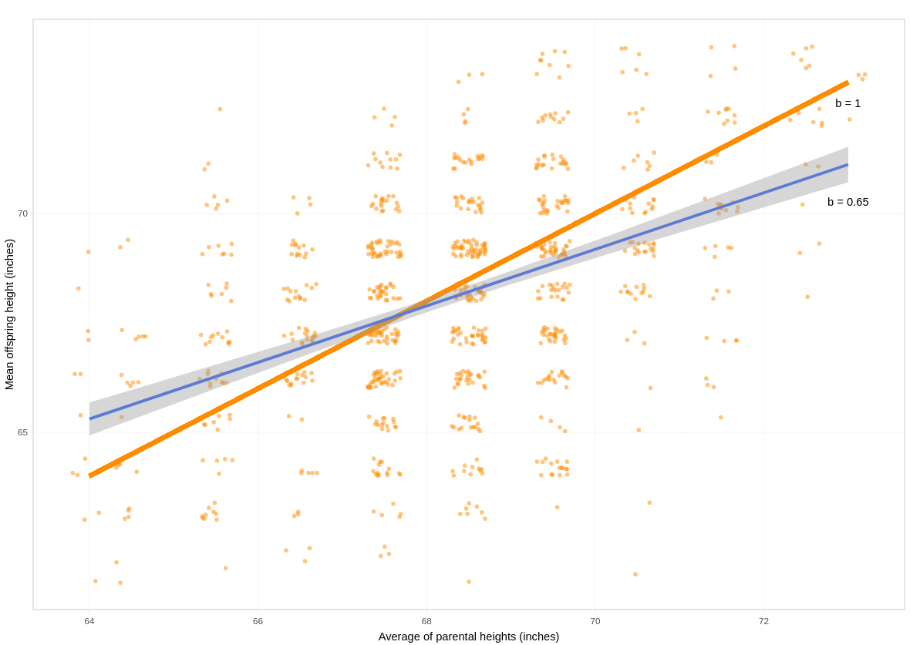
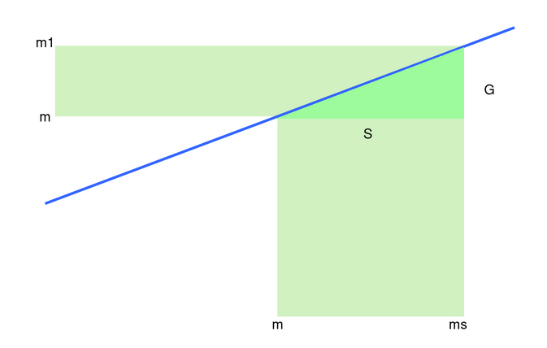
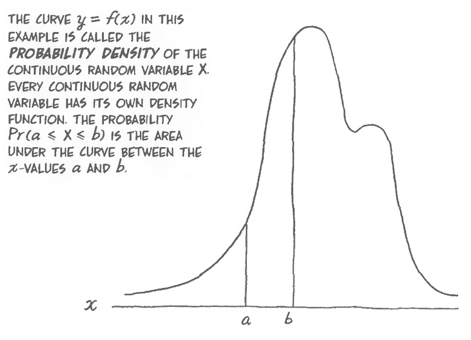
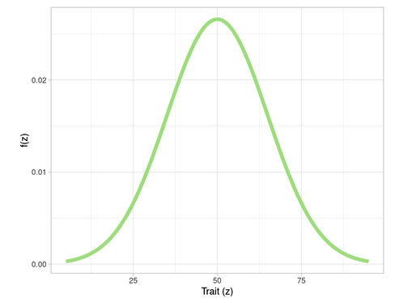
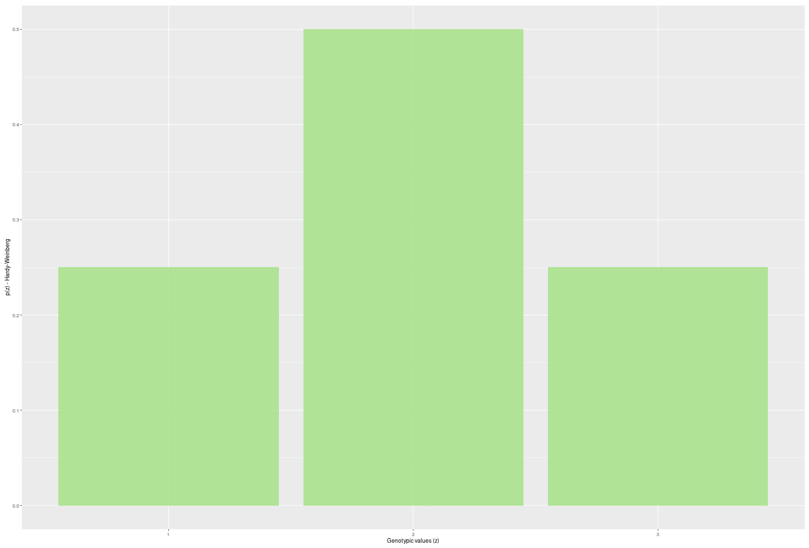
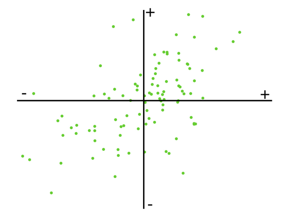
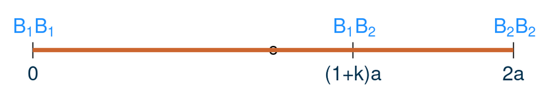
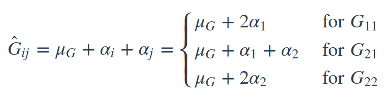
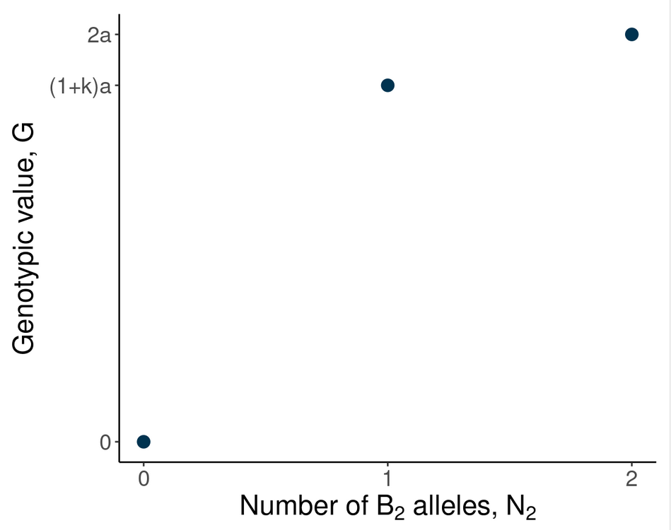
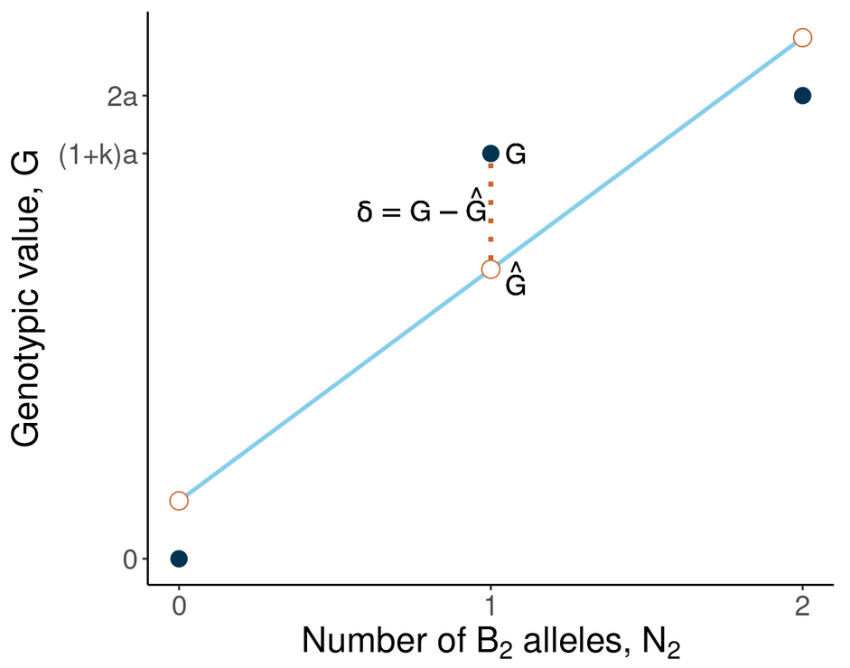

```{r setup, include=FALSE}
knitr::opts_chunk$set(echo = TRUE)
```

# Aula 01 - Introdução à Genética Quantitativa
##  Características Quantitativas

**Características quantitativas** são de natureza métricas, ou seja, temos que avalia-las usando alguma escala de medida. Por terem natureza métrica são controladas por _muitos genes_. Elas foram descobertas por Fisher (1918), onde muitos conceitos foram consolidados neste paper. Na época:

- existia um embate entre mendelianos e biometristas;

- muitos biometristas consideravam as leis de Mendel como um caso particular e serviam apenas para características qualitativas;

- Fisher colocou um ponto final nessa discussão ao descobrir que as características quantitativas eram controlados por diversos genes.

Por serem governadas por muitos genes, elas precisam ser avaliadas usando _métodos estatísticos_, podendo ser contínuas ou discretas. Essas características também são conhecidas como _poligênicas_ ou _multifatorias_. E por serem controladas por muito genes elas são altamente influenciadas pelo ambiente. Também temos que:

- as características qualitativas _quase não_ são influenciadas pelo ambiente;

- já nas características quantitativas, cada gene reflete uma pequena influência do ambiente e de maneira geral a característica como um todo sofre uma grande influência do ambiente;

- é um _erro_ pensa que quanto maior o número de genes maior será ainfluência do ambiente. A partir de um pequeno número genes podemos ter uma influência do ambiente. A partir de um pequeno número de genes podemos ter uma influência maior ou menos, o _efeito do ambiente_ em cada gene pode variar.

Dessa forma, é necessário métodos estatísticos para estudar essas características. Assim, pode-se diferenciar genética quantitativa e estatística:

- genética quantitativa é estudar a _transmissão e herança_ dos caracteres quantitativos;

- genética genética estatística é _desenvolvimento de modelos_ ara analisar dados de genética que pode ser caracteres quantitativos ou qualitativos. Ou seja, o desenvolvimento de métodos estatísticos para fenômenos genéticos.

## Papers Seminais
**Fisher(1918)** - com esse paper Fisher colocou um ponto final na briga dos biometristas e mendelianos. Ele mostrou que um caráter quantitatibo tem sim heranla mendeliana. Nesse paper ele também apresentou o conceito de ANOVA, decomposição da variância, delinamentos experimentais, verossimilhança, evolução quantitativa.

**Wright (1921)** 

**Lockerham (1954)** - decompopsição da variância genética e componentes devio aos diferentes tipos de epistasia.


## Histórico
A genética quantitativa começou com esse paper do Fisher, mas a discussão a respeito da herdabilidade das características quantitativas começou antes com vários autores. 

**Mendel** 

- Mendel apresentou a herança das características discretas, ou seja, variáveis qualitativas e definiu primeira e segunda lei de Mendel;

- O paper de Mendel na época não teve tanto destaque porque na mesma época Darwin publicou o paper dele que teve muito impacto na época.

**Darwin**

- Apresenta a teoria da evolução.

**Galton (1889) - Regression toward mediocraty**

- Era primo de Darwin e foi uma das pessoas que propôs o conceito de eugenia;

- Ele fez uma interpretação errrônea de alguns conjuntos de dados e, em 1889 ele apresentou o conceito de regressão para mediocridade.

**Pearson (1908)**

- Em 1903, Pearson interpretou os dados do Galton corretamente e para interpretar ele propôs alguns conceitos, como por exemplo resposta à seleção e regressão linear.

## Galton's Data
Galton tinha a altura média dos pais e a altura média dos filos. Ele obteve um gráfico mais ou menos assim:



Em uma primeira visualização podemos observar que pais mais altos tendem a ter filhos mais altos e, pais mais baixos tendem a ter filhos mais baixos. Existe, portanto, uma tendência, mas que não é _absoluta_. Observa-se também uma concentração de pontos em torno da media, ou seja, indivíduos medianos tem filhos com alturas medianas.

Galton passou uma linha nesse gráfico com coeficiente angular *b = 1*, este determina a inclinação de uma reta. O coeficiente angular pode ser demonstrado pela fórmula:

$$cA = \frac{\delta y}{\delta x}$$
$\delta$ = variação

Ter um $cA = 1$ significa que a altura do pai é igual a altura do filho. Se a análise do gráfico for feita quando o _coeficiente angular = 1_, nota-se que temos muito mais filhos baixos para pais mais altos do que o contrário. A quantidade de pontos é bem maior para filhos mais baixos. Portanto, parece que os pais mais altos têm tendência de ter filhos mais baixos do que seria esperado em uma reta igual a 1.

Seguindo essa análise, ao olharmos na região de pais mais baixos, nota-se que tem mais pontos na parte acima da reta. Ou seja, os pais mais baixos tendem a ter filhos mais altos, Filhos mais baixos tem a tendência a ter filhos mais altos na próxima geração.

Portanto, a interpretação de Galton foi: pais mais altos tendem a ter filhos mais baixos e pais mais baixos tendem a ter filhos mais altos. Ou seja, de uma geração para outra os que são muito alto vão tender a ficar mais baixos e os que são mais baixos vão tendem a ficam mais altos. E com isso, ao longo das gerações irá _regredir em torno da mediocridade_, ou seja, regressão em direção à média.

Ou seja, a população irá caminhar para uma altura mediana, se acumulando em torno da média. Com isso, a amplitude de variação de uma geração para outra irá diminuir.

Galton generalizou isso para todas as características e com isso porpôs a _eugenia_ (melhoramento de humanos). Ele queria fazer uma selação de pessoas para que com o passar das gerações a espécie humana não caminhasse para a mediocridade.

## Interpretação de Pearson
Pearson interpretou novamente os dados de Galton a partir de uma regressão. Pearson ajustou o coeficiente angular da reta a apartir dos mínimos quadrados ajustados aos pontos, assom teve:

- $\hat{\beta} = 0.65$ como a reta que melhor se ajusta aos dados;

- Na regressão, a soma de quadrados dos desvios em torno da reta é a menos possível;

- De acorodo com essa reta metade dos indivíduos estão acima da reta e metade está abaixo. Então, o argumento de Galton não é verdadeiro quando passamos a reta de mínimos quadrados.


A herdabilidade do caráter é uma _função do coeficiente angular_ da regressão. Ou seja, o quanto _transmite_ de uma geração para outra depende da reta do coeficiente angular. Quando fazemos uma regressão de uma característica, o coeficiente angular é proporcional ao coeficiente de herdabilidade.

Esse $\hat{\beta}$ não é igual a 1 porque a _herdabilidade_ de uma característica _nunca é igual a 1_, pois existe o _efeito do ambiente_ e o _efeito da transmissão_ (um pai nunca transmite os genótipos para os filhos e sim os gametas). Na média os gametas se combinam para formar a próxima geração. Não transmitimos de uma geração para outra integralmente os fenômesmo que observamos em uma geração. Ou seja, nem tudo que medimos em uma geração vai passar para outra. O que estamos medindo em um geração tem erros e causas ambientais que não são herdáveis (por isso $\hat{\beta}$ nunca será igual a 1).

A média e a variância _se mantém_ ao longo dos anos, ou seja, a média de uma população não muda de uma geração para outra. Elas vão se alterar se fizermos seleção (pressão seletiva).

A herdabilidade está _relacionada com a covariância_ entre os eixos, porque o $\beta$ da regressão é uma função da covariância entre os dois eixos. É uma covariância entre as gerações ou entre indivíduos aparentados. Quando medimos a covariância entre indivíduos aparentados estamos medindo uma função da herdabilidade. Tem que haver uma dependência ou uma covariância entre eixos para termos progresso de uma geração para outra.

Galton estava errado em dizer que haveria uma regressão em torno da média. Na verdade, se não fizermos nada a média e a variância continuarão sendo as mesmas. Se selecionarmos os pais com as maiores alturas termos a média dos indivíduos selecionados e alteraremos a média da geração seguinte:



Quando selecionamos a geração atual (ms) temos uma média igual a m1 da geração seguinte. Essa diferença entre a média da população e a média dos selecionado é o **diferencial de seleção**. Que pode ser exemplificado da seguinte maneira:

$$ms - m = \delta s$$

e a diferença entre o m1 e m é o **ganho de seleção**. Exemplificado da seguinte maneira:

$$m1 -m = G$$

a relação entre o cateto oposto e o cateto adjacente é a tangente do ângulo:

$$tg \ \alpha = \frac{C.O.}{C.A.}$$
a tangente desse ângulo é o coeficiente angular da reta:

$$cA = \frac{\delta y}{\delta x}$$

o coeficiente angular dita quão grande é esse ganho, quanto maior o $\beta$ que é a tangente do ângulo, maior será o ganho de seleção:

$$\therefore \beta = \frac{G}{S} \\
\therefore G = \beta.S \\
\therefore G = h^2.S$$

Quando fazemos uma regressão dos pais em relação aos filhos, o slope da regressão (coeficiente angular da reta) é proporcional à herdabilidade no sentido restrito. Ele mede o quando eu ganho no eixo y (cateto oposto) quando eu ando no eixo x (cateto adjacente). E se pararmos para pensar, o cateto adjacente nada mais é do que o diferencial de seleção (alteração do fenótipo causado pela selação) e o cateto oposto é o ganho de seleção (resposta à seleção).

E Pearson nouto exatemente isso, a resposta à seleção através das gerações é a diferençã média da altura dos pais selecionados e a média da altura antes da seleção.

## Dias "Atuais"

**Shull (1905)** - Reparou que a uniformidade genética diminui a variabilidade. Portanto, as características devem ter uma base genética grande.

**Nelson-Ehle (1909)** - Estudou a segregação em três locos e observou que isso tinha uma influência na variabilidade.

**Johannsen (1903) & Johannsen (1909)** 

- Propôs a separação entre genótipo e fenótipo;

- Observou que os caracteres sofrem influência do ambiente;

- Observou que não existe ganho de seleção em materiais homogêneos, ou seja, é necessário ter variabilidade genética para se ter ganho.

## Tecnologias Modernas

**Quantitative Trait Loci** - hoje conseguimos encontrar quais são os locos que controlam as características (onde eles estão localizados no cromossomos), quais são os efeitos desses QTL na característica e qual influência do ambiente sobre eles.

**Seleção Genômica** - são métodos que usm muitos locos ao mesmo tempo para tentar fazer a predição de características quantitativas.

**Objetivos da Genética Quantitativa** 

- Entender e estimar a proporção das variações fenotípicas explicadas por causas genéticas. QUais são as bases genéticas da variabilidade que a gente observa?

- Entender as consequências da endogamia e heterose;

- Entender e estimar o ganho de seleção;

- Estimar o breeding value.

## Tarefa

- Ler o capítulo 1 Lynch & Walsh (1998);

- Escrever o que entendeu da discussão Galton x Pearson

### Capítulo 01

**Foundations of Quantitative Genetics**

A seleção natural é o que temos mais próximo a uma lei em biologia. Portanto, é lógico que a adotemos como uma referência em nossas tentativas de entender a natureza. Enquanto a teoria de otimização pode ser bem sucedida em predizer o que deve evoluir, mas no diz pouco de como deve acontecer. O objetivo principal da genética quantitativa é entender os mecanismos do processo evolutivo.


**Quantitative Genetics and Phenotypic Evolution**

A problemática central na natureza do processo que define a evolução de características morfológicas, fisiológicas e comportamentais, que são o foco da maioria dos programas de melhoramento, onde o homem em vez da natureza define a intensidade e direção da seleção.

Apesar da cultura e/ou transmissão dos efeitos ambientais terem papel importante em alguns casos, evolução é primeiramente um processo genético.

Na genética quantitativa, a maioria das formulações são ditas em termos de médias fenotípicas e variâncias. Seus princípios foram delineados por Fisher (1918) e Wright (1921).

Os princípios Mendelianos nos quais as teorias da genética quantitativa são fundadas são universais, aplicadas às espécies domesticadas e populações naturais. Mesmo assim, devido os sistemas de cruzamento, forças evolucionárias encontradas em populações naturais são geralmente bem diferentes do que programas controlados impõem nas plantas domesticadas, estudos de herança de características quantitativas em populações naturais apresentam muitos desafios. A maioria dos parâmetros são estimados pela comparação de fenótipos de indivíduos com grau de relacionamento conhecidos. Idealmente, análises genéticas controladas devem ser realizadas em conjuntos específicos em ambientes específicos. Essa falta de controle pode comprometer os tipos de parentes que podem ser testados e o grau de "balanceamento" do conjunto final de dados. Tais problemas incentivaram o desenvolvimento de novas estatísticas como BLUP e REML.

**Historical Background**

A genética quantitativa desenvolvida nesse século em resposta à uma controvérsia que ainda há remanescentes. A redescoderta da genética Mendeliana focou na herança de caracteres discretos, enquanto que Galton se concentrou em caracteres contínuos. A maior discussão era se caracteres possuíam as mesmas propriedades de hereditariedade e evolução que os caracteres contínuos. Os Mendelianos acreditavam que a variação nos caracteres discretos levavam a evolução ao surgimento de novas macromutações, enquanto que os biometricos viam a evolução como resultado da seleção natural agindo em caracteres distribuídos continuamente.

Darwin assumiuque características contínuas exibiam herança misturada. O problema desse pensamento já foi apontado por Jenkin (1867), que metade da variação existente é removida a cada geração com herança misturada.

Galton apontou outro problema. Quando ele plotou a altura média de filhos contra altura média dos pais. No entnato, a inclinação da reta indicava que a progênie era, em média, menos exepcional que seus pais. Pais cuja média eram baixa tendiam a ter progênie mais alta, mas ainda abaixo da média. Galton chamou essa tendência de regressão para a mediocridade e, argumentou que isso iria erosar qualquer progresso seletivo. Ele concluiu que a evolução deve ser baseada em mutações de grandes efeitos ao invés de selecionar variações contínuas.

Pearson (1903) apontou o erro de Galton. Imagine que a seleção aja de maneira que apenas pais altos se reproduzam, então a altura média dos adultos reprodutivos após a seleção ($\mu s$) é maior do que a altura média antes da seleção ($\mu$). Se $\mu_0$ é  a altura média da progênie dos pais selecionados, então a resposta à seleção entre gerações é $\mu_0 - \mu$. Uma vez que a inclinação da relação parental-progênie é menor do que 1, a progênie adulta não pe esperada ser tão grande quanto aos pais selecionados. No entanto, a altura média é estável, se a seleção for parada, a nova altura não pe esperada decair ao valor original. Galton aparentemente falhou ao perceber que a seleção começa de uma nova média a cada geração e é para essa nova média que a próxima geração regressa. 


### Minha Resposta

_Após a redescoberta das leis de Mendel surgiu a questão se era possível explicar caracteres contínuos por essas leis, uma vez que estas foram inicialmente estabelecidas por meio de estudos com caracteres discretos. E então começou-se um embate entre os Mendelianos e os Biometristas. Para os Mendelianos, o surgimento de novas mutações eram consequência da variação dos caracteres discretos, já para os Biometristas a seleção natural agia nos caracteres distribuídos continuamente. Darwin tentou descrever essas características quantitativas através de uma “herança de mistura”, em que a progênie seria a média de seus genitores, o que foi contestado por Jenkin (1867), uma vez que caso isso ocorresse a cada geração metade de sua variação seria desfeita. Como um adepto aos biometristas, Galton, primo de Darwin, tentou desenvolver uma estatísticas que pudesse descrever a passagem de caracteres contínuos de uma população parental para sua prole. Para isso ele plotou em um gráfico a média da altura dos pais (eixo x) contra a altura dos filhos (eixo y), e então traçou uma reta com ângulo de inclinação igual a 1. A partir desse gráfico ele observou que na extremidade com os pais mais baixos a maioria de seus filhos estavam acima da reta traçada, ou seja, eram mais altos que seus pais. E na outra extremidade ele observou o contrário, pais mais altos tinham mais filhos cuja altura estava abaixo da reta, ou seja eram mais baixos que seus pais. Isso o fez concluir que ao longo das gerações iria ocorrer uma “regressão à mediocridade”, isto é, a população  iria caminhar até uma altura mediana onde haveria uma estagnação. Atualmente sabemos que diversos fatores influenciam na característica observada, como o ambiente, o ambiente e a sua interação com o genótipo, o grau de herdabilidade, o pedigree - que me fez pensar sobre os dados obtidos pelo Galton, uma vez que casamentos entre primos (consanguíneos) eram mais comuns no século 19 (o próprio Darwin era casado com sua prima), o que pode ter efeitos negativos na progênie - entre outros. Mas o erro de Galton não foi não levar em consideração esses fatores que hoje sabemos ser importantes, e sim na sua interpretação ao estabelecer uma reta com inclinação, b =1. O que foi corrigido, em 1903, por Pearson ao ajustar uma reta que melhor adequasse os dados, através dos mínimos quadrados. A nova reta ajustada obteve coeficiente angular igual a 0.65 com, metade da progênie está acima da reta e outra metade abaixo. E então, Pearson interpretou que caso nenhuma seleção fosse aplicada a média e a variância de uma população continuará a mesma de uma geração para outra. E caso haja alguma pressão de seleção a média terá uma tendência para onde há a seleção e uma nova média irá compor a nova geração. Galton não percebeu que a seleção começa em uma nova média e é pra ela que a próxima geração regressa._


# Aula 02 - Revisão de Conceitos Estatísticos
## Distribuição de Probabilidades
É um modelo matemático que gera uma curva cuja área é igual a 1. 



A curva $y=f(x)$ nesse exemplo é chamda de densidade de probabilidade de uma variável aleatória continua x. Cada variável contínua tem sua própria funça densidade. A probabilidade $Pr(a \leq x \leq b)$ é a área abaixo da curva entre x-valores a e b.

No eixo x nós temos uma variável que é medida no mundo real. Essa variável pode ser discreta (cara ou coroa/indivíduos homo ou heterozigostos) ou contínua (peso/altura dos indivíduos). 

Se a variável for discreta teremos que usar distribuições discretas para modelar o fenômeno. E se ela for contínua, distribuições contínuas.

Pode ser que a curva acima consiga modelar algum fenômeno do mundo real. Nota-se que essa curva apresenta um pico mais alto e outro mais baixo. Isso poderia ser, por exemplo, a altura de pessoas ou plantas segregando para dois QTL, em que o QTL com maior frequência representa o pico mais alto da curva e o com menor frequência o mais baixo.

A função que gere o gráfico é uma função matemática e a usamos para modelar um fenômeno do mundo real. Como ela é função de probabilidade, a área abaixo da curva deve ser igual a 1. Matematicamente pode ser representada como:

$$\int_{-\infty}^{\infty}p(z)dz = 1$$

Onde:

-$p(z)$ é a função da variável aleatória;

- $z$ é a variável aleatória (característica);

- A área é igual a 1 porque é a soma de todos os possíveis eventos.

A probabilidade de um determinado evento ocorrer entre dois intervalos é obtida através da integral definida entre esses dois intervalos. A integral divide a área desses dois intervalos em vários retângulos pequenos e posteriormente soma a área desses retângulos. Matematicamente, temos:

$$P(z_1 \le z \le z_2) = \int_{z_1}^{z_2}p(z)dz$$

## Distribuição Normal

Iniciou-se coma a predição de jogos e movimentos dos astros e foi formalizada por Gauss. Sua função densidade pode ser descrita por:

$$f(z) = \frac{1}{\sqrt{2\pi\sigma^2}} e^{\frac{-(z-\mu)^2}{2\sigma^2}}$$

Onde:

- $\sigma^2$ é a variância;

- $f(z)$ é a probabilidade de se obter o valor z;

- $\mu$ é a média;

- $z$ é a variável quantitativa.

Para fazer a curva de densidade de probabilidade precisamos de $\mu$, $z$ e $\sigma^2$. O $\mu$ interfere no desenho da cursa e dizemos que ele é uma medida de posição. Para diferentes valores de $\mu$ e $\sigma^2$, teremos curvas de densidade de probabilidade. Graficamente temos:



É muito comum fazermos transformações e padronizar essa distribuição. A transformação é feita para cada valor da seguinte maneira:

$$z' = \frac{z - \mu}{\sigma}$$

Em que $z'$ é o valor transformado (standardizado).

A transformação da variável aleatória normal com média $\mu$ e desvio padrão $\sigma$ em uma aleatória normal padronizada com média 0 e o desvio padrão 1, permite a comparação das distribuições, uma vez que elas estarão em uma mesma escala. 

A variância é uma medidade de dispersão e portanto, quanto maior a variância mais os dados estarão dispersos em torno da média e mais aberta será a curva.

Na análise de dados o objetivo é encontrar um modelo que consiga explicar de alguma maneira uma determinada variável e um modeo muito usado á a distribuição normal. Essa distribuição funciona muito bem para fenômenos do mundo real, inclusive caracteres quantitativos.

**Propriedades da Distribuição Normal**

A distribuição normal é amplamente utilizada, pois:

- A distribuição normal é normal é uma boa distribuição para medir variáveis quantitativas em que a maioria das observações estão concentradas ao longo da média. Os dados mais concentrados ao longo da média possuem maior probabilidade de ocorrer. _(A maioria dos valores estão concentrados em torno da média)_;

- A distribuição é simétrica, ou seja, o que acontece acima da média também acontecerá abaixo. _(Quando os dados acima e abaixo da média são simétricos)_;

- Raramente iremos observar indivíduos nas extremindades. Podemos até observa-los, mas probabilidade de ocorrer valores extremos é muito pequena. _(Os valores extremos são raros)_;

## Caracteres Quantitativos
Quanto eu tenho um evento que é a soma de evento de menores, independente da distribuição dos eventos menores a distribuição do evento final tende a ser uma distribuição normal.

Trazendo para a genética quantitativa: o efeito de um caracter quantitativo é a soma do efeito de diversos pequenos genes. E quando eu somo tudo é razoável pensar que a distribuição do efeito final é uma normal.

Quando temos apenas **um gene** controlando determinada característica, temos:

$$\mbox{valores genotípicos estabelecidos} \left \{ \begin{matrix} 1 = aa \\ 2 = Aa \\ 3 = AA \end{matrix} \right.$$

O número de indivíduos que temos em cada categoria depende da população que estamos trabalhando. Se fizermos a frequência alélica e a população estiver em equilíbrio de Hardy-Weinberg teremos $p^2$, $2pq$ e $q^2$ genótipos. Se cada alelo for 0.5, temos:



Nota-se que pelo gráfico não temos a distribuição normal, pois temos apenas 3 categorias (AA, Aa e aa) e a distribuição não temos apenas 3 categorias. Já quando há 2 genes controlando uma determinada característica, temos:

$$\mbox{valores genotípicos} \left \{ \begin{matrix} 1 = aa & 1 = bb \\ 2 = Aa & 2 = Bb \\ 3 = AA & 3 = BB \end{matrix} \right.$$

A medida que aumentamos o número de genes nós aumentamos também o número de categorias.

Quando temos seis genes segregando temos algo próximo da distribuição normal. Usa-lá para aproximar esse fenômeno funcionará. A distribuição dos genes não é uma distribuição normal, mas se eu modelar como sendo, poucas propriedades da distribuição normal serão perdidas. Dessa forma, a istribuição normal é um excelente modelo para estudar características quantitativas.

Como é uma simulação, sabemos que não e uma distribuição normal e sim uma multinomial. No exemplo, cada gene acrescenta uma unidade no valor genotípico. Como, por exemplo, o indivíduo AABBCCDDEEFF apresenta uma valor genotípico igual a 18. No entanto, se considerarmos o efeito ambiente, esse indivíduos poderá ser 17, 17.5, 19... Portanto, haverá trocas de classes e e valores intermediários, que dependerão do tipo de escala usada e do ambiente.

Por fim, é possível modelar caracteres quantitativos através da distribuição normal porque esses caracteres são controlados por muitos genes de pequeno efeito e há influência do ambiente. Como são resultado do efeito de múltiplas variáveis de pequeno efeito, ao somarmos esses efeitos tenderemos a encontrar a distribuição normal. Isso é o **Teorema Central do Limite**.

No Teorema Central do Limite é estabelecido que em algumas situações quando variáveis aleatórias independentes são acionadas, sua soma adequadamente normalizada tende para uma _distribuição normal_, mesmo que as próximas variáveis originais não sejam (Ou seja, efeito diferentes com distribuição diferente terão uma distribuição normal ao se somar seus efeitos).

## Esperança Matemática

A esperança é o primeiro momento em relaão à média da distribuição. A média está relacionada com o conjunto de dados que já observamos. A esperanla é a média de um conjunto de dados que não estamos vendo ou que não ocorreu. Matematicamente, temos a esperança de uma variável z como:

$$E(z) = \mu = \int_{-\infty}^{\infty}z \ p(z) \ dz$$

Onde $p(z)$ é uma determinada distribuição probabilidade de ocorrência. (Se eu usar a distribuição normal, teremos uma determinada esperaça). Portanto, a média esperada varia de acordo com a distribuição.

Imagine uma característica quantitativa modelada com distribuição normal. Qual a média dess variável quando a modelagem é feita usando distribuição normal? A média dessa distribuição é o que chamamos de esperaça de z; e no caso da distribuição normal a esperançã é $\mu$.

Pela fórmula vemos que a esperaça é a soma do produto de cada probabilidade de ocorrência pelo seu respectivo valor. Isto é, representa o valor médio "esperado" de uma experiência se for repetida muitas vezes.

**Propriedades**

- $E(x + y) = E(x) + E(y)$

- $E(cx) = cE(x)$

## Variância Esperada

A variância é o segundo momento em relação à média da distribuição. Matematicamente temos:

$$\sigma^2 = \int_{-\infty}^{\infty}(z-\mu)^2p(z)dz \\
= E[(z-\mu)^2] \\ \\
\therefore \sigma^2 = E(z^2) - [E(z)]^2$$

Portanto, para uma determinada distribuição podemos obter a esperaça (média esperada da distribuição) e a variância (variância esperada da distribuição). Cada distribuição terá uma esperança e uma variância.

A esperanla de $z$ para variáveis centradas námédia é igual a zero e, portanto, a variância será de $z$ ao quadrado:

$$\sigma^2 = E(z^2)$$

**Formula da variância**

$$\sigma^2 = \frac{1}{n-1} \left[\sum z^2 - \frac{\sum z^2}{n} \right] $$

## Distribuição Normal Bivariada
Duas variáveis do mundo real são utilizadas para descrever um fenômeno. Segue a função:

$$f(x,y) = \frac{1}{2 \pi \sigma_x  \sigma_y \sqrt{1-p^2}} \ exp \left( - \frac{1}{2(1-p^2)} \left[\frac{(x - \mu_x)^2}{\mu_x^2} + \frac{(y - \mu_y)^2}{\mu_y^2} - \frac{2 \rho(x - \mu_x)(y - \mu_y)}{\sigma_x \sigma_y}  \right] \right)$$

Os parâmetros da função são:

- Variância de x ($\sigma_x^2$) e variância de y ($\sigma_y^2$);

- Correlação entre x e y ($\rho$);

- Média de x ($\mu_x$) e média de y ($\mu_y$).

Portanto, para descrever essa distribuição bivariada é necessário termos a média e a variância das duas variáveis e a sua correlação. Também temos:

$$\mu = {\mu_x \choose \mu_y}$$

e

$$\sum = \begin{pmatrix} 
  \sigma_x^2 & \rho\sigma_x\rho\sigma_y \\ 
  \rho\sigma_y\rho\sigma_x & \sigma_y^2 \\
  \end{pmatrix}$$

Quando estamos estudando duas variáveis a distribuição depende de como essas duas variáveis se associam. O fato de x e y seguirem uma distribuição normal não garante que x e y conjuntamente terão uma distribuição normal bivariada. Se duas variáveis aleatórias são independentes, a correlação e a covariância é igual a zero.

Nos dados de Galton, nota-se um achatamento na elipse. Esse achatamento sugere que existe uma correlação entre as duas carcterísticas. E é exatamente isso que acontece, pois pais mais altos tendem a ter filhos mais altos. 

Na distribuição bivariada o f(x,y) nos dá a probabilidade de observar um valor para as duas variáveis ao mesmo tempo. Já na distribuição normal univariada f(x) nos dá a probabilidade de observar um valor para a variável x. O pico da distribuição é a média das duas variáveis ao mesmo tempo. Nota-se que a maioria dos valores estão concentrados na média. E nas extremidades temos os valores raros.

### Distribuição Conjunta para Normal Bivariada
É a probabilidade de determinado evento acontecer entre algum intervalo de x e y. Obtida através da integral entre esses intervalos. É o cálculo do volume:

$$P(y_1 \leq y \leq y_2, \ x_1 \leq x \leq x_2) = \int_{y_1}^{y_2} \int_{x_1}^{x_2} p(x, y) \ \delta_x\delta_y$$

Podemos também calcular a probabilidade condicional. Podemos, por exemplo, fixar o valor de x e calcular a probabilidade de y estar entre $y_1$ e $y_2$.

$$P(y_1 \leq y \leq y_2 \ | \ x) = \int_{y_1}^{y_2} p(y \ | \ x) \ \delta_y$$

E da mesma maneira conseguimos calcular a esperança:

$$E[f(x,y)] = \int_{ -  \infty}^{\infty } \int_{- \infty}^{ \infty} f(x,y) \ p(x, y) \ \delta_x\delta_y$$

O valor esperado é a média da população que estamos estimando. A esperança e a variância da distribuição é a média e a variância populacional, respectivamente. Não conhecemos a média e a variância populacional e o que usamos são amostras para estimar o comportamento dessa população.

## Covariância
Quando estamos lidando com apenas uma variável precisamos de média e variância. Já quando estamos lidando com duas características nós precisamos da média e da variância das duas características e da correlação ou da covariância.

A covariância é a variação conjunta de duas características, ou seja, é uma medida de associação linear entre duas variáveis.

Assim:

$$\sigma(x,y) = E[(x - \mu_x)(y - \mu_y)]$$
ou

$$\sigma(x,y) = E(xy) - \mu_x \mu_y \\
= E(xy) - E(x)E(y)$$

Por definição é a esperança do produto dos desvios das observação em torno da média.

Mas também pode ser representada por:

$$\sigma(x,y) = \frac{1}{n-1} \left[\sum (x - \mu_x)(y - \mu_y) \right]$$

ou 

$$\sigma(x,y) = \frac{1}{n-1} \left[\sum xy - \frac{\sum x \sum y}{n} \right]$$

Quando fazemos os desvios de y em torno da média, metade dos valores estarão acima da média e metade abaixo. A mesma coisa também contece para o x.
Será que quando os valores de x estão acima da média existe alguma relação para que os valores de y também estejam acima da média?

Se fizermos o produto de desvios positivos de x com desvios positivos de y teremos uma covariância positiva. E se fizermos o produto dos desvios negativos de x com os desvios negativos de y também termos uma covariância positiva. Ou seja, se tivermos produto de indivíduos com o mesmo sinal, a covariância deve ser positiva. Graficamente pode ser ilustrado da seguinte maneira:



A partir do gráfico, podemos perceber que existe um predomínio de pontos no quadrante positivo/positivo e no negati/negativo. Ou seja, a tendência é que essa covariância seja positiva. Se os pontos estiverem igualmente distribuídos ao longo dos quatro quadrantes, os efeitos irão se cancelar e a covariância será igual a zero. E se tivermos mais pontos nos quadrantes em que os indivíduos tem sinais diferentes teríamos covariâncias negativa.

A covariância é uma medidad de _associação_ entre x e y. Essa medida pode assumir:

$$- \infty < cov(x,y) < \infty$$
Portanto, ela é difícil de interpretar na escala original e geralmente usamos o coeficiente de correlação que varia de -1 a 1.

### Identidades Úteis
Considera que _a_ é uma constante e _x_ e _y_ são variáveis aleatórias:

1. $\sigma(x,x) = \sigma_x^2$ (a covariância de uma constante com ela mesma é a variância).

**Demonstração**

$$cov(x,x) = E[(x - \mu_x)(x - \mu_x)] \\
= E[(x^2 - 2\mu_x x - \mu_x^2)] \\
= E(x^2) - E(2\mu_x x) + E(\mu_x^2) \\
= E(x^2) - 2\mu_xE(x) + \mu_x^2 \\
= E(x^2) - 2\mu_x\mu_x + \mu_x^2 \\
= E(x^2) - 2\mu_x^2 + \mu_x^2 \\
= E(x^2) - \mu_x^2 \\
= E(x^2) - [E(x)]^2 \ \mbox{(formula da variância)}$$

2. $\sigma(a,x) = 0$ ( a covariância de uma constante e uma variável é zero)

**Demonstração**

$$cov(a,x) = E[(a-\mu_a)(x-\mu_x)] \\
\therefore cov(a,x) = 0$$


3. $cov(ax,y) = a cov(x,y)$

**Demonstração:**

$$cov(ax,y) = E[(ax-a\mu_x)(y-\mu_y)] \\
= E[a(x-\mu_x)(y-\mu_y)] \\
= a E[(x-\mu_x)(y-\mu_y)] \\
= a \sigma(x,y)$$

4. $\sigma(ax,by) = ab \sigma(x,y)$

**Demonstração:**

$$cov(ax,by) = E[(ax-a\mu_x)(by-b\mu_y)] \\
= E[a(x-\mu_x)b(y-\mu_y)] \\
= ab E[(x-\mu_x)(y-\mu_y)] \\
= ab \ \sigma(x,y)$$

5. $\sigma^2(ax)= a^2 \sigma^2 (x)$

**Demonstração:**

$$cov(ax) = E[(ax-a\mu_x)(ax-a\mu_x)] \\
= E[a(x-\mu_x)a(x-\mu_x)] \\
= aa E[(x-\mu_x)(x-\mu_x)] \\
= a^2 E[(x^2) - 2\mu x^2 - \mu x^2] \\
= a^2 E[(x^2) - \mu x^2] \\
= a^2 E(x^2) - [E(x)]^2 \\
= a^2 \sigma^2(x)$$

6. $\sigma[(x+y), (w+z)] = \sigma(x,w) + \sigma(x,z) + \sigma(y,w) + \sigma(y,z)$

7. $\sigma^2(x+y) = \sigma^2(x) + \sigma^2(y) + 2\sigma(x,y)$

Se analisarmos os dados de Galton, nota-se que os dados apresentam uma correlação positiva. A elipse está achatada com os dados concentrados nos quadrantes positivos e negativos. A medidade que a altura dos pais aumenta a dos filhos também aumenta. Como medir a associação? Calculando a covariância ou fazendo uma medida de dose e resposta.

## Modelos para a regressão
### Filhos = Pais
Esse seria o modelo mais simples em que tentamos explicar o comportamento dos filhos comportamento dos pais

### Filhos = Pais + $\alpha$
Agora temos um modelo um pouquinho mais complexo em que somamos uma constante para explicar a próxima geração. Essa constante pode ser, por exemplo, adicionada ao modelo porque pode ter tido uma melhora na nutrição de uma geração para outra.

### Filhos = Pais x $\beta$
Podemos também considerar um coeficiente e multuplica-lo na altura dos pais.

### Filhos = Pais x $\beta$ + $\alpha$
Por fim, poderíamos considerar um coeficiente e uma constante. Esse último modelo é o que mais se aproxima da realidade. E esse se aproxima muito de uma _regressão linear_. Esse modelo tenta explicar os filhos em função dos pais.

## Regressão linear
**Modelo Linear** é uma boa aproximação para se iniciar os estudos. Esse modelo tenta explicar o y (variável resposta) em função do x (variável preditora). Para associações, temos:

$$y =\alpha + \beta x + e$$

Colocamos o e (componente de incerteza) para coisas que não consseguimos controlar. No exemplo de Galton, pai com uma determinada altura não necessariamente terão filhos com essa altua.

$\alpha$ e $\beta$ são parâmetros do modelo. Nós precisamos desses dois parâmetros para obter valores de $\hat{y}$. Esses parâmetros são desconhecidos e precisamos estima-los. Ao conseguirmos isso, é possível predizer os valores preditos do modelo.

$$\hat{y} = \alpha + \beta x$$

$\alpha$ e $\beta$  são estimados para dar o melhor ajuste para a distribuição conjunto de x e y. E geralmente podemos utilizar mínimos quadrados para obter essas estimativas.

## Mínimos Quadrados
Seu critério é minimizar o $e$, que são desvios e a $E(e^2)$ é a variância residual.

O melhor ajuste é alcançado quando minimizamos a SQR.
Assumimos que erramos para baixo e para cima com a mesma probabilidade e em média o meu erro será zero, e haverá uma boa representação do modelo.

Depois de algumas derivações, temos:

$$a = \bar{y} - b \bar{x}$$

e

$$b = \frac{cov(x,y)}{var(x)}$$
### Algumas Suposições:

- **E(e) = 0:** em média, o erro é zero. Não necessariamente temos a mesma magnitude de erros, mas na média eles se cancelam. É razoável se assumir isso no mundo real. As vezes erramos para + e as vezes para -, e em média esses erros se cancelam. QUando estimamos o $\beta$ e o $\alpha$, em média não erramos (Diminuímos esse erro controlando as _fontes de variação_).

- **$cov(x,e)=0$:** a covariância entre o eixo x e o erro é zero, ou seja, você vai erra ao longo da reta na mesma maneira. Nós supomos o erro como zero. Nunca iremos conhecer o erro. O erro está condicionado ao modelo que escolhemos para representar algo da vida real. Isso não significa que será o melhor modelo. Nenhum modelo é correto, mas são suficiente para _representar_ aquilo que estudamos.

### Regressão dos dados de Galton

Intercepto ($\alpha$): 23,94. Se os pais tiverem altura _zero_ os filhos terão altura média de 23,94.

Coeficiente angular ($\beta$): 0,64629. A cada uma unidade que eu acrescento no eixo x para a direita eu tenho um _aumento_ de 0,64629 na altura dos filhos.

## Correlação

É um reescalonamento da covariância. É uma medida adimensional de associação. Pode ser representada pela seguinte fórmula:

$$r(x,y) = \frac{cov(x,y)}{\sqrt{var(x)var(y)}}$$
é a estimativa de máxima verossimilhança de $\rho$.

Nota-se que tanto $\beta$ quanto r tem em comum a covariância, ou seja, os dois são em função da covariância. Portanto, conseguimos reescrever o $\beta$ em função do r, da seguinte forma:

$$b(x,y) = r \sqrt{\frac{var(y)}{var(x)}}$$
 
Correlação, covariância e regressão são medidas de covariação ou de _variação conjunta_. Em escalas diferentes, com finalidades diferentes mas que medem tendência de associação entre as variáveis da mesma maneira.
 
### Coeficiente de determinação ($r^2$)
Quando elevamos a correlação ao quadrado ($r^2$) nos temos o coeficiente de determinação. É a proporção da variação de y explicada pelo modelo que eu ajustei.

- variância da regressão $r^2 var(y)$

- variância residual: $(1-r^2) var(y)$

No exemplo de Galton o $r² = 0,21$, ou seja, dessa variação apenas 21% é explicada pela variação dos pais, o restante é explicado por outras coisas. Quanto maior o $r^2$ maior será o resíduo.

## Genética Quantitativa
Calculamos a correlação entre os valores fenotípicos e genotípicos:

$$z = G + E$$
Assim:

$$\sigma(z,G) = \sigma[(G+E), \sigma] \\
= \sigma(G,G) + \sigma(E,G) \\
= \sigma_G^2 + \sigma_{GE}$$
e

$$\rho(G,z) = \frac{\sigma_G,z}{\sigma_G \sigma_z} \\
= \frac{\sigma_G^2 + \sigma_{GE}}{\sigma_G \sigma_z}$$


Se a covariância entre genótipo e o ambiente ($\sigma_{G,e}$) é igual a zero, o efeito genético e o ambiente são idependentes. Se a covariânca for positiva, valores maiores de G tendem a ter maiores de E. Se fizermos uma _casualização_ no experimento no qual controlamos o ambiente, conseguimos eliminar esse termo da fórmula (evitamos erros sistemáticos).

Assim:

$$\rho(G,z) = \frac{\sigma_G^2+ \sigma_{GE}}{\sigma_G \sigma_z} \\
= \frac{\sigma_G^2}{\sigma_G \sigma_z} \\
=\frac{\sigma_G}{\sigma_z}$$

**Coeficiente de Herdabilidade -** é uma função da correlação entre o fenótipo e o genótipo.

$$H^2 = \rho^2(G,z) = \frac{\sigma_G^2}{\sigma_z^2}$$
Isso é conhecido como herdabilidade no sentido amplo (proporção da variância fenotípica que é explicada por fatores genéticos).

## Tarefa

- Leia os capítulos 2 e 3 - Lynch & Walsh (1998)

- Leia os capítulos 4 e 5 - Gonick & Smith (1993)

- Dê exemplos numéricos das identidades úteis

- Prove que $b(x,y) = r \sqrt{\frac{var(y)}{var(x)}}$

### Capítulo 02
Antes de mergulhar na variação qauntitavida da genética, é essencial ter um entendimento básico de estatística.

Caracteres biológicos estudados são de 3 tipos:

- Características que são distribuídas em uma variedade de classes discretas, como a contagem de folhas em plantas, que são chamadas de _caracteres merísticos_;

- Aqueles que são medidos em uma escala continua conhecida, são conhecidos como _caracteres métricos_. Ex.: tamanho, peso, taxa de crescrimento, etc;

- Atribuitos como sobrevivência à uma idade fixa, são conhecidos como _caracteres binários_.

Por algumas limitações técnicas características verdadeiramente contínuas devem ser colocadas artificialmente na categoria discreta. A coleta de dados dá informações na incidência relativa de diferentes características. Uma _distribuição univariada_ descreve a frequência relativa de fenótipos para uma única característica. A distribuição conjunta de duas características é conhecida como _distribuição bivariada_, enquanto que para mais de duas características é _distribuição multivariada_.

Um dos objetivos da estatística é ajustar matemáticas relativamente simples como distribuições de probabilidade, nos dados. Se uma variável z possui apenas valores discretos, a distribuição de z é descrita completamente dado $P(z = z_i)$ para cada valor possível de $z_i$. O somatório de todos os resultados possíveis é igual a um, visto que a probabilidade de todos eventos possíveis é 1.

Por outro lado, se z é uma variável distribuiída continuamente, $P(z = z_i)$ não faz sentido uma vez que a probabilidade que z assuma um valor específico é infinitezimalmente pequeno. É mais significativo considerar a probabilidade de z se posicionar em um intervalo específico de valores $z_1$ e  $z_2$. Isso é descrito pela função de probabilidade:

$$P(z_1 \le z \le z_2) = \int_{z_1}^{z_2}p(z)dz$$
É importante distinguie distribuição de _parâmetros verdadeiros_ e _estimativas_ desses parâmetros obtidas por amostragem. Valores verdadeiros dos parâmetros só podem ser obtidos se cada membro da população é medido com acurácia absoluta. Portanto, devemos acomodarmos com aproximações, cuja acurácia depende na experimentação, equipamento de medida e tamanho da amostragem.

As funções densidade de probabilidades são definidas completamente por um ou dois parâmetros que descrevem a localização central e a dispersão da distribuição. A medida de localização amplamente utilizada é a média ($\mu$). Se $p(z)$ é a função densidade de probabilidade do fenótipo z, então pesando todos valores de z pela sua densidade leva à:

$$E(z) = \mu = \int_{-\infty}^{\infty}z \ p(z) \ dz$$
onde, E(z) siginifica _valor esperado_ de z. Para caracteres indicado por z, a média estimada da amostra geralmente é indicada por $\bar{z}$ e a média estimada de n medidas é:

$$\bar{z} = \frac{1}{n} \sum z_i$$

Outra medida importante é a dispersão de uma distribuição. Uma medida utilizada é a variância de uma pópulação que é a esperança do desvio de uma observação em relação à média ao quadrado:

$$\sigma^2 = \int_{-\infty}^{\infty}(z - \mu)^2 \ p(z) \ dz \\
= E[(z - \mu)^2]$$

**Distribuição Normal**

Quando grande conjuntos de dados são dispostos em forma de histogramas de frequência, eles geralmente se aproximam de uma distribuição na forma de sino. A distribuição normal é função de apenas 2 parâmetros, a média e a variância. A densidade atinge o máximo quando $z=\mu$ e declina simetricamente e continuamente nas duas direções. Uma variável distribuída normalmente é indicada por $z \sim N(\mu, \sigma^2)$.

A distribuição normal tem papel central por duas razões:

1. a função densidade de probabilidade tem muitos recursos matemáticos que permitem a derivação de testes estatísticos práticos;

2. mesmo quando fenótipos não se encaixam na distribuição normal após transformação apropriada eles podem ser utilizados como.

O motivo porquê tantas características são distribuídas normalmente é dado pelo _teorema central do limite_, que diz que a soma de um número aleatório de variáveis independentes se aproximam da normalidade a medida que o número de variáveis aumenta.

## Capítulo 03
**Propriedades de Loco Único**

O fato da maioria dos princípios de genética quantitativa poder serem expressos sem se referir a um gene específico é precisamente o porquê análises de genética quantitatia é tão popular no estudo de caracters complexos.

É sabido que a informação genética codificada para caracteres residem em longas cadeias de DNA chamadas de _cromossomos_. Sequências de DNA que codificam produtos em particular são chamados de _genes_ e, sua localização cromossomal é chamda de loco. A maioria dos organismos são diplóides, ou seja, tem 2 cópias de cada cromosssomo, Uma vez que a replicação do DNA é um processo imperfeito, surgem _mutações_ e como consequência as duas cópias de cada gene carregados por indivíduos diplóides não são necessariamente iguais. Essas várias formas de um gene são chamadas de _alelos_. Locos que possuem genes com mais de um alelo são chamdos de polimórficos.

### Frequências alélicas e genotípicas
Ao denotar o genótipo em um único loco, nós referimos ao para de alelos que um indivíduo carrega no loco. Indivíduos com dois alelos identicos são chamados de homozigotos e quando são diferentes são heterozigotos. Por exemplo, um loco dialélico pode ter os alelos $B_1$ e $B_2$ e seu genótipo possível: $B_1B_1$ e $B_2B_2$ são homozigotos e $B_1B_2$ heterozigoto.

Frequências alélicas são definidas pelas frequências genotípicas. Suponha que $P_{11}$, $P_{12}$ e $P_{22}$ sejam frequências de $B_1B_1$, $B_2B_2$ e $B_1B_2$ na população. Como há um total de @N genes na população para cada loco autossômico, então, a freuncia do alelo $B_1$ é:

$$p_1 = \frac{2P_{11}N + 2P_{12}N}{2N} = P_{11} + \frac{1}{2}P_{12}$$

Para características complexas influenciada por multiplos fatores ambientais e genéticos, é usualmente impossível de se ter certeza sobre o estado genotípico de um loco em particular. Em alguns casos, no entanto, a maioria da viarção genética de um carater depende em um único loco com grandes efeitos no qual, suas frequências podem ser estimadas diretamente.

### Transmissão de informações genéticas - Princípio de Hardy-Weinberg
Do ponto de vista de análise evolucional é crucial entender como as frequências alelicas e genotípicas muda de geração para geração. Tais mudanças podem ocorrer devido à: seleção natural, mutação, migração, cruzamento endogâmico e deriva genética dada amostragem de populações finitas. Esses efeitos podem ser minimizados ao se assumir uma população de tamanho infinito e cruzamento aleatório.

Em populações sexuais, indivíduos não necessariamente produzem progênie cujo genótipo se iguala com o seu. Antes da reprodução, indivíduos produzem gametas haplóides através da meiose. Então. no loco, o heterozigoto $B_1B_2$ produz dois tipos de gametas $B_1$ e $B_2$, podendo produzir 3 tipos de progênie  $B_1B_1$, $B_1B_2$ e $B_2B_2$. Sob cruzamento aleatório, as frequências genotípicas esperadas na próxima geração é obtida do produto das frequências dos gametas masculinos ($p_{1m}$ e $p_{2m}$) e os gametas femininos ($p_{1f}$ e $p_{2f}$). Assim, a frequência do alelo $B_1$ na próxima geração é:

$$p_1 = \frac{p_{1f} + p_{1m}}{2}$$

E as frequências genotípicas da próxima geração será encontrada pelas frequências:

- $p_1^2$

- $2p_1p_2$

-$p_2^2$

Tais proporções são conhecidas como frequências de Hardy-Weinberg. Essas proporções podem ser expandidas para qualquer número de alelos:

- Para os homozigotos $B_i$ a frequência é $p_i^2$

- Para os heterozigotos $B_iB_j$ é $2p_ip_j$

Caso as condições do princípios sejam cumpridas, o que se tem é que:

- Não leva mais do que uma geração para estabilizar e equilibrar a frequência dos genes nos 2 sexos;

- Apenas uma geração adicional é necessária para estabilizar as frequências genotípicas para as proporções preditas pelo EHW.

### Caracterizando a influência de um loco no fenótipo
O fenótipo de um indivíduo pode ser particionado em:

$$z = G + E$$

onde G é o fenótipo esperado, dado um genótipom resultando de uma expressão conjunta de todos os genes responsáveis pela característica. Para características com múltiplos locos Ge é uma função complicada.

Começando com um exemplo contendo apenas 2 alelos. Os três valore genotípicos podem ser representados pela escala:



onde 2a representa a diferença entre os fenótipos médios $B_2B_2$ e $B_1B_1$, e k dá uma medida de dominância. Os alelos $B_2$ e $B_1$ se comportam de maneira completamente aditiva quando k = 0, onde k = 1 implica em uma dominância completa do alelo $B_1$, e k = -1 um dominância completa do $B_2$. Se k > 1, a expressão fenotípica do heterozigoto excede ambos homozigostos e, o loco exibe _sobredominância_ no contrátio k < -1 implica _subdominância_.

### A Base da Dominância
Infelizmente a presença da dominância não pode ser ignorada na genética quantitativa pois há complicações em diversas fórmulas.
Inicialmente em estudos, genes submetidos à análises eram apenas aqueles que possuiam grandes efeitos fenotípicos. Locos envolvendo tais genes geralmente são caracterizados por impressionanetes níveis de dominância. Por exemplo, a maioria dos genes com grande efeito deletério na adaptabilidade são recessivos. Isso indica que novas mutações são inerentemente recessivas? Fisher argumentou que uma vez que alelos raros são encontrados quase que exclusivamente no estado heterozigoto, seleção deveria favorecer aqueles alelos que modificam locos que causam o heterozigoto portador do alelo deletério se parecer com o homozigoto normal. Ou seja, a selação deveria favorecer os heterozigotos parecidos com o homozigoto, mesmo que ele seja portados do alelo deletério também. No entanto, esse argumento implica que o heterozigoto codifique um fenótipo intermediário. Utilizando argumentos fisiológicos Wright discordou fortemente de Fisher. Ele apontou que apesar das relações de dominância serem sujeitas à mudanças, a intensidade da seleção operando no loco modificador é improvável ser forte o suficiente para ser uma força evolucionária.

Muito depois, Kaser e Burns desencolveram uma explicação geral para a dominância baseada em princípios bioquímicos. A maioria dos produtos gênicos (enzimas) estão envolvidas em vias bioquímicas complexas, como a taxa de produção de um produto final (fenótipo) é regulada por diversos passos. Consequentemente, a relação entre a atividade enzimática (uma função do estado alélico) e o produto final é hiperbólica. O que leva à 3 predições:

1. Mutações com grande efeitos a nível fenotípico serão viesadas para umadireção baixa. Mesmo mutações que aumentam a atividade enzimática.

2. A recessividade descendente das mutações é consequência da relação enzima-produto. Se considerarmos o heterozigoto como intermediário na atividade enzimática, o alelo produzindo homozigoto de maior atividade sempre produzirá dominância no produto-final.

3. Quanto menor o efeito da mutação, menos pronunciado será o nível de dominância. Tal resultado é esperado simplismente porque a relação entre BB, Bb e bb tende a linearidade enquanto os desvios entre suas atividades enzimáticas são reduzidas. Em princípio, a dominância é muito mais favorável a ser um fator de complicação para caracteres cuja variação é influenciada por um ou dois genes de grande efeito do que caracteres quantitativos codificados por vários locos cujo efeitos individuais são indetectáveis.

### Decomposição de Fisher do Valor Genotípico
O número de cópias de um alelo em um genótipo ($N_2$ = 0, 1 ou 2) é dito como conteúdo gênico. A não ser que esse alelo interaja aditivamente com outros alelos, haverá uma relação não-linear entre o conteúdo gênico e seu valor genotípico. No entanto, é útil considerar a melhor aproximação linear para essa relação, pois isso leva à partição dos valores genotípicos em seus valores esperados com base na aditividade($\hat{G}$) e desvios dessas expectativas resultado da dominância ($\delta$).
Isso pode ser formalizado por regressão de quadrados mínimos dos valores genotípicos no número de alelos $B_1$ e $B_2$ no genótipo ($N_1$ e $N_2$):

$$G_{ij} = \hat{G}_{ij} = \mu_G + \alpha_1N_1 + \alpha_2N_2 +\delta_{ij}$$

Dessa forma, o valor genotípico $B_iB_j$ é função de $\mu_G$, a média do valor genotípico na população; $\alpha_1$ e $\alpha_2$, a inclinação da regressão; $N_1$ e $N_2$, as variáveis preditoras; e $delta_{ij}$ o resíduo. Essa equeção é uma regressão múltipla que pde ser reduzida, para casos de 2 alelos para:

$$G_{ij} =  \mu_G + \alpha_1(2 - N_2) + \alpha_2N_2 + \delta_{ij} \\
\iota + (\alpha_1 \alpha_2)N_2 + \delta_{ij}$$

onde $\iota = \mu_G + 2\alpha_1$ é o intercepto. E a inclinação é dada por: $alpha = alpha_2 - alpha_1$

Os valores preditos pela regressão são:


Sob cruzamento aleatório $\alpha$ é conhecido como valor médio da substituição alélica. Ele representa a mudança no valor genotípico resultado da mudança do alelo $B_1$ para $B_2$. Para um caso puramente aditivo $\alpha = a$. No entanto, para outros casos $\alpha$ também é função de k e das frequências alélicas. Isso é, resultdado porque com a dominância o efeito da substituição de um gene no fenótipo depende do statu do alelo não substituido.

**Por que particionar o valor genotípico em componentes aditivos e de dominância?**

Essa distinção é útil pois cruzamento aleatório na natureza em espécies diplóides, cada parental doa apenas um alelo por loco para cada progênie. O alelo transmitido exibe seu efeito aditivo quando combinado com um gene do outro pai. Os desvio de dominância de um parental é elimindo quando os gametas são produzidos. Portanto pode-se pensar que $\hat{G}$ e $\delta$ são componentes herdáveis e não herdáveis de um indivíduo.

## Minhas respostas
- Dê exemplos numéricos das identidades úteis
[Exemplo Numérico](Numeric_Exemples.pdf)

- Prove que $b(x,y) = r \sqrt{\frac{var(y)}{var(x)}}$
[Prova](Prova.pdf)

- Find a paper (review, article, website…) about the controversy between the mendelians and the biometrists. Present an overview about it.

Segundo Darwin os organismos possuem variações nas características que ao longo do tempo e mudanças ambientais os poderiam oferecer vantagens que serão passadas aos seus descendentes. Mas a questão não respondida por ele era: como essas características são passadas? Em um grupo, os Biometristas, havia a tentativa de corroborar as teorias de Darwin por meio da avaliação de características contínuas. Esse grupo era representado por Pearson e Weldon. E então, em 1900, as leis de Mendel foram redescobertas. Seus dados sugerem a herança como sendo uma combinação de eventos discretos que levam a variações discretas nas características. Essa descoberta levou ao surgimento de um outro grupo, os Mendelianos. As leis de Mendel foram apresentadas por William Baterson na Royal Horticultural Society como uma forma de aplicar casos em que envolviam relação de dominância e as teorias de Galton que não se encaixavam. Bateson, que era um forte naturalista, porém um fraco matemático, teve um embate com Pearson que era seu oposto, um forte matemático, porém um pobre naturalista. Porém Pearson contava com a ajuda de Weldon para entender a parte biológica do problema. Weldon revistou as leis de Mendel e constatou que elas não eram universais para qualquer cruzamento e concluiu que Mendel errou ao negligenciar a ancestralidade. Wendel acabou falecendo em 1906 e Pearson utilizou suas anotações para determinar se poderia conciliar Mendelismo a uma regra estatística. Ele mostrou que as frequências em locos diferentes era estatisticamente independentes uma das outras nas gerações subsequentes. Esse conflito foi posto fim por Fisher que reconheceu a variabilidade contínua como sendo consequência do efeito cumulativo de muitos fatores mendelianos herdados de forma discreta, ou seja, agindo de maneira aditiva.

Ps.: fica como recomendação esse vídeo (Vídeo: https://youtu.be/QmiwQ0Kosa8), que começa pelo problema de Darwin não conseguir explicar como as heranças são passadas, passa por Mendel e porquê suas ideias não foram tão divulgadas na época de publicação até chegar McClintock e os genes de transposição. Mas é bem superficial. O canal todo também é bem legal e didático.

**Material base:**

Bulmer, Michael. The Ancestral Law and Mendelism. In: Bulmer, Michael. Francis Galton: Pioneer of Heredity and Biometry. Jhu Press, 2003. p. 255-264. 

Walter W. Piegorsch. Fisher's Contributions to Genetics and Heredity, with Special Emphasis on the Gregor Mendel Controversy. Biometrics, Dec., 1990, Vol. 46, No. 4 (Dec., 1990), pp. 915-924.

# Aula 03 - Decomposição do Valor Genotípico
## Frequências Alélicas e Genotípicas
Considere que um conjunto de indivíduos diplóides se cruzam ao acaso. E possui determinado loco com dois alelos ($B_1$ e $B_2$). Nesse caso, os possíveis genótipos são: $B_1B_1$, $B_1B_2$ e $B_2B_2$. Dessa forma, é possível predizer as frequências alélicas e genotípicas como:

$$\text{frequência genotípica} = \left \{ \begin{matrix} f(B_1B_1) = P_{11} \\ f(B_1B_2) = P_{12} \\ f(B_2B_2) = P_{22} \end{matrix} \right.$$

$$\text{frequência alélica} = \left \{ \begin{matrix} f(B_1) = P_{11} + \frac{P_{12}}{2} = p_1 \\ f(B_2) = P_{22} + \frac{P_{12}}{2} = p_2 \end{matrix} \right.$$

Casos os cruzamentos continuem aleatórios de geração em geração, as frequências alélicas e genotípicas permancerão constantes. Dizemos portanto que essa população está em Equilíbrio de Hardy-Weinberg. Considerando uma população em EHW, as frequências da pŕoxima geração serão:

$$ 1 = (p+q)^2 = \left \{ \begin{matrix} f(B_1B_1) = p_1^2 \\ f(B_1B_2) = 2p_1p_2 \\ f(B_2B_2) = p_2^2 \end{matrix} \right.$$

## Influência de um Loco no Genótipo
O fenótipo de um indivíduo é dado pelo valor genotípico e o ambiente:

$$z = G + E$$

em que G é a soma de todos os locos que controlam a caracerística. É também o fenótipo esperado resultante da expressão conjunta de todos os genes.

Para representação de G por meio de uma escala, iremos considerar um único loco com dois alelos ($B_1$ e $B_2$) e três genótipos possíveis $B_1B_1$, $B_1B_2$ e $B_2B_2$.


A parte de baixo da escala mede o valor genotípico, ou seja, o quanto o gene B influencia na característica. Já a parte de cima da escala representa os gentótipos possíveis em uma população. Um indivíduo pode ocupar toda a escala ou apenas uma parte dela, isso dependerá do seu genótipo.

Tem-se que _a_ é igual a metade da diferença entre os valores genotípicos dos dois homozigotos, fornecendo uma medida do grau de alteração no fenótipo que ocorre com a substituição do alelo $B_1$ por $B_2$. O valor de _k_ é em função dos desvio de dominância, medindo os desvios do heterozigoto em relação ao ponto médio das duas classes homozigotas. De acordo com os valores de k e a, podemos avaliar os diferentes casos de interação alélica (ou seja, a interação que ocorre entre os alelos de um loco).

- Quando k = 0, os alelos se comportam de forma completamente aditiva. Ou seja, não há dominância e a interação é chamada de **aditiva**;

- Quando 0 < k < 1, a interação alelica é de **dominância parcial**;

- Quando k = 1, **dominância completa** do alelo $B_2$ sobre o $B_1$;

- Quando k > 1, ocorre interação de **sobredominância** e, a expressão fenotípica do heterozigoto excederá o homozigoto  $B_2B_2$;

- Quando k = -1, há **dominância completa** do alelo $B_1$ sobre o $B_2$.

Na escala:

-  $B_1B_1$ = 0 siginifica que o alelo não está acrescetendo nenhum valor ao gene;

-  $B_2B_2 = 2a$ o efeito do alelo está sendo explorado ao máximo permitido;

- $B_1B_2$, está em algum lugar na escala.

## Decomposição de Fisher(1918) do valor genotípico

O número de cópias de um alelo particular é referido como _conteúdo gênico_. E a menos que o alelo interaja aditivamente com todos os outros alelos, haverá uma relação não linear entre o conteúdo gênico e o valor genotípico (G). No entanto, é útil considerar a melhor aproximação linear para essa realção. Em 1918, Fisher estabeleceu uma relação entre o conteúdo gênico ($N_2$) e o valor genotípico (G). Graficamente temos:



Em função disso, ele fez a partição dos valores genéticos em função dos seus valores esperados. Uma parte ele chamou de aditividade e os desvios que ele conseguiu predizer chamou de dominância.

Mesmo quando têm-se dominância é útil considerar que eles têm uma relação linear, pois isso leva a uma partição de valores esperados com base na aditividade ($\hat{G}$) e nos desvios das expectativas ($\delta$)



Nota-se que cada genótipo apresenta um desvio. Os pontos podem ser formalizados por regressão de quadrados mínimos dos valores genotípicos no número de alelos $B_1$ e $B_2$ no genótipo ($N_1$ e $N_1$):

$$G_{ij} = \hat{G}_{ij} = \mu_G + \alpha_1N_1 + \alpha_2N_2 +\delta_{ij}$$

$\alpha_i$ e $\alpha_j$ são efeitos dos alelos 1 e 2; $N_1$ e $N_1$ são os valores da variável que eu observo (número de cópias do alelo). E o $\delta_{ij}$ são os desvios daquilo que eu observo. Portanto, a partir daquilo que eu observ em uma população podemos ajustar um modelo e predizer o valor genotípico. O que não conseguimos vai para o $\delta$.

Os valores G preditos pela reta representam os valores genotípicos caso a realçaõ entre os alelos fosse completamente aditiva. Assim, a diferança entre os valores reais e preditos é causado pelo efito da relação de dominância entre alelos.

Essa equação é uma regressão múltipla. No entanto, para o caso de dois alelos podemos reduzir o modelo a uma regressão simples, observando que para qualquer indivíduo, $N_1 = 2 - N_2$, de modo que:

$$G_{ij} =  \mu_G + \alpha_1(2 - N_2) + \alpha_2N_2 + \delta_{ij} \\
\iota + (\alpha_1 \alpha_2)N_2 + \delta_{ij}$$

o slope dessa regressão pode ser denotado por $\alpha = \alpha_2 - \alpha_1$, e portanto, o modelo de regressão final é:

$$\hat{G}_{ij} = \iota + \alpha N_2 + \delta_{ij}$$

$\therefore$ esse modelo de regressão associa o número de cópias de um determinado alelo e o seu valor genotípico.

Os valores genotípicos preditos pela regressão são:

$$ \hat{G}_{ij} = \mu_G + \alpha_i \alpha_j \left \{ \begin{matrix}
\mu_G + 2\alpha_i \ \mbox{para} \ G_{11} \\ 
\mu_G + \alpha_i \alpha_j  \ \mbox{para} \ G_{12} \\
\mu_G + 2\alpha_j \ \mbox{para} \ G_{22}
\end{matrix} \right.$$

Tomando a esperança de $G_{ij} =  \mu_G + \alpha_1(2 - N_2) + \alpha_2N_2 + \delta_{ij}$ pode-se mostrar que:

- $\alpha_2 = p_1 \alpha$

- $\alpha_1 = -p_2 \alpha$

$\alpha$ é  coeficiente de regressão e pode ser calculado da seguinte forma:

$$\alpha = \frac{\sigma(G, N_2)}{\sigma^2 (N_2)}$$

Fazendo os cálculos temos que:

$$\alpha = a[1 + k (p_1 - p_2)]$$

Essa é a interpretação genética do slope. Esse slope será diferente de zero apenas se 'a' for diferente de zero. Se o 'a' foir zero siginifica que esse gene em particular não tem nenhum efeito na característica e, trocar, $B_1B_1$ por $B_1B_2$ não terá nenhum efeito.

Caso k = 0, não existe dominância e o heterozigoto estaŕa na metade da escala. Nesse caso $\alpha = a$.

Embora $\alpha$ e $a$ tenham a mesma notação (efeito aditivo) eles são conceitualmente diferentes. De maneira geral, podemos dizer que a e k estão relacionados com a bioquímica do funcionamento do gene. Sob a hipótese de acasalamento aleatório, $\alpha$ é conhecido como _efeito médio de substicuição alélica_. Ele representa a mudança média do valor genotípico que resulta quando um alelo $B_1$ é substituído aleatoriamente por um alelo $B_2$.

Para o caso puramente aditivo (k = 0) as frequências alélicas iguais (p = q), o $\alpha$ é igual a 'a', ou seja, estima-se o efeito aditivo ao fazer a regressão. No entanto, para todos os outros casos, o $\alpha$ está em função de 'a' e 'k' e das frequências alélicas da população. Assim, exceto no caso puramente aditivo, o efeito de substituição alélicar não é simplismente uma função das propriedades fisiológicas inerentes ao alelo e só pode ser definido no contexto populacional; 

Com dominância, o efeito de substituição alélica depende do status do alelo não substituído.

**Considerando vários cenários**

1. Quando não tem dominância os pontos ficam posicionados exatamente em cima da reta de mínimos quadrados. Além disso, nota-se que os valores genotípicos no eixo y são equidistantes. Nesse caso, em que o caráter é puramente aditivo.

2. Quando colocamos dominância nota-se que o heterozigoto se deslocou no eixo y. A medida que aumentamos a dominância, os pontos vão se afastando mais da reta, ou seja, os desvios estão aumentando.

3. Quando diminuimos a frequência de $B_2$, que é o alelo favorável, nota-se que a inclinação da reta é amior, consequentemenete o efeito de substituição é maior.

4. Quando temos sobredominância o efeito de trocar $B_1B_2$ por $B_1B_1$ é negativo.

## Particionando a Variância Genética
Fisher mostrou que uma vez que os valores genéticos são posicionados dessa maneira, é possível posicionar também as fontes de variação genética em um loco. Dados que $G = \hat{G} + \delta$, a variância genética total é:

$$\sigma^2_G = \sigma^2(\hat{G} + \delta) = \sigma^2(\hat{G}) + 2 \sigma(\hat{G} + \delta) + \sigma^2 (\delta)$$
Lembrando que o preditor ($\hat{G}$) e os desvios não são correlacionados, ou seja, eles são independentes. Sendo assim, a covariância será 0.

Então os componentes podem ser denotados como:

$$\sigma_G^2 = \sigma_A^2 + \sigma_D^2$$

Estatisticamente, o $\sigma_A^2$ representa a quantidade da variação que é explicada pela regressão de $N_2$ e o $\sigma_D^2$ representa a variação residual da regressão. Biologicamente, a variância aditiva $\sigma_A^2$ é a variação dos efeitos aditivos dos alelos e a variância de dominância $\sigma_D^2$ é associada a interação dos alelos no mesmo loco.

## Variância Genética

Usando $E(\hat{G^2})$, $E(\hat{G})$, $E(\delta^2)$ e $E(\delta)$, nós podemos obter:

$$\sigma_A^2 = E(\hat{G})^2 - [E(\hat{G})]^2 = 2p_1p_2\alpha$$
e 

$$\sigma_A^2 = E(\delta)^2 - [E(\delta)]^2 = (2p_1p_2ak)^2$$

Nota-se que a variância de $\sigma_A^2$ está relacionada com o efeito de substituição alélica. Já a $\sigma_D^2$ depende do a e do k.

## Tarefa
- Leia o capítulo 04 - Lynch & Walsh (1998) e apresente um overview

- Faça um vídeo explicando os slides 3, 5, 11 e 14. 

### Minha resposta

**Capítulo 04 - Propriedades de loco único**

A relevância da genética quantitativa está na possibilidade de extrapolar seus princípios à diversos genes e, o capítulo 04 trata das propriedades de loco único. O capítulo então se inicia pelas definições do que é um loco (localização cromossomal) e um alelo (formas de um gene). Em seguida é mostrado que a partir de uma população podemos calcular suas frequências genotípicas e alélicas, e que caso não haja influência de fatores externos (seleção, mutação, deriva, migração, cruzamento endogâmico), pelo cruzamento aleatório essas frequências tendem a ser estáveis ao longo das gerações (Equilíbrio de Hardy-Weinberg). E casos específicos como genes ligados ao sexo, poliploidia e estrutura etária possuem dinâmicas próprias para essas frequências.

Além de entender a dinâmica dos locos através das gerações também é importante compreender a sua influência sobre o fenótipo, que sabemos ser resultado do genótipo. No capítulo Lynch & Wash dispõem os três valores genotípicos (B1B1, B1B2, B2B2), que são resultantes da combinação de 2 alelos (B1 e B2), em uma escala. Na qual o B2B2 tem valor genotípico igual a 2a, o B1B1 igual a zero e o heterozigoto (1+k)a, onde k é uma medida de dominância. O princípio da dominância foi explicado por Kaser e Burns por meio de princípios bioquímicos.

Então o capítulo apresenta a decomposição do valor genotípico feito por Fisher, que relacionou o conteúdo gênico (no de cópias de um alelo) com o seu valor genotípico, através de uma aproximação linear por meio da regressão de quadrados mínimos. Essa aproximação particiona os valores genotípicos em valores esperados e seus desvios (dominância). E após diversas reduções e substituições da regressão temos que: α = a [1+k(p1+p2)]. E como α também é um função da covariância entre os valores genotípicos (G) e o número de alelos (N2) se, a covariância for zero, ou seja, se não houver associação entre G e N2, α também será zero. O que faz sentido, pois se não há associação entre os valores genotípicos e conteúdo gênico, o aumento ou diminuição do conteúdo gênico não irá refletir nos valores genotípicos e então o efeito médio de substituição alélica (α) será nulo. 

E por último, o capítulo apresenta a partição da variância genética, pois se eu posso decompor o valor genotípico eu posso decompor suas variáveis, da seguinte forma: σG2 = σ2(Ĝ+δ) = σ2(Ĝ) + σ2(δ) + 2σ(Ĝ,δ), e como os desvios não são correlacionados com Ĝ, a sua covariância é zero, portanto temos a variância genética como a soma da variância aditiva com a variância de dominância. 

Para finalizar, o meu destaque para esse capítulo vai para o exemplo 3, pois através dele foi possível visualizar melhor o que seria e quais as consequências de se alterar o “a” e o “k” na escala dos valores genotípicos. O exemplo apresenta o gene Booroola (B) que influencia na fertilidade de ovelhas. E seus valores genotípicos médios de bb, Bb e BB são, respectivamente, 1.48, 2.17 e 2.66. Se a se encontra na metade da escala seu valor será a diferença dos valores extremos (GBB - Gbb) dividido por dois, ou seja a =  (GBB - Gbb)/2 = (2.66-1.48)/2 = 0.59. Caso não houver dominância, a diferença nos valores genotípicos será puramente aditivo. E então, como encontramos o valor aditivo a = 0.59, a substituição do alelo b no homozigoto bb para o alelo B no heterozigoto deveria resultar em um acréscimo de 0.59 no seu valor genotípico, ou seja, 1.48+0.59(1+0) = 2.07. No entanto, o valor genotípico que vemos no heterozigoto é de 2.17, portanto pode ser que exista a influência de outro fator, que pode ser um erro ou o efeito de dominância. Como a posição do heterozigoto na escala é a(1+k) = GBb - Gbb, podemos encontrar k, que será igual a 0.17.

# Aula 04 - Breeding Values, Herdability e QTL
## Revisão de alguns conceitos da aula 03
Considere uma escala métrica representando uma determinada característica:

Para essa característica estamos usando uma representação simbólica que apresenta uma escala de variação. Essa característica pode variar para uma determinada espécie. Essa escala métrica pode ser dividída em duas partes que explica a variação do caráter. Uma parte da variação é devido à fatores genéticos e outra parte é devido à fatores ambientais.

Na parte ambiental (E), temos:

1. Efeitos gerais, plantas do mesmo bloco têm efeitos gerais;

2. Efeitos específicos, temperatura local da planta;

3. Efeitos aleatórios, aquilo que não conseguimos controlar.


$$\text{Modelo de Regressão}: G_{ij} = \iota + \alpha N_2 + \delta_{ij}$$
$$\text{Modelo Gamético}: G_{ij} = \mu_G + \alpha_i + \alpha_j + \delta_{ij}$$

## Efeitos Aditivos e Breeding Value


**Efeitos Aditivos**

$$\alpha_2 = p_1 \alpha = p_1\alpha[1+k(p_1 - p_2)]$$

$$\alpha_1 = -p_2 \alpha = - p_2\alpha[1+k(p_1 - p_2)]$$